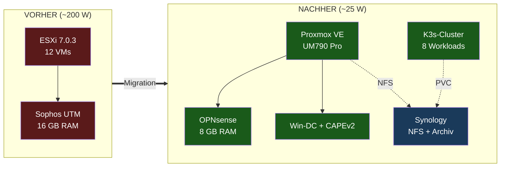
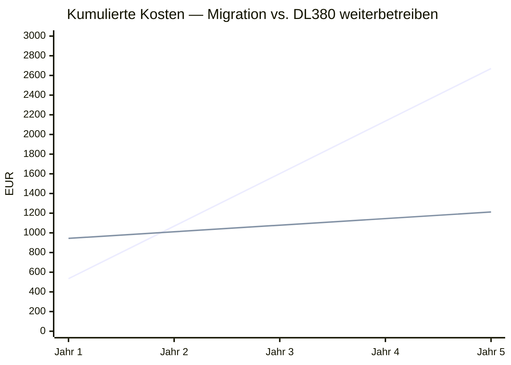

# esxi2proxmox — DL380 Gen9 zu Proxmox UM790 Migration

[View on GitHub](https://github.com/icepaule/esxi2proxmox){: .btn .btn-primary .fs-5 .mb-4 .mb-md-0 .mr-2 }

***

**Status:** Migrationsplan finalisiert, Hardware bestellt (Mai 2026)
**Trigger:** Sophos UTM SG Lizenz abgelaufen + DL380 Gen9 zieht 200 W kontinuierlich
**Ziel:** Stromsparender Mini-PC mit Proxmox VE statt 2 U Rack-Server

## 💡 Was hier dokumentiert ist

Eine vollständige Migration vom Enterprise-Server-Setup (HP ProLiant DL380 Gen9 mit VMware ESXi 7.0.3 und 12 VMs) zu einem stromsparenden Mini-PC-Setup (Minisforum UM790 Pro Refurbished mit Proxmox VE), inklusive:

- Bestandsanalyse mit echten Daten aus Home Assistant
- Klassen-basierte Hardware-Auswahl (N100 bis Ryzen 9)
- Schnäppchen-Recherche (Refurbished, eBay, AliExpress)
- VM-für-VM Migrationsmatrix mit Risikostaffelung
- Wirtschaftlichkeitsanalyse mit Tibber-Live-Preisen
- PV-Synergie-Berechnung
- Phasen-Migrationsplan

## 📊 Eckwerte

| Kennzahl | Vorher | Nachher | Veränderung |
|---|---|---|---|
| Stromverbrauch (Idle) | ~200 W | ~25 W | **−87,5 %** |
| Jahresstromkosten (Tibber-Median 30,5 ct/kWh) | 534 € | 67 € | **−467 € / Jahr** |
| PV-Eigenverbrauchsquote | ~27 % | ~33 % | **+6 Prozentpunkte** |
| CO₂-Footprint | 666 kg/Jahr | 83 kg/Jahr | **−583 kg/Jahr** |
| Investition (Refurb + Komponenten) | — | 877 € | Amortisation **~21 Monate** |
| Geräusch | 45–55 dB(A) | < 25 dB(A) | flüsterleise |
| Höheneinheiten | 2 U | 0 U (Mini-PC) | Platz gewonnen |

## 🏗️ Architektur

## 🛡️ Sicherheits-Aspekte (Defense in Depth)

Mit dem Wechsel von **End-of-Life Sophos UTM (Lizenz abgelaufen)** zu **OPNsense (aktiv gepflegt, Open Source)** wird die Substanz der Hausnetz-Sicherheit zurückgewonnen:

* **Patch-Continuity:** Wöchentliche Security-Updates für OPNsense vs. veraltete Sophos-Pattern-Datenbank.
* **Crypto-Modernisierung:** WireGuard für Hetzner-VPN statt klassischem IPsec — schnellere Performance auf Ryzen-Zen4 mit AES-NI.
* **IDS-Capability:** Suricata-Plugin mit Emerging-Threats-Listen ersetzt die Sophos-IPS-Engine.
* **Network-Segmentierung:** Bestehendes 6-VLAN-Schema unverändert übernommen (Mgmt, IoT, Bad-Zone, Storage, Internet).
* **Defense-in-Depth:** FritzBox (NAT) → OPNsense (L3 Firewall + IDS) → VLAN-Segmentierung → Endgerät-Hardening.

## 🛠️ Hardware-BOM (Bill of Materials, Variante B)

| Position | Modell | Funktion | Preis |
|---|---|---|---|
| Hauptgerät | Minisforum UM790 Pro Refurbished Barebone | R9 7940HS, 2× I226 2,5G NIC, 2× USB4 | **299 €** |
| RAM | Crucial 64 GB DDR5-5600 SODIMM Kit | Hauptspeicher | 150 € |
| Storage | 2× WD Black SN770 1 TB NVMe Gen4 | ZFS-Mirror | 140 € |
| 10G NIC | QNAP QNA-T310G1S (SFP+) | 10G-Trunk an CRS305 | 260 € |
| DAC | MikroTik S+DA0001 1 m | SFP+ DAC | 28 € |
| **Total** | | | **877 €** |

## 📈 Wirtschaftlichkeit & PV-Synergie

* **Rote Linie**: DL380 weiterlaufen lassen → kumulierte Stromkosten
* **Grüne Linie**: UM790-Migration → einmalige Investition + niedrige laufende Kosten
* **Break-Even** bei ~22 Monaten, ab Jahr 3 deutlich günstiger

## 🏛️ Regulatorische/Compliance-Aspekte

Auch wenn dies ein Homelab-Setup ist, orientiert sich die Migration an Enterprise-Best-Practices:

* **Defense-in-Depth** statt Single-Vendor-Lock-In
* **Backup-Strategie 3-2-1** (Proxmox Backup Server + Synology ABB + Cold-Storage)
* **Change-Management** mit Phasen-Plan und Rollback-Trigger
* **Capacity Planning** mit realen Lastdaten statt Bauchgefühl
* **Asset Lifecycle Management** (DL380 Gen9 ist EOL-of-Support bei VMware nach Broadcom-Übernahme)

## 🎯 Strategische Entscheidungen

| Workload | Entscheidung |
|---|---|
| Sophos UTM | → OPNsense (Open Source, kein Lock-In) |
| BDC2025 (AD-DC) | → UM790 Proxmox-VM (saubere AD-Migration, kein Klon) |
| splunk | → K3s Helm-Chart |
| Kibana_OSINT (8 TB) | → 8 TB Archiv auf Synology + frischer Elastic-Stack auf K3s |
| CAPEv2 (Malware-Sandbox) | → UM790 Proxmox mit Nested-Virt (AMD-Vi/IOMMU) |
| Light Workloads (Caldera, CheckMK, ecoDMS, OS-Watch, MWcrawler) | → K3s |
| MailCOW (off), tembo (off) | → verschrottet |

## 🔗 Vollständige Dokumentation

* [📘 README](https://github.com/icepaule/esxi2proxmox/blob/main/README.md) — Übersicht & Status
* [01 — Herleitung & Ausgangslage](https://github.com/icepaule/esxi2proxmox/blob/main/docs/01-herleitung.md)
* [02 — Hardware-Auswahl](https://github.com/icepaule/esxi2proxmox/blob/main/docs/02-hardware-auswahl.md)
* [03 — Zielarchitektur](https://github.com/icepaule/esxi2proxmox/blob/main/docs/03-zielarchitektur.md)
* [04 — Migrationspfad](https://github.com/icepaule/esxi2proxmox/blob/main/docs/04-migrationspfad.md)
* [05 — Einsparungen & PV-Synergie](https://github.com/icepaule/esxi2proxmox/blob/main/docs/05-einsparungen.md)
* [06 — Integration ins bestehende Setup](https://github.com/icepaule/esxi2proxmox/blob/main/docs/06-integration.md)

## 📊 Verwandte Projekte

* [IceHomeAssist](icehomeassist.html) — Home Assistant Setup, Tibber-Integration für Strompreis-Live-Daten
* [Ice-Kubernetes](ice-kubernetes.html) — K3s-Cluster, der die migrierten Container-Workloads aufnimmt
* [IceMatrix](icematrix.html) — Strompreis-/PV-Anzeigen über MAX7219-LED-Matrizen
* [followmysun](followmysun.html) — PV-Solartracker auf Schuppen, dessen Ertrag durch DL380-Abschaltung erstmals den Hausverbrauch deckt
