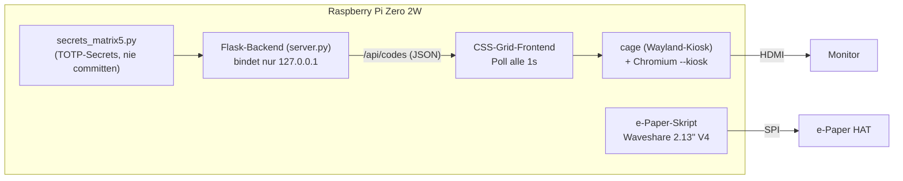
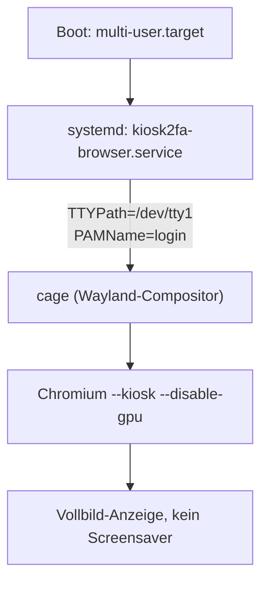

# Ice-2FA-Kiosk

[View on GitHub](https://github.com/icepaule/Ice-2FA-Kiosk){: .btn .btn-primary .fs-5 .mb-4 .mb-md-0 .mr-2 }

***

**Ice-2FA-Kiosk**


Ein Raspberry Pi Zero 2W zeigt **alle** TOTP/2FA-Codes gleichzeitig auf einem HDMI-Monitor an
(kein Auswählen mehr nötig, kein Handy zücken), zusätzlich zeigt ein aufgestecktes e-Paper-HAT
klassische Betriebsdaten des Geräts an.

Zweitgerät neben dem Schwesterprojekt [IceMatrix](https://github.com/icepaule/IceMatrix)
(dessen HUB75-LED-Panel "Matrix5" ursprünglich diese TOTP-Rolle hatte, aber nur 4 Accounts
gleichzeitig zeigen konnte — Matrix5 wurde inzwischen zu einer Stromkosten-/Waschzeitpunkt-
Anzeige umgewidmet, seit dieses Gerät hier die komplette 2FA-Rolle übernommen hat). Hardware:
ein baugleicher Pi Zero 2W, der zuvor für das
[Bjorn](https://github.com/infinition/Bjorn)-Projekt lief.

**Status**: Produktiv, mit den echten 48 Accounts im "Issuer: Konto"-Format, auf dem
vorgesehenen DVI-Monitor.

## Hardware

| Teil | Spezifikation |
|------|---------------|
| Controller | Raspberry Pi Zero 2W (BCM2710, 512MB RAM), Raspberry Pi OS Lite (Debian trixie), Python 3.13 |
| Anzeige 1 | HDMI-Monitor über mini-HDMI-auf-DVI, volles Grid aller Accounts |
| Anzeige 2 | Waveshare 2.13" e-Paper HAT, Platinen-Revision "Rev2.1", Panel-Generation **V4** (per Live-Test ermittelt — V2/V3-Treiber zeigten kein Bild) |
| Netzwerk | eigenes WLAN, zusätzlich USB-Ethernet-Gadget (dwc2/g_ether) für direkten Konsolenzugriff |

Die SD-Karte des alten Bjorn-Betriebs war ext4-beschädigt (korrupte Extent-Bäume, `e2fsck`
brach ab) und wurde komplett neu geflasht statt repariert — die alte Bjorn-Installation war
ohnehin nicht mehr relevant.

## Anzeige


*Account-Namen sind für diesen Screenshot per CSS-Blur unkenntlich gemacht. Die Codes selbst
bleiben sichtbar — unproblematisch, da TOTP-Codes alle 30 Sekunden ablaufen.*

Grün = mehr als 5 Sekunden Restzeit, Rot = Code läuft gleich ab (Countdown-Balken darunter).
Account-Name (Überschrift) bricht bei Bedarf mehrzeilig um statt mit Ellipsis abgeschnitten zu
werden — bei "Issuer: Konto"-Namen teils deutlich länger als der reine Issuer-Name. Farbe hell
(`#eee`) statt mittelgrau, da der tatsächlich vorgesehene DVI-Monitor schlechteren Kontrast hat
als der ursprüngliche Test-Monitor.

## Architektur



Das Flask-Backend berechnet die TOTP-Codes serverseitig und bindet ausschließlich an
`127.0.0.1` — die Codes verlassen den Pi nie über das Netzwerk, nur der lokale Kiosk-Browser
liest sie über localhost. Kein MQTT/Home-Assistant-Bezug (anders als Matrix5) — der Monitor
zeigt bewusst **alle** Accounts gleichzeitig, keine Auswahl nötig.

## Kiosk-Autostart ohne Desktop-Umgebung



**cage** ist ein minimaler Wayland-Kiosk-Compositor ohne Desktop-Umgebung, X11 oder
Display-Manager. Er startet als systemd-Service direkt auf der Konsole (`TTYPath=/dev/tty1` +
`PAMName=login`) und hat keinerlei Idle-/DPMS-Logik eingebaut — dadurch automatisch "kein
Screensaver, keine Dunkelschaltung" ganz ohne zusätzliche Konfiguration.

- **GPU-Rendering deaktiviert** (`--disable-gpu`): Chromiums GPU-Rasterization über den
  VC4/V3D-Treiber unter Wayland/Ozone lieferte nur einen weißen Bildschirm (Renderer-Prozess
  lief, aber kein Bildinhalt — per Screenshot direkt vom Compositor-Speicher verifiziert,
  nicht nur vom HDMI-Signal). Die Seite ist reines CSS/Text ohne WebGL/Video, Software-
  Rendering ist völlig ausreichend.
- **Chromium-Übersetzungs-Bubble** ließ sich durch `--disable-translate` /
  `--disable-features=Translate` **nicht** unterdrücken (neuere Chromium-Version ignoriert
  das teilweise) — erst die Enterprise-Policy `/etc/chromium/policies/managed/kiosk2fa.json`
  (`{"TranslateEnabled": false}`) hat zuverlässig gewirkt.
- **Mauszeiger sichtbar, obwohl kein Zeigegerät angeschlossen ist (offen)**: `cursor: none`
  in der Seiten-CSS bewirkt nichts, weil der Zeiger nicht von Chromium/der Seite gerendert
  wird, sondern von **cage/wlroots selbst als Compositor-Cursor** — die HDMI-CEC-
  Fernbedienungs-Eingabe des Pi (`vc4-hdmi`) meldet Zeigefähigkeiten (REL-Capability) und
  lässt wlroots deshalb einen Seat-Cursor zeichnen. Versuch, das per udev-Regel
  (`LIBINPUT_IGNORE_DEVICE=1` für `vc4-hdmi`) zu unterbinden, hat **cage zuverlässig zum
  Hängenbleiben gebracht** (reagierte nicht mehr auf SIGTERM, Chromium startete gar nicht
  mehr, auch nach sauberem Neustart) — Regel wieder entfernt. Nächster möglicher Ansatz:
  `hdmi_ignore_cec`/`hdmi_ignore_cec_init` in `config.txt` statt einer live nachgezogenen
  libinput-Regel (noch nicht getestet).

## e-Paper-Betriebsdaten


Waveshare 2.13" e-Paper HAT, Full-Refresh alle 60 Sekunden. Zeigt Hostname, alle IPs,
CPU-Temperatur, Load-Average, RAM-/Disk-Belegung und Uptime.

**Treiber-Fallstrick**: Die Aufschrift "Rev2.1" auf der HAT-Platine bezeichnet laut Waveshare
nur die *Trägerplatine* (3.3V/5V-Pegelwandler-Revision), **nicht** die Panel-Generation
(V1-V4) — beide Angaben sind unabhängig voneinander. `epd2in13_V2` (naheliegend wegen
Kaufzeitraum) zeigte kein Bild (Panel blieb beim alten Bjorn-Inhalt stehen, obwohl der
Service fehlerfrei lief), erst `epd2in13_V4` funktionierte — verifiziert per Testbild direkt
über SSH, ohne die Karte nochmal ausbauen zu müssen.

## Herausforderungen beim Bau (Pi Zero 2W, 512MB RAM)

- **WLAN nach Erstflash dreifach blockiert**: Der Kernel-Parameter für den Regulatory-Domain-
  Code (Länder-Einstellung) allein reicht nicht — zusätzlich mussten ein `rfkill`-Softblock
  (`/var/lib/systemd/rfkill/*:wlan`) und NetworkManagers eigener `WirelessEnabled`-Zustand
  (`/var/lib/NetworkManager/NetworkManager.state`) manuell freigegeben werden. Normalerweise
  erledigt das ein interaktiver Ersteinrichtungsdialog automatisch mit, der bei einem headless
  vorbereiteten Image aber nie läuft.
- **`/etc/resolv.conf` zeigte auf `x.x.x.x`** (Image-Platzhalter, extern — vom IoT-Netz
  geblockt) und wurde nie überschrieben, weil nie eine Verbindung zustande kam (Henne-Ei mit
  dem WLAN-Block). Nach dem WLAN-Fix regeneriert NetworkManager die Datei korrekt.
- **`systemd-timesyncd` hing fest** trotz erreichbarem NTP-Server — ein einmaliges
  `systemctl restart systemd-timesyncd` nach Herstellen der WLAN-Verbindung hat genügt.
- **`apt-get install chromium` lief ohne zusätzliches Swap in "Swapping Hell" fest** — ein
  bekanntes, gut dokumentiertes Community-Problem auf 512MB-RAM-Geräten. Fix: vor der
  Paketinstallation ein echtes 3GB-Swapfile anlegen (zusätzlich zum Standard-zram-Swap),
  bleibt dauerhaft aktiv für den laufenden Chromium-Betrieb.
- **Chromium-Wrapper zeigt bei <1GB RAM einen Bestätigungsdialog** ("Launch anyway"), der ohne
  Maus/Tastatur am Kiosk nie wegklickbar wäre — `--no-memcheck`-Flag nötig.

## Account-Provisionierung (Secrets)

`secrets_matrix5.py` (identisches `ACCOUNTS`-Dict-Format wie beim IceMatrix-Schwesterprojekt)
wird vom Matrix5-Pi auf dieses Gerät kopiert (über einen kurzlebigen Zwischenstopp, danach
sofort `shred`), beide Geräte zeigen danach dieselben Accounts an.

**"Issuer: Konto"-Format**: Ursprünglich zeigten Accounts nur den Dienstnamen mit
Nummern-Suffix bei Kollisionen (z.B. `authentik2`/`authentik3`). Google-Authenticator-Export
erneut gemacht (6 QR-Seiten), Bilder sicher übertragen (nie per Mail — Mail-Archive behalten
sonst dauerhaft Kopien), QR-Codes gelesen, alte Einträge durch die neuen "Issuer: Konto"-Namen
ersetzt. Ergebnis: 48 eindeutig benannte Accounts.

## Sicherheitshinweise

- Flask-Backend bindet nur an `127.0.0.1` — TOTP-Codes sind nie übers Netzwerk erreichbar.
- **`secrets_matrix5.py` niemals committen** (`.gitignore` global auf den Dateinamen gesetzt)
  — liegt nur lokal auf dem Gerät.
- **Physische Sichtbarkeit**: Wer auf den Monitor schauen kann, sieht ALLE aktuellen
  2FA-Codes gleichzeitig — Gerät entsprechend platzieren (bewusster Kompromiss für die
  bequeme Komplettübersicht).

## Offene Punkte

- [x] SD-Karte neu geflasht (alte Bjorn-Installation ext4-beschädigt)
- [x] WLAN/NTP/Swap-Fallstricke gelöst, Kiosk + e-Paper beide verifiziert produktiv
- [x] Echte Accounts im "Issuer: Konto"-Format, 48 Accounts
- [x] Vorgesehener DVI-Monitor angeschlossen, Account-Namen aufgehellt für besseren Kontrast
- [ ] Mauszeiger dauerhaft ausblenden, ohne cage zum Hängen zu bringen (siehe oben) — nächster
      Ansatz: `hdmi_ignore_cec`/`hdmi_ignore_cec_init` in `config.txt`

## Dateien

```
Ice-2FA-Kiosk/
├── README.md
├── images/                            # Screenshots (geblurrt) + e-Paper-Sample
└── config/
    ├── server.py                      # Flask-Backend (TOTP-Berechnung, /api/codes)
    ├── epaper_stats.py                # e-Paper-Betriebsdaten-Skript
    ├── firstboot-provision.sh         # Erstboot: Pakete, Swapfile, kiosk-User, Services
    ├── secrets_matrix5.py.example     # Vorlage, echte secrets_matrix5.py nie committen
    ├── static/index.html              # Kiosk-Frontend (CSS-Grid)
    ├── waveshare_epd/                 # Vendored Waveshare e-Paper-Treiber (epd2in13_V4)
    └── systemd/                       # kiosk2fa-server/-browser/-firstboot, epaper-stats
```

Auf dem Pi liegt alles flach unter `/home/mpauli/kiosk2fa/` (bzw. die systemd-Units in
`/etc/systemd/system/`), nicht in der hier gezeigten Repo-Ordnerstruktur.

