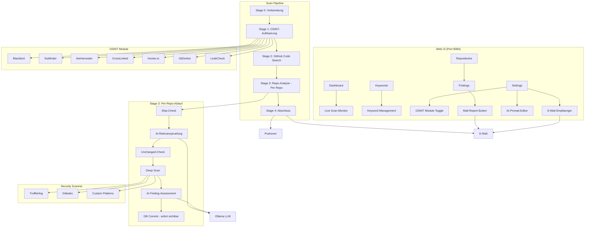
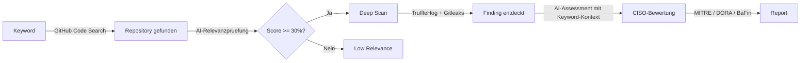
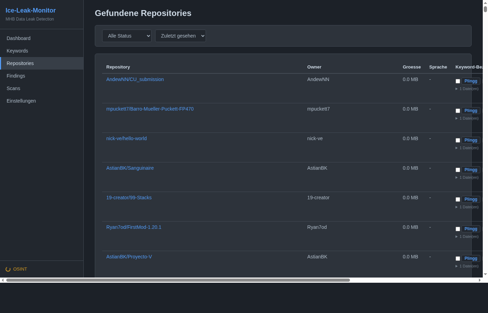

<!-- manually-curated -->

# Ice-Leak-Monitoring
{: .fs-9 }

Automatisierte GitHub Data Leak Detection mit OSINT-Aufklaerung und KI-Bewertung.
{: .fs-6 .fw-300 }

[GitHub Repository](https://github.com/icepaule/Ice-Leak-Monitoring){: .btn .btn-primary .fs-5 .mb-4 .mb-md-0 .mr-2 }

---

## Management Summary

Ice-Leak-Monitor ueberwacht kontinuierlich die oeffentliche Code-Plattform GitHub auf unbeabsichtigt veroeffentlichte Unternehmensdaten. Das System sucht automatisiert nach Firmennamen, Domains, E-Mail-Adressen und weiteren konfigurierbaren Suchbegriffen in oeffentlichem Quellcode und bewertet Funde hinsichtlich ihrer Relevanz und ihres Risikopotenzials.

**Warum ist das relevant?** Mitarbeiter, Dienstleister oder ehemalige Beschaeftigte laden regelmaessig — meist versehentlich — interne Konfigurationen, Zugangsdaten oder vertrauliche Dokumente auf GitHub hoch. Solche Datenlecks koennen Angreifern direkten Zugang zu internen Systemen verschaffen und stellen ein erhebliches operationelles Risiko dar.

**Was leistet das System?**

- **Proaktive Erkennung** — Taegliche automatisierte Durchsuchung von GitHub nach Unternehmensbezuegen, ergaenzt durch OSINT-Aufklaerung (Subdomain-Enumeration, E-Mail-Harvesting, LinkedIn-Recherche, Datenleck-Abgleich)
- **KI-gestuetzte Triage** — Ein lokales Sprachmodell (Ollama) bewertet jeden Fund auf Relevanz und ordnet ihn in MITRE ATT&CK, DORA- und BaFin-Kontext ein, um False Positives zu minimieren und die Priorisierung zu unterstuetzen
- **Inkrementelle Analyse** — Bereits gescannte Repositories werden nur bei Aenderungen erneut geprueft; per Repo koennen Scans manuell erzwungen oder gesperrt werden
- **Sofortige Alarmierung** — Bei neuen Findings werden Verantwortliche per Pushover und E-Mail benachrichtigt; Empfaenger koennen direkt in der Web-UI konfiguriert werden; Ergebnisse sind in Echtzeit im Dashboard sichtbar
- **Anpassbarer AI-Prompt** — Der Bewertungsprompt fuer Findings kann in der UI editiert werden, mit Platzhaltern fuer Scanner, Detektor, Dateipfad, Repo-Kontext und Keyword-Kette
- **Manueller Finding-Report** — Einzelne Findings koennen per Checkbox ausgewaehlt und als CISO-konformer HTML-Mail-Report versendet werden
- **Regulatorische Einordnung** — Findings werden automatisch auf DORA-Relevanz (Digital Operational Resilience Act) und BaFin-Anforderungen (BAIT/VAIT) geprueft

Das System laeuft als Docker-Container im internen Netzwerk, speichert Daten lokal in einer SQLite-Datenbank und benoetigt lediglich einen GitHub API-Token als externe Abhaengigkeit. Alle KI-Analysen laufen lokal ueber Ollama — es werden keine Daten an externe KI-Dienste uebermittelt.

---

## Uebersicht

Ice-Leak-Monitor ist ein vollautomatisches System zur Erkennung von Datenlecks auf GitHub. Es durchsucht GitHub Code Search nach sensiblen Informationen (Firmennamen, Domains, E-Mail-Adressen), fuehrt OSINT-Aufklaerung durch und bewertet Funde mittels KI-Analyse.

### Kernfunktionen

- **5-Stage Scan-Pipeline** mit Per-Repo-Verarbeitung und Live-Monitoring im Web-Dashboard
- **7 OSINT-Module** (Blackbird, Subfinder, theHarvester, CrossLinked, Hunter.io, GitDorker, LeakCheck)
- **Multi-Scanner Deep Scan** (TruffleHog, Gitleaks, Custom Patterns)
- **KI-Relevanzpruefung** mit Ollama/LLM (MITRE ATT&CK, DORA, BaFin)
- **Skip-Logik** — Unveraenderte Repos werden uebersprungen, AI-Override pro Repo (Erzwingen/Sperren)
- **Automatischer Tages-Scan** mit Pushover und E-Mail-Benachrichtigungen
- **Dark-Mode Web-UI** mit Echtzeit-Fortschrittsanzeige

---

## Architektur



### Keyword-Erkennungskette



---

## Screenshots

### Dashboard mit Live Scan Monitor


Das Dashboard zeigt Statistiken, den Live Scan Monitor mit 5-Stage-Fortschritt, letzte Scans und Aktivitaeten.

### Einstellungen: E-Mail-Empfaenger & OSINT-Module


E-Mail-Empfaenger fuer Scan-Berichte koennen direkt in der UI konfiguriert werden. Alle 7 OSINT-Module koennen per Toggle-Schalter aktiviert/deaktiviert werden. Fuer Hunter.io und LeakCheck werden API-Keys konfiguriert.

### AI-Bewertungsprompt Editor


Der Prompt fuer die KI-Bewertung von Findings kann direkt in der UI bearbeitet werden. Platzhalter wie `{scanner}`, `{repo_name}` und `{keyword_context}` werden automatisch ersetzt.

### Keyword-Verwaltung


Keywords werden nach Kategorie (Company, Domain, E-Mail, Supplier, Custom) verwaltet und koennen aktiviert/deaktiviert werden.

### Repositories mit Keyword-Matches



Gefundene Repositories mit AI-Override-Steuerung (Auto/Erzwungen/Gesperrt), Keyword-Bezug und AI-Score.

### Repository-Detailseite


Detailansicht mit allen Keyword-Matches, Datei-Bezuegen, AI-Bewertung und zugehoerigen Findings.

### Scan-Verlauf


Vollstaendige Scan-Historie mit Status, Repos, Findings und Dauer.

### Findings mit Mail-Report


Security-Findings mit Severity-Level, Scanner-Typ, KI-Bewertung und Checkbox-Auswahl fuer den Mail-Report.

---

## OSINT-Module

| Modul | Funktion | Input | Output |
|:------|:---------|:------|:-------|
| **Blackbird** | Account-Suche auf 200+ Plattformen | Username/E-Mail | Account-URLs |
| **Subfinder** | Subdomain-Enumeration per DNS/CT-Logs | Domains | Subdomains |
| **theHarvester** | E-Mail/Host/IP-Sammlung | Domains | E-Mails, Hosts, IPs |
| **CrossLinked** | LinkedIn-Personensuche | Firmennamen | Personen, Jobtitel |
| **Hunter.io** | E-Mail-Finder per Domain | Domains + API-Key | E-Mails, Patterns |
| **GitDorker** | GitHub Dork-Suche | Keywords + GitHub Token | Repos mit Secrets |
| **LeakCheck** | Datenleck-Pruefung | E-Mails/Domains + API-Key | Breach-Daten |

OSINT-Ergebnisse (neue E-Mails, Subdomains, Personennamen) fliessen automatisch als zusaetzliche Keywords in die GitHub-Suche ein.

---

## Scan-Pipeline

### 5-Stage Ablauf mit Per-Repo-Verarbeitung

| Stage | Name | Beschreibung |
|:------|:-----|:-------------|
| 0 | **Vorbereitung** | Aktive Keywords aus DB laden |
| 1 | **OSINT** | Alle aktivierten OSINT-Module ausfuehren |
| 2 | **GitHub-Suche** | GitHub Code Search fuer alle Keywords, Repo-Details inkl. pushed_at |
| 3 | **Repo-Analyse** | Per Repo: Skip-Check, AI-Relevanz, Deep Scan, AI-Assessment, DB-Commit |
| 4 | **Abschluss** | Benachrichtigungen senden, Scan finalisieren |

In Stage 3 wird jedes Repository vollstaendig abgearbeitet, bevor das naechste beginnt. Findings erscheinen sofort im Dashboard — man muss nicht warten bis alle Repos durch sind.

### Skip-Logik pro Repo (Stage 3)

Jedes Repo durchlaeuft folgenden Entscheidungsbaum:

| Pruefung | Ergebnis |
|:---------|:---------|
| Repo dismissed? | Uebersprungen |
| Repo zu gross (> max_repo_size_mb)? | Uebersprungen (skipped) |
| User hat Scan gesperrt (ai_scan_enabled=0)? | Uebersprungen |
| User hat Scan erzwungen (ai_scan_enabled=1)? | Scan ohne AI-Check |
| Ollama AI-Score < 0.3? | Uebersprungen (low_relevance) |
| Repo seit letztem Scan unveraendert (pushed_at <= last_scanned_at)? | Uebersprungen (unchanged) |
| Alle Checks bestanden | Deep Scan + AI-Assessment |

### Scanner

| Scanner | Erkennung | Methode |
|:--------|:----------|:--------|
| **TruffleHog** | API-Keys, Tokens, Passwoerter | Remote Git-Scan |
| **Gitleaks** | Secrets, Credentials | Lokaler Clone-Scan |
| **Custom Patterns** | Benutzerdefinierte Keywords | Regex-basiert |

---

## Technologie-Stack

| Komponente | Technologie |
|:-----------|:------------|
| Backend | FastAPI (Python 3.12) |
| Datenbank | SQLite mit WAL-Modus |
| ORM | SQLAlchemy 2.0 |
| Frontend | Jinja2, Vanilla JS, Canvas Charts |
| Scheduler | APScheduler (taeglich 03:00 UTC) |
| AI | Ollama (llama3 / beliebiges LLM) |
| Container | Docker, Docker Compose |
| Benachrichtigungen | Pushover, SMTP E-Mail |

---

## Installation

### Voraussetzungen

- Docker >= 24.0, Docker Compose >= 2.20
- GitHub Personal Access Token
- Optional: Ollama Server, Pushover, SMTP, Hunter.io/LeakCheck API-Keys

### Quick Start

```bash
# 1. Repository klonen
git clone https://github.com/icepaule/Ice-Leak-Monitoring.git
cd Ice-Leak-Monitoring

# 2. Konfiguration erstellen
cp .env.example .env
nano .env  # GitHub Token eintragen

# 3. Starten
docker compose up -d --build

# 4. Dashboard oeffnen
open http://localhost:8084
```

### Konfiguration (.env)

```ini
# Pflicht
GITHUB_TOKEN=ghp_xxxxxxxxxxxxxxxxxxxx

# Optional: Benachrichtigungen
PUSHOVER_USER_KEY=your_key
PUSHOVER_API_TOKEN=your_token

# Optional: AI
OLLAMA_BASE_URL=http://ollama-host:11434
OLLAMA_MODEL=llama3

# Zeitplan
SCAN_SCHEDULE_HOUR=3
TZ=Europe/Berlin
```

Vollstaendige Dokumentation: [Installationsanleitung](https://github.com/icepaule/Ice-Leak-Monitoring/blob/main/docs/INSTALL.md) | [Benutzerhandbuch](https://github.com/icepaule/Ice-Leak-Monitoring/blob/main/docs/BENUTZERHANDBUCH.md) | [Adminhandbuch](https://github.com/icepaule/Ice-Leak-Monitoring/blob/main/docs/ADMINHANDBUCH.md)

---

## API-Endpunkte

| Methode | Pfad | Beschreibung |
|:--------|:-----|:-------------|
| POST | `/api/scans/trigger` | Scan starten |
| POST | `/api/scans/cancel` | Scan abbrechen |
| POST | `/api/scans/reassess` | AI-Reassessment aller offenen Findings |
| GET | `/api/scans/progress` | Live-Fortschritt |
| GET | `/api/stats` | Statistiken |
| POST | `/repos/{id}/ai-override` | AI-Scan-Override pro Repo (0=sperren, 1=erzwingen, null=auto) |
| POST | `/settings/modules/{key}/toggle` | OSINT-Modul an/aus |
| POST | `/settings/modules/{key}/config` | API-Key speichern |
| POST | `/settings/email-recipients` | E-Mail-Empfaenger speichern |
| POST | `/settings/prompts/finding` | AI-Bewertungsprompt speichern |
| POST | `/settings/prompts/finding/reset` | AI-Prompt auf Standard zuruecksetzen |
| POST | `/api/findings/email-report` | Finding-Mail-Report senden |
| POST | `/api/findings/{id}/rescan` | Einzelnes Finding re-scannen |

---

## Deployment

Laeuft als Docker-Container auf dem NUC im internen Netzwerk. Automatischer taegliger Scan um 03:00 UTC mit Pushover-Benachrichtigung bei neuen Findings.

```
NUC (Docker Host)
 +-- iceleakmonitor (Port 8084)
     +-- SQLite DB (/data/iceleakmonitor.db)
     +-- TruffleHog, Gitleaks, Subfinder, Blackbird
     +-- theHarvester, CrossLinked (Python)
     +-- Ollama Connection (Remote LLM)
```
