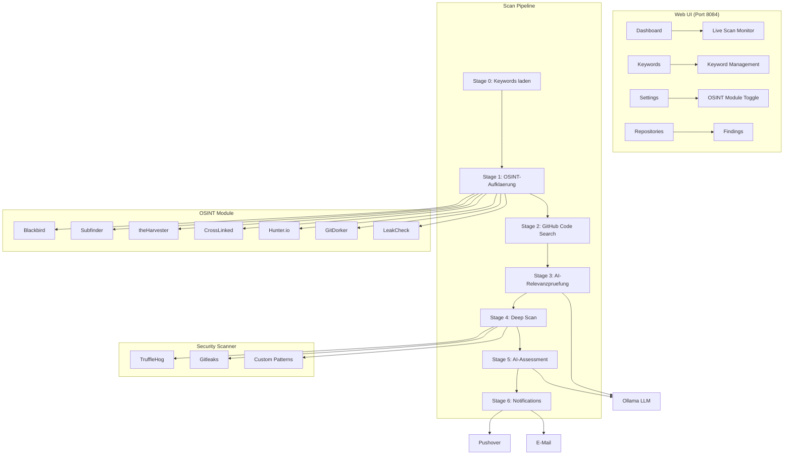
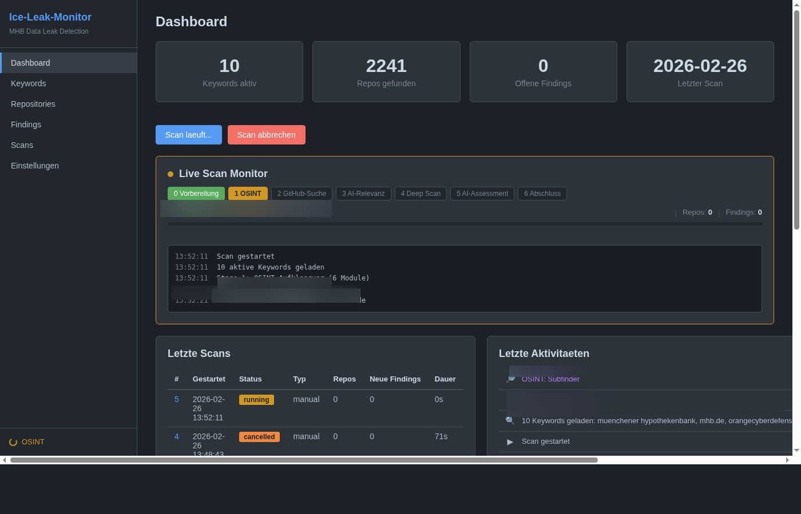
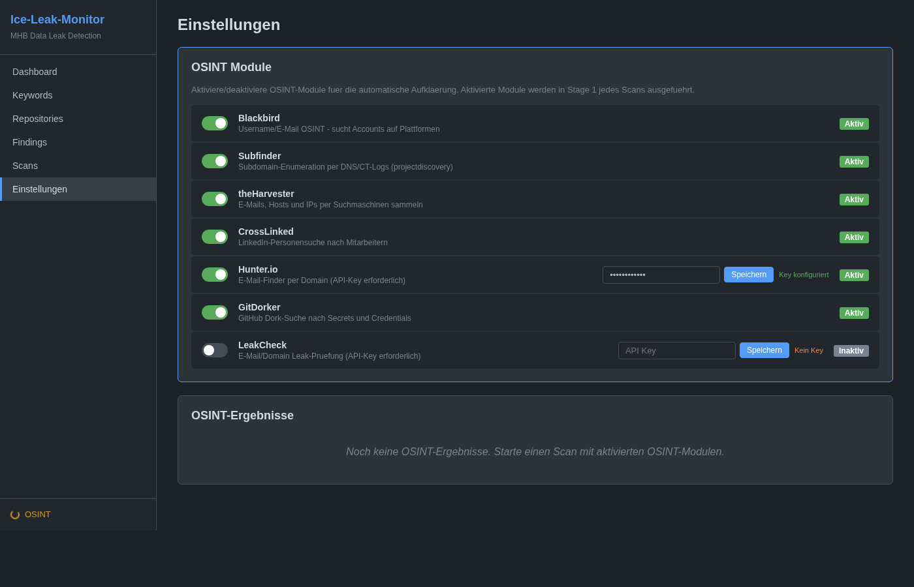
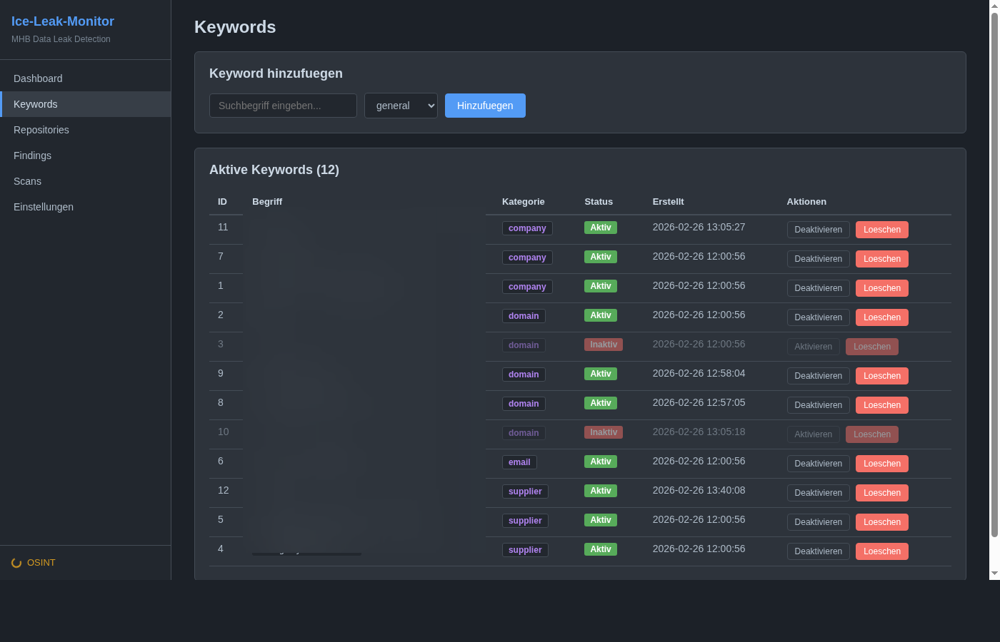
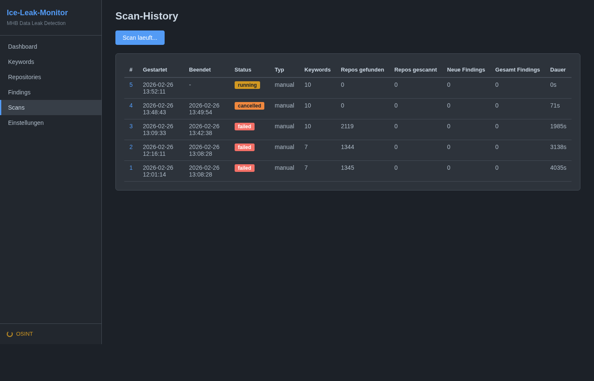
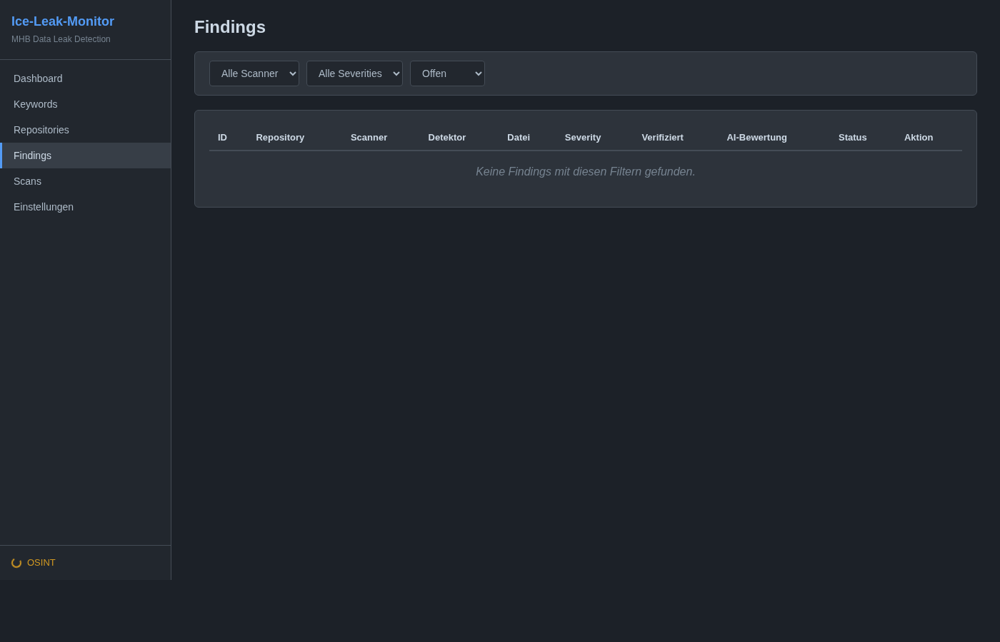

<!-- manually-curated -->

# Ice-Leak-Monitoring
{: .fs-9 }

Automatisierte GitHub Data Leak Detection mit OSINT-Aufklaerung und KI-Bewertung.
{: .fs-6 .fw-300 }

[GitHub Repository](https://github.com/icepaule/Ice-Leak-Monitoring){: .btn .btn-primary .fs-5 .mb-4 .mb-md-0 .mr-2 }

---

## Uebersicht

Ice-Leak-Monitor ist ein vollautomatisches System zur Erkennung von Datenlecks auf GitHub. Es durchsucht GitHub Code Search nach sensiblen Informationen (Firmennamen, Domains, E-Mail-Adressen), fuehrt OSINT-Aufklaerung durch und bewertet Funde mittels KI-Analyse.

### Kernfunktionen

- **7-Stage Scan-Pipeline** mit Live-Monitoring im Web-Dashboard
- **7 OSINT-Module** (Blackbird, Subfinder, theHarvester, CrossLinked, Hunter.io, GitDorker, LeakCheck)
- **Multi-Scanner Deep Scan** (TruffleHog, Gitleaks, Custom Patterns)
- **KI-Relevanzpruefung** mit Ollama/LLM (MITRE ATT&CK, DORA, BaFin)
- **Automatischer Tages-Scan** mit Pushover und E-Mail-Benachrichtigungen
- **Dark-Mode Web-UI** mit Echtzeit-Fortschrittsanzeige

---

## Architektur



---

## Screenshots

### Dashboard mit Live Scan Monitor



Das Dashboard zeigt Statistiken, den Live Scan Monitor mit 7-Stage-Fortschritt, letzte Scans und Aktivitaeten.

### OSINT-Modul Einstellungen



Alle 7 OSINT-Module koennen per Toggle-Schalter aktiviert/deaktiviert werden. Fuer Hunter.io und LeakCheck werden API-Keys konfiguriert.

### Keyword-Verwaltung



Keywords werden nach Kategorie (Company, Domain, E-Mail, Supplier, Custom) verwaltet und koennen aktiviert/deaktiviert werden.

### Scan-Verlauf



Vollstaendige Scan-Historie mit Status, Repos, Findings und Dauer.

### Findings



Security-Findings mit Severity-Level, Scanner-Typ und KI-Bewertung.

---

## OSINT-Module

| Modul | Funktion | Input | Output |
|:------|:---------|:------|:-------|
| **Blackbird** | Account-Suche auf 200+ Plattformen | Username/E-Mail | Account-URLs |
| **Subfinder** | Subdomain-Enumeration per DNS/CT-Logs | Domains | Subdomains |
| **theHarvester** | E-Mail/Host/IP-Sammlung | Domains | E-Mails, Hosts, IPs |
| **CrossLinked** | LinkedIn-Personensuche | Firmennamen | Personen, Jobtitel |
| **Hunter.io** | E-Mail-Finder per Domain | Domains + API-Key | E-Mails, Patterns |
| **GitDorker** | GitHub Dork-Suche | Keywords + GitHub Token | Repos mit Secrets |
| **LeakCheck** | Datenleck-Pruefung | E-Mails/Domains + API-Key | Breach-Daten |

OSINT-Ergebnisse (neue E-Mails, Subdomains, Personennamen) fliessen automatisch als zusaetzliche Keywords in die GitHub-Suche ein.

---

## Scan-Pipeline

### 7-Stage Ablauf

| Stage | Name | Beschreibung |
|:------|:-----|:-------------|
| 0 | **Vorbereitung** | Aktive Keywords aus DB laden |
| 1 | **OSINT** | Alle aktivierten OSINT-Module ausfuehren |
| 2 | **GitHub-Suche** | GitHub Code Search fuer alle Keywords |
| 3 | **AI-Relevanz** | KI-Bewertung der Repos (Ollama) |
| 4 | **Deep Scan** | TruffleHog + Gitleaks + Custom Patterns |
| 5 | **AI-Assessment** | KI-Bewertung der Findings (MITRE/DORA/BaFin) |
| 6 | **Abschluss** | Benachrichtigungen, Scan finalisieren |

### Scanner

| Scanner | Erkennung | Methode |
|:--------|:----------|:--------|
| **TruffleHog** | API-Keys, Tokens, Passwoerter | Remote Git-Scan |
| **Gitleaks** | Secrets, Credentials | Lokaler Clone-Scan |
| **Custom Patterns** | Benutzerdefinierte Keywords | Regex-basiert |

---

## Technologie-Stack

| Komponente | Technologie |
|:-----------|:------------|
| Backend | FastAPI (Python 3.12) |
| Datenbank | SQLite mit WAL-Modus |
| ORM | SQLAlchemy 2.0 |
| Frontend | Jinja2, Vanilla JS, Canvas Charts |
| Scheduler | APScheduler (taeglich 03:00 UTC) |
| AI | Ollama (llama3 / beliebiges LLM) |
| Container | Docker, Docker Compose |
| Benachrichtigungen | Pushover, SMTP E-Mail |

---

## Installation

### Voraussetzungen

- Docker >= 24.0, Docker Compose >= 2.20
- GitHub Personal Access Token
- Optional: Ollama Server, Pushover, SMTP, Hunter.io/LeakCheck API-Keys

### Quick Start

```bash
# 1. Repository klonen
git clone https://github.com/icepaule/Ice-Leak-Monitoring.git
cd Ice-Leak-Monitoring

# 2. Konfiguration erstellen
cp .env.example .env
nano .env  # GitHub Token eintragen

# 3. Starten
docker compose up -d --build

# 4. Dashboard oeffnen
open http://localhost:8084
```

### Konfiguration (.env)

```ini
# Pflicht
GITHUB_TOKEN=ghp_xxxxxxxxxxxxxxxxxxxx

# Optional: Benachrichtigungen
PUSHOVER_USER_KEY=your_key
PUSHOVER_API_TOKEN=your_token

# Optional: AI
OLLAMA_BASE_URL=http://ollama-host:11434
OLLAMA_MODEL=llama3

# Zeitplan
SCAN_SCHEDULE_HOUR=3
TZ=Europe/Berlin
```

Vollstaendige Dokumentation: [Installationsanleitung](https://github.com/icepaule/Ice-Leak-Monitoring/blob/main/docs/INSTALL.md) | [Benutzerhandbuch](https://github.com/icepaule/Ice-Leak-Monitoring/blob/main/docs/BENUTZERHANDBUCH.md) | [Adminhandbuch](https://github.com/icepaule/Ice-Leak-Monitoring/blob/main/docs/ADMINHANDBUCH.md)

---

## API-Endpunkte

| Methode | Pfad | Beschreibung |
|:--------|:-----|:-------------|
| POST | `/api/scans/trigger` | Scan starten |
| POST | `/api/scans/cancel` | Scan abbrechen |
| GET | `/api/scans/progress` | Live-Fortschritt |
| GET | `/api/stats` | Statistiken |
| POST | `/settings/modules/{key}/toggle` | OSINT-Modul an/aus |
| POST | `/settings/modules/{key}/config` | API-Key speichern |

---

## Deployment

Laeuft als Docker-Container auf dem NUC im internen Netzwerk. Automatischer taegliger Scan um 03:00 UTC mit Pushover-Benachrichtigung bei neuen Findings.

```
NUC (Docker Host)
 +-- iceleakmonitor (Port 8084)
     +-- SQLite DB (/data/iceleakmonitor.db)
     +-- TruffleHog, Gitleaks, Subfinder, Blackbird
     +-- theHarvester, CrossLinked (Python)
     +-- Ollama Connection (Remote LLM)
```
