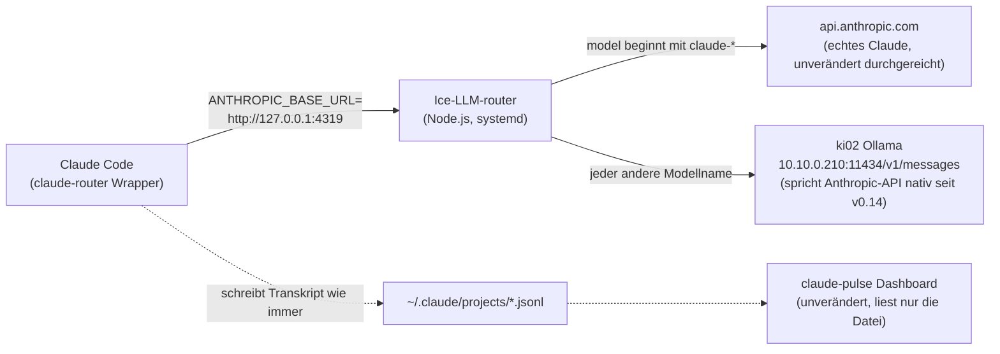

# Ice-LLM-router

[View on GitHub](https://github.com/icepaule/Ice-LLM-router){: .btn .btn-primary .fs-5 .mb-4 .mb-md-0 .mr-2 }

***

**Ice-LLM-router**


Schlanker Modell-Router für Claude Code: erlaubt, innerhalb einer laufenden
Session per `/model <name>` zwischen echten Claude-Modellen und lokalen
Ollama-Modellen (auf ki02, `10.10.0.210`) hin- und herzuschalten — **ohne**
die Session zu verlassen, und **ohne** dass sich am bestehenden
[claude-pulse](https://github.com/nikitadoudikov/claude-pulse)-Dashboard
irgendetwas ändern muss.

## Warum das funktioniert

- Claude Code liest `ANTHROPIC_BASE_URL` nur beim **Start** ein (Neustart
  nötig, um den Endpoint zu wechseln) — aber `/model` kann **innerhalb**
  einer laufenden Session beliebig oft wechseln, solange der Endpoint gleich
  bleibt. Zeigt der Endpoint auf einen eigenen Proxy statt direkt auf
  Anthropic, validiert Claude Code Modellnamen nicht mehr strikt gegen die
  offizielle Liste.
- Ollama unterstützt seit **v0.14** die Anthropic-Messages-API nativ
  (`/v1/messages`). Es ist also **keine Format-Übersetzung** nötig — nur
  reines Routing nach dem `model`-Feld im Request-Body.
- claude-pulse liest ausschließlich die lokalen Transkript-Dateien, die
  Claude Code sowieso unter `~/.claude/projects/` schreibt — unabhängig
  davon, welches Modell tatsächlich geantwortet hat. Dadurch ist claude-pulse
  von diesem Projekt komplett unberührt.

## Architektur



## Installation

```bash
# 1. Router-Dateien nach /opt/ice-llm-router legen
mkdir -p /opt/ice-llm-router
cp router.js /opt/ice-llm-router/
cp claude-router.sh /opt/ice-llm-router/
chmod +x /opt/ice-llm-router/claude-router.sh
ln -sf /opt/ice-llm-router/claude-router.sh /usr/local/bin/claude-router

# 2. Als systemd-Service einrichten
cp systemd/ice-llm-router.service /etc/systemd/system/
systemctl daemon-reload
systemctl enable --now ice-llm-router.service
```

## Nutzung

```bash
claude-router                              # normale interaktive Session, Router aktiv
claude-router -p --model devstral-small-2 "..."   # non-interaktiver Test
```

Innerhalb der Session einfach `/model devstral-small-2` (oder ein anderes
auf ki02 installiertes Modell) zum Wechseln.

**Wichtig — Opt-in, nicht global:** `ANTHROPIC_BASE_URL` wird **nur** für die
Prozesse gesetzt, die über `claude-router` gestartet werden. Der normale
Befehl `claude` (ohne Wrapper) bleibt vollständig unberührt und geht immer
direkt an Anthropic — fällt der Router oder ki02 aus, ist die normale
Claude-Code-Nutzung nicht betroffen.

## Getestet (17.07.2026)

| Test | Ergebnis |
|---|---|
| Ollama natives `/v1/messages` (Text) | ✅ funktioniert |
| Ollama natives `/v1/messages` (Tool-Use) mit `qwen2.5-coder:14b` | ❌ liefert nur unstrukturierten Text statt `tool_use`-Block |
| Ollama natives `/v1/messages` (Tool-Use) mit `devstral-small-2` | ✅ korrekter `tool_use`-Block + `tool_result`-Round-Trip |
| Router-Passthrough zu echtem Anthropic (`claude-*`) | ✅ erreicht nachweislich `api.anthropic.com` |
| Router-Routing zu Ollama (Nicht-`claude-*`-Namen) | ✅ |
| Kompletter End-zu-Ende-Test über echtes Claude Code (`claude-router -p --model devstral-small-2`) | ✅ |
| claude-pulse zeigt die Session danach korrekt an | ✅ (Modellname, Tokens, eigene Session-Datei) |

## Bekannte Einschränkungen

- **Modellwahl ist kritisch:** Nicht jedes lokale Modell unterstützt
  strukturiertes Tool-Calling über Ollamas Anthropic-Endpoint. Für
  Coding-Agent-Nutzung (Claude Code braucht Tool-Use für praktisch jede
  Aktion) ist bisher nur **`devstral-small-2`** verifiziert. Andere Modelle
  vor Produktivnutzung selbst gegenprüfen (Test-Snippet siehe unten).
- **Kaltstart-Zeit:** `devstral-small-2` (23,57 Mrd. Parameter) braucht auf
  ki02 (2× RTX 3060) rund **4 Minuten** Kaltstart, bis das erste Modell
  geladen ist. Danach (warm) Antwortzeiten im Sekundenbereich. Ollamas
  Standard-`keep_alive` hält das Modell 5 Minuten warm nach der letzten
  Anfrage — bei längeren Pausen erneuter Kaltstart.
- **Kostenanzeige in claude-pulse ist irreführend für lokale Modelle:**
  claude-pulse kennt die Preise nur für Anthropic-Modelle und rechnet
  unbekannte Modellnamen mit dem Sonnet-Default-Tarif — die angezeigten
  "Kosten" für lokale Sessions sind rein kosmetisch falsch (lokale Nutzung
  ist tatsächlich kostenlos).
- Kein Streaming-spezifischer Test durchgeführt (nur Standard-Requests) —
  bei Bedarf vor Nutzung mit langen Antworten prüfen.

### Tool-Use-Fähigkeit eines Modells selbst testen

```bash
curl -s -X POST http://10.10.0.210:11434/v1/messages \
  -H "Content-Type: application/json" -H "x-api-key: dummy" \
  -H "anthropic-version: 2023-06-01" \
  -d '{"model":"<MODELLNAME>","max_tokens":100,
       "tools":[{"name":"get_weather","description":"Get weather",
       "input_schema":{"type":"object","properties":{"city":{"type":"string"}},"required":["city"]}}],
       "messages":[{"role":"user","content":"Weather in Munich? Use the tool."}]}'
```
Erfolg = Antwort enthält `"type":"tool_use"` und `"stop_reason":"tool_use"`.
Fehlschlag = nur ein `"type":"text"`-Block mit hallizuniertem JSON-Text.

## Revert / Deinstallation

Reiner Betrieb ohne `claude-router` ist bereits der Normalzustand — nichts
muss zurückgesetzt werden, solange der Wrapper nicht benutzt wird. Um den
Router komplett zu entfernen:

```bash
systemctl disable --now ice-llm-router.service
rm /etc/systemd/system/ice-llm-router.service
rm /usr/local/bin/claude-router
rm -rf /opt/ice-llm-router
systemctl daemon-reload
```

Backups des Config-Stands vor der Einrichtung (17.07.2026, zur Sicherheit,
falls doch irgendwo Seiteneffekte auftauchen) liegen unter
`/opt/ice-llm-router/backups/` auf NUC-HA (`~/.claude/settings.json`,
`~/.claude-pulse.json`, `~/.claude-pulse/rules.json` — keiner davon wurde
durch dieses Projekt tatsächlich verändert, da der Router rein Opt-in über
den Wrapper läuft).

## Dateien in diesem Repo

- `router.js` — der eigentliche Router (Node.js, keine Dependencies)
- `claude-router.sh` — Wrapper-Skript, startet `claude` mit gesetztem
  `ANTHROPIC_BASE_URL`
- `systemd/ice-llm-router.service` — systemd-Unit für den Router-Prozess

