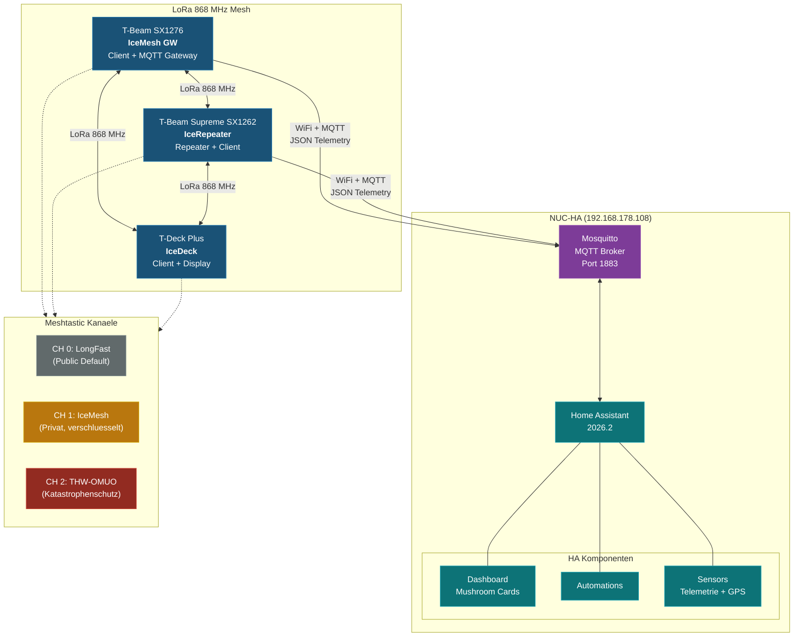

# Ice-MTastik

[View on GitHub](https://github.com/icepaule/Ice-MTastik){: .btn .btn-primary .fs-5 .mb-4 .mb-md-0 .mr-2 }

***

Meshtastic-basiertes LoRa-Mesh-Netzwerk mit vollstaendiger Home Assistant Integration ueber MQTT. Migration von MeshCore auf Meshtastic mit 3 Geraeten, lokaler Mosquitto-MQTT-Anbindung und dediziertem THW-Kanal fuer den Katastrophenschutz.

## Architektur



## Geraete

| Geraet | Node Name | Node ID | Hardware | Rolle | MQTT | Firmware |
|--------|-----------|---------|----------|-------|------|----------|
| T-Beam SX1276 | IceMesh GW | `!a` | TTGO T-Beam v1.1 | Client + MQTT Gateway | WiFi -> Mosquitto | 2.7.15 |
| T-Beam Supreme SX1262 | IceRepeater | `!b` | T-Beam Supreme | Repeater + Client | WiFi -> Mosquitto | 2.7.15 |
| T-Deck Plus | IceDeck | `!c` | LilyGO T-Deck Plus | Client | - (nur LoRa) | 2.7.15 |

> **Hinweis:** Die tatsaechlichen Node IDs werden nach dem ersten Flashen vergeben und muessen hier aktualisiert werden.

## Kanaele

| Index | Name | Zweck | Verschluesselung | Uplink MQTT |
|-------|------|-------|-------------------|-------------|
| 0 | LongFast | Oeffentlicher Default-Kanal | Standard (AQ==) | Ja |
| 1 | IceMesh | Privater Mesh-Kanal | PSK (individuell) | Ja |
| 2 | THW-OMUO | Katastrophenschutz / THW | PSK (THW-spezifisch) | Nein |

## Features

- **MQTT JSON Telemetrie** - Alle Sensordaten (Temperatur, Luftfeuchtigkeit, Luftdruck, Spannung) als JSON ueber MQTT an Home Assistant
- **Batterie-Monitoring** - Echtzeit-Ueberwachung der Akkustande aller Mesh-Nodes in HA
- **GPS-Tracking** - Positionsdaten aller Geraete auf der HA-Karte (device_tracker)
- **Nachrichten senden/empfangen** - Bidirektionale Textnachrichten zwischen HA und Mesh-Netzwerk
- **THW-Notfallkanal** - Dedizierter verschluesselter Kanal fuer Kommunikation im Katastrophenschutz (THW OV Muelheim-Uhlenhorst/Oberhausen)
- **Automatisierungen** - Warnungen bei niedrigem Akku, Verbindungsverlust, Notfallnachrichten
- **Mushroom Cards Dashboard** - Uebersichtliche Darstellung aller Nodes, Telemetrie und Nachrichten

## MQTT Topic-Struktur

```
msh/EU_868/2/json/LongFast/!<node_id>     # Telemetrie + Position
msh/EU_868/2/json/IceMesh/!<node_id>       # Privater Kanal
msh/EU_868/2/json/LongFast/!<node_id>/tx   # Nachrichten an Mesh senden
```

## Schnellstart

### Voraussetzungen

- Home Assistant (>= 2026.2) mit MQTT-Integration
- Mosquitto MQTT Broker (lokal auf NUC-HA oder als HA Add-on)
- Meshtastic-Geraete mit Firmware >= 2.7.15
- Meshtastic Python CLI oder App fuer Erstkonfiguration

### 1. Geraete flashen und konfigurieren

Detaillierte Anleitungen fuer jedes Geraet befinden sich in `docs/`:

```
docs/
  tbeam-gw-setup.md        # T-Beam Gateway Konfiguration
  tbeam-supreme-setup.md   # T-Beam Supreme Repeater Setup
  tdeck-setup.md           # T-Deck Plus Setup
  mqtt-config.md           # MQTT Broker + HA Integration
  channels.md              # Kanal-Konfiguration
```

### 2. MQTT Broker konfigurieren

Mosquitto muss Meshtastic-Verbindungen akzeptieren:

```yaml
# Mosquitto Konfiguration
listener 1883
allow_anonymous false
password_file /mosquitto/config/password_file
```

Meshtastic-Zugangsdaten anlegen:

```bash
mosquitto_passwd -b /mosquitto/config/password_file meshcore <MQTT_PASSWORD>
```

### 3. Meshtastic MQTT aktivieren

Auf jedem MQTT-faehigen Geraet (GW + Repeater):

```bash
meshtastic --set mqtt.enabled true
meshtastic --set mqtt.address 192.168.178.108
meshtastic --set mqtt.username meshcore
meshtastic --set mqtt.password <MQTT_PASSWORD>
meshtastic --set mqtt.json_enabled true
meshtastic --set mqtt.tls_enabled false
```

### 4. WiFi konfigurieren

```bash
meshtastic --set network.wifi_enabled true
meshtastic --set network.wifi_ssid "<WIFI_SSID>"
meshtastic --set network.wifi_psk "<WIFI_PSK>"
```

### 5. Home Assistant konfigurieren

Die HA-Konfigurationsdateien liegen in `homeassistant/`:

```
homeassistant/
  mqtt_sensors.yaml        # MQTT Sensor-Definitionen
  automations.yaml          # Automatisierungen
  dashboard.yaml            # Mushroom Cards Dashboard
```

## Dashboard Screenshots

> **TODO:** Screenshots des HA-Dashboards hier einfuegen

```
screenshots/
  dashboard-overview.png    # Gesamtuebersicht
  node-details.png          # Node-Detailansicht
  map-tracking.png          # GPS-Karte
  messages.png              # Nachrichtenverlauf
```

## Projektstruktur

```
Ice-MTastik/
  README.md                 # Diese Datei
  configs/                  # Meshtastic Device-Konfigurationen
  docs/                     # Detaillierte Anleitungen
  homeassistant/            # HA Konfiguration (Sensoren, Automations, Dashboard)
  scripts/                  # Hilfs-Skripte (Provisioning, Backup, etc.)
```

## Tech Stack

| Komponente | Version / Details |
|------------|-------------------|
| Meshtastic Firmware | 2.7.15 |
| Home Assistant | 2026.2 |
| MQTT Broker | Mosquitto (lokal, NUC-HA) |
| MQTT Format | JSON (native Meshtastic JSON-Ausgabe) |
| Dashboard | Mushroom Cards |
| LoRa Frequenz | 868 MHz (EU_868) |
| LoRa Preset | LONG_FAST |
| Hardware | T-Beam v1.1, T-Beam Supreme, T-Deck Plus |

## Migration von MeshCore

Dieses Projekt ersetzt die vorherige MeshCore-basierte Loesung (`IceMeshCore`). Gruende fuer die Migration:

- **Meshtastic** bietet native MQTT-JSON-Unterstuetzung ohne Custom-Firmware
- Groessere Community und bessere Hardware-Kompatibilitaet
- Integrierte Kanalverwaltung mit Verschluesselung
- Offizieller HA-Support ueber MQTT Discovery
- THW/BOS-Kompatibilitaet durch standardisiertes Protokoll

## Lizenz

MIT License - siehe [LICENSE](LICENSE)

## Autor

**icepaule** - [github.com/icepaule](https://github.com/icepaule)

***

*Ice-MTastik - Meshtastic LoRa Mesh fuer Home Assistant*
