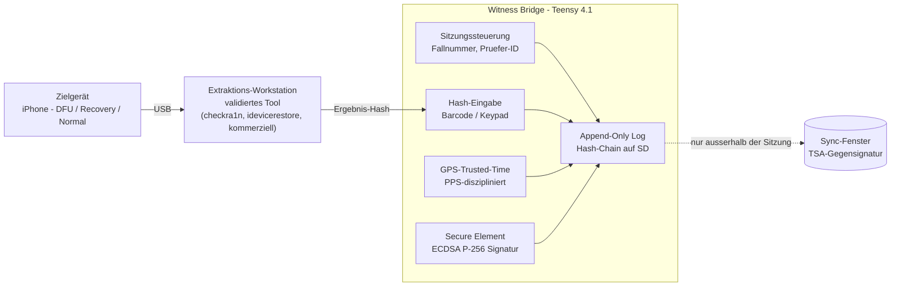
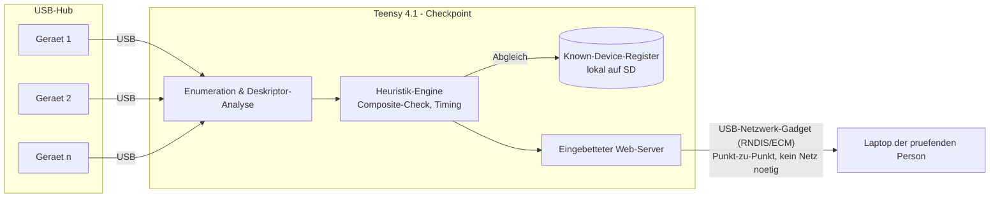

# Ice-USB-Witness-Bridge

[View on GitHub](https://github.com/icepaule/Ice-USB-Witness-Bridge){: .btn .btn-primary .fs-5 .mb-4 .mb-md-0 .mr-2 }

***

**Ice-USB-Witness-Bridge**


Ein eigenständiges, Teensy-4.1-basiertes Gerät für forensische Begleitprotokollierung und USB-Geräte-Triage — unabhängig, manipulationssicher und ohne Abhängigkeit von einem Heim- oder Firmennetz.

> **Status:** Firmware-Grundgerüst läuft auf echter Teensy-4.1-Hardware (Sitzungssteuerung, Hash-Chain, SD-Log, verifiziert). GPS/PPS, Secure Element und die USB-Hub-Triage sind noch nicht umgesetzt.

## Inhalt

- [Zielsetzung](#zielsetzung)
- [Technische Grenzen](#technische-grenzen)
- [Architektur — Zeugenprotokoll](#architektur--zeugenprotokoll)
- [Ausbaustufen](#ausbaustufen)
- [USB-Hub-Triage & Anomalieerkennung](#usb-hub-triage--anomalieerkennung)
- [Bedienung ohne Netzwerk-Infrastruktur](#bedienung-ohne-netzwerk-infrastruktur)
- [Hardware](#hardware)
- [Firmware](#firmware)
- [Labor-Modus](#labor-modus)
- [Log-Format](#log-format)
- [Kryptografie & Zeit](#kryptografie--zeit)
- [Datenschutz & Aufbewahrung](#datenschutz--aufbewahrung)
- [Governance-Checkliste vor Produktiveinsatz](#governance-checkliste-vor-produktiveinsatz)
- [Roadmap](#roadmap)

## Zielsetzung

Witness Bridge begleitet eine forensische Untersuchung als unabhängige zweite Instanz. Während die eigentliche Extraktion mit einem etablierten, validierten Werkzeug auf der Prüf-Workstation läuft, führt Witness Bridge parallel ein eigenständiges, kryptografisch versiegeltes Sitzungsprotokoll: wer, wann, welcher Fall, welche Hashes, welche Ereignisse.

Die Unabhängigkeit von der Workstation ist der eigentliche Wert. Ein Protokoll, das dieselbe Maschine schreibt, die auch extrahiert, ist als Nachweis schwächer als ein zweites, getrenntes System mit eigener Zeitquelle und eigenem Schlüssel.

**Kernprinzip:** Trennung von Durchführung und Bezeugung. Die Workstation extrahiert. Witness Bridge bezeugt, signiert und versiegelt — unabhängig, offline-fähig, auditierbar.

## Technische Grenzen

Aktuelle iPhones (A12 Bionic und neuer, ab iPhone XS) sind von keinem öffentlich bekannten BootROM-Exploit betroffen. Der DFU-Modus ist ein reines Firmware-Flash-Protokoll; ohne einen ungepatchten SecureROM-Exploit lässt sich darüber weder Verschlüsselung umgehen noch Gerätezugriff erzwingen.

**Kein Bypass-Werkzeug.** Witness Bridge extrahiert, entsperrt oder analysiert keine Geräteinhalte. Es dokumentiert ausschließlich den Prozess und die Ergebnis-Hashes eines bereits autorisierten, mit anderen Mitteln durchgeführten Zugriffs.

## Architektur — Zeugenprotokoll

Das Zielgerät kommuniziert ausschließlich mit der Extraktions-Workstation. Witness Bridge sitzt daneben, nicht dazwischen: Prüfer:in eröffnet die Sitzung, scannt Fallnummer und die von der Workstation erzeugten Ergebnis-Hashes ein, und Witness Bridge verkettet jeden Eintrag kryptografisch mit dem vorherigen — zeitlich verankert über eine GPS-disziplinierte, manipulationsresistente Uhrzeit.



Ein echter, transparenter USB-Inline-Tap zwischen Workstation und Gerät erfordert dedizierte Analyzer-Hardware und würde, falsch implementiert, selbst zum Risiko für die Integrität der Extraktion werden. Die getrennte Zeugen-Rolle liefert den forensischen Mehrwert ohne dieses Risiko.

## Ausbaustufen

| Stufe | Umsetzung | Beschreibung |
|---|---|---|
| **A — Zeugenprotokoll** | Jetzt umsetzbar | Sitzungs-, Hash- und Zeit-Protokollierung. Nutzt ausschließlich native Teensy-4.1-Fähigkeiten (SD, RTC, USB-Host für Scanner). Geringes Risiko, hoher Nachweiswert. |
| **B — Gespiegelter USB-Mitschnitt** | Forschung / später | Echter Protokoll-Mitschnitt über einen Hub mit Monitor-Port, ausgewertet über den Teensy-USB-Host-Controller. Nur nach validierter Stufe A sinnvoll. |

## USB-Hub-Triage & Anomalieerkennung

Der Host-Controller des Teensy 4.1 sieht ohnehin jedes Gerät hinter jedem Port eines angeschlossenen Hubs — das ist eine Grundeigenschaft von USB, keine Zusatzfunktion. Damit lässt sich Witness Bridge um ein zweites Modul erweitern: eine Geräte-Triage mit Abgleich gegen ein Known-Device-Register und Heuristiken gegen bekannte HID-Injection-Hardware.

### Checkpoint-Modus — sofort umsetzbar

Der Hub hängt ausschließlich am Teensy, nicht an einer produktiven Workstation — etwa als Prüfstation für gefundene oder eingeschickte USB-Sticks, bevor sie überhaupt in die Nähe eines echten Rechners kommen. Der Teensy enumeriert jedes angeschlossene Gerät, liest Deskriptoren aus, wendet Heuristiken an und meldet pro Gerät einen Status. Da nie ein produktives System am selben Bus hängt, ist das Risiko minimal.

### Inline-HID-Firewall — Stufe C, deutlich komplexer

Für Echtzeit-Schutz einer aktiv genutzten Workstation müsste der Teensy tatsächlich dazwischen sitzen: Host-Port zum untersuchten Gerät/Hub, nativer USB-Port zur Workstation, dort als HID-Passthrough (Tastatur/Maus) emuliert — jeder Report wird live bewertet, bevor er weitergereicht wird. Massenspeicher-Geräte sollten hier bewusst **nicht** transparent durchgereicht, sondern standardmäßig blockiert oder nur nach manueller Freigabe im Nur-Lese-Modus erlaubt werden.



### Erkennungsheuristiken

| Muster | Erkennungsmethode | Zielt auf |
|---|---|---|
| Composite HID + Storage auf einem Gerät | Interface-Deskriptor-Prüfung bei Enumeration | Rubber Ducky, Bash Bunny, O.MG Cable |
| VID/PID nicht im Known-Device-Register | Abgleich gegen gepflegte Positivliste | generische Nachbauten |
| Verstümmelte/fehlende String-Deskriptoren | String-Deskriptor-Validierung | Billig-Klone |
| Tastatureingabe ohne menschliche Variabilität | Statistische Analyse der Inter-Keystroke-Zeit (Keystroke-Dynamics) | skriptgesteuerte HID-Injection |
| Mausbewegung streng periodisch, kein Klick/Scroll | Bewegungsmuster-Analyse der HID-Reports | Mouse-Jiggler |
| Wiederholtes schnelles Neu-Enumerieren | Frequenzanalyse der Enumeration-Events | instabile/manipulierte Firmware |

Für rekonstruierte Tastatureingaben lässt sich zusätzlich eine einfache Signaturliste führen (z. B. `powershell`, `IEX(New-Object`, `certutil -urlcache`) — das ist eine heuristische Zusatzschicht, keine Garantie. Der harte technische Boden ist die Deskriptor-Analyse; alles Verhaltensbasierte liefert Wahrscheinlichkeiten, keine Beweise, und sollte im Interface auch so dargestellt werden.

> **Mouse-Jiggler-Erkennung ist Mitarbeiterüberwachung.** Sie erfasst faktisch Aktivitäts-/Anwesenheitsverhalten von Personen und ist rechtlich eine andere Kategorie als Malware-Erkennung — in Deutschland vermutlich ein Mitbestimmungstatbestand nach § 87 BetrVG mit eigener Rechtsgrundlage. Als eigenes, standardmäßig deaktiviertes Modul führen, nicht stillschweigend in die Security-Funktion einbetten (Zweckbindung, Art. 5 Abs. 1 lit. b DSGVO).

## Bedienung ohne Netzwerk-Infrastruktur

Witness Bridge ist als portables Gerät gedacht und darf nicht von einem bestimmten Heim- oder Firmennetz abhängen. Deshalb kein Cloud- oder Broker-Anschluss — die Auswertung läuft direkt auf dem Gerät:

1. **Primär — USB-Netzwerk-Gadget:** Der native USB-Port des Teensy meldet sich beim Laptop der prüfenden Person als eigenes Netzwerkinterface (RNDIS/CDC-ECM) an. Punkt-zu-Punkt-Verbindung über Link-Local-Adressierung, keine Infrastruktur nötig, funktioniert an jedem Ort.
2. **Optional — Ethernet:** Der native Ethernet-Port des Teensy 4.1 kann zusätzlich in ein vor Ort vorhandenes Netz eingebunden werden, falls gewünscht.
3. **Fallback — Offline-Export:** Für Archiv-/Aktenzwecke schreibt das Gerät einen in sich geschlossenen statischen HTML-Bericht auf die SD-Karte, der in jedem Browser ohne laufende Verbindung zum Gerät geöffnet werden kann.

Das Known-Device-Register liegt lokal auf der SD-Karte als einfache Datei und wird über das Web-Interface oder einen manuellen Import (USB-Stick) aktualisiert — ohne Abhängigkeit von einer externen Datenbank.

## Hardware

| Komponente | Zweck | Beispiel |
|---|---|---|
| Teensy 4.1 | Kernsteuerung, USB-Host, SD-Slot, gepufferte RTC | PJRC |
| GPS-Modul mit PPS | Unabhängige, manipulationsresistente Zeitquelle | u-blox NEO-M8N/M9N |
| Secure Element | ECDSA-P256-Signatur, privater Schlüssel hardware-gebunden | Microchip ATECC608A |
| Industrietaugliche microSD | Append-Only-Log-Speicher, AES-256 auf Feldebene | pSLC-Karte |
| USB-Barcode-/QR-Scanner | Manipulationsarme Hash-Eingabe statt Tippen | HID-Scanner am USB-Host-Port |
| Tamper-evident-Gehäuse | Physischer Schutz, verplombbar | verplombtes Gehäuse + Sabotageschalter |
| Sabotageschalter | Log-Eintrag bei Gehäuseöffnung | Mikroschalter an GPIO, Dauerstrom-Pufferung |
| Status-Display | Sitzungsstatus ohne Laptop einsehbar | kleines OLED (SSD1306) |
| PJRC-Ethernet-Kit (RJ45-Magjack) | nativer Ethernet-Port, nur für den Labor-Modus | wird unterseitig aufgelötet, in der Basisbestückung nicht enthalten |

*Aufbaufotos folgen, sobald die Hardware real existiert.*

## Firmware

PlatformIO-Projekt für Teensy 4.1. Aktueller Stand deckt Roadmap-Schritt 1 ab: Sitzungssteuerung, Hash-Chain, SD-Schreibpfad.

```
platformio.ini
src/
  main.cpp              Serielle Kommandozeile, verdrahtet die Module
lib/
  SessionController/     Sitzungszustand (offen/geschlossen, Fall-/Prüfer-ID)
  ChainLog/               SHA-256-Hash-Chain, schreibt JSONL auf die SD-Karte
  TimeSource/             Zeitquelle (aktuell: gepufferte RTC)
```

Bauen und flashen:

```sh
pio run -t upload
pio device monitor
```

Kommandos über die serielle Konsole (115200 Baud) — als Platzhalter für den späteren USB-Host-Barcode-Scanner:

| Befehl | Wirkung |
|---|---|
| `OPEN <case_id> <examiner_id>` | Sitzung eröffnen, Log-Datei `/cases/<case_id>.jsonl` anlegen |
| `HASH <sha256> <artefakt>` | Ergebnis-Hash als `hash_ingest`-Ereignis anhängen |
| `NOTE <text>` | Freitext-Ereignis anhängen |
| `CLOSE` | Sitzung beenden |
| `STATUS` | aktuellen Zustand, Sequenznummer und letzten Hash anzeigen |

**Bewusste Einschränkungen des Grundgerüsts**, damit Doku und Code nicht auseinanderlaufen:

- `time_source` steht standardmäßig auf `rtc_local` — die gepufferte RTC ist *keine* manipulationsresistente Quelle. Im Labor-Modus wechselt das Feld nach `NTPSYNC` auf `ntp_lab` (kalibriert, aber weiterhin nicht unabhängig verifiziert). Erst nach GPS/PPS-Integration (Roadmap Schritt 2) wechselt es auf `gps_pps`.
- `sig_ecdsa_p256` ist `null`. Ohne verbautes Secure Element gibt es noch keine Signatur — der Platz im Log-Format ist vorbereitet, wird aber nicht vorgetäuscht (Roadmap Schritt 3).
- Eingabe läuft über die serielle Konsole, nicht über den USB-Host-Barcode-Scanner aus der Stückliste.

## Labor-Modus

Zweite PlatformIO-Umgebung, `env:teensy41_lab`, statt eines Laufzeit-Schalters — bewusst als eigene Firmware-Variante, damit während einer echten Sitzung nie versehentlich ein Netzwerkstack aktiv sein kann. Wer die Feld-Firmware (`env:teensy41`) flasht, bekommt gar keinen Netzwerkcode mit einkompiliert.

Ergänzt gegenüber dem Grundgerüst:

- **Nativer Ethernet-Port** (QNEthernet, DHCP) — braucht das PJRC-Ethernet-Kit, siehe Hardware-Tabelle.
- **Automatischer NTP-Abgleich beim Boot**: sobald DHCP eine IP liefert, stellt die Firmware die RTC selbstständig gegen das per DHCP gelernte Default-Gateway (die meisten Router/pfSense-Setups beantworten NTP-Anfragen). Damit ist der Werkbank-Betrieb komplett seriell-frei möglich — kein USB-Kabel nötig, nur Strom + Ethernet.
- **Manueller SNTP-Client** weiterhin über `NTPSYNC <server_ip>` erreichbar — z. B. um gegen eine andere Quelle zu resynchronisieren (etwa eine interne NTP-IP, falls das Zielnetz externes NTP blockiert).
- **Rein lesender Status-Webserver** auf Port 80 — nur `GET`, keine schreibenden Endpunkte:
  - `/` — HTML-Übersicht mit Links auf alle Fall-Log-Dateien
  - `/status` — aktueller Sitzungsstatus als JSON, inkl. `link`, `ip`, `gateway`, `time_source`, `now_utc`
  - `/cases/<case_id>.jsonl` — Rohdaten einer Log-Datei

Bauen/flashen/beobachten:

```sh
pio run -e teensy41_lab -t upload
pio device monitor
```

Danach entweder über die serielle Konsole (`NETINFO`, `NTPSYNC <ip>`) oder rein über das Netz:

```sh
curl http://<teensy-ip>/status
```

Ohne Ethernet-Kit oder ohne Kabel bleibt der Link `getrennt` und die IP `0.0.0.0` — das ist der erwartete, sichere Ausfallzustand, kein Fehler in der Firmware. Schlägt der Auto-NTP-Abgleich fehl (z. B. Gateway beantwortet kein NTP), bleibt `time_source` auf `rtc_local` stehen; das ist über `/status` remote sichtbar, ganz ohne USB-Zugang.

> **Nicht für den Einsatz.** Der Labor-Modus ist ausschließlich für Werkbank, Kalibrierung und Entwicklung gedacht. Ein dauerhaft erreichbarer Webserver während einer echten Untersuchung widerspricht dem Air-Gap-Prinzip aus [Kryptografie & Zeit](#kryptografie--zeit) und vergrößert die Angriffsfläche unnötig. Für einen Fall wird ausschließlich `env:teensy41` geflasht.

## Log-Format

Jeder Eintrag ist mit dem vorherigen verkettet (Hash-Chain) und einzeln signiert. Ein nachträglich verändertes oder entferntes Ereignis bricht die Kette sichtbar.

```json
{
  "seq": 42,
  "ts_gps_utc": "2026-08-17T14:32:01.184Z",
  "case_id": "IR-XXXX-XXXX",
  "examiner_id": "EX-XXXX",
  "event": "hash_ingest",
  "detail": {
    "source_tool": "checkra1n",
    "artifact": "full_extraction.tar",
    "sha256": "..."
  },
  "prev_hash": "...",
  "entry_hash": "SHA256(prev_hash|seq|ts|case_id|examiner_id|event|detail)",
  "sig_ecdsa_p256": "..."
}
```

Ereignistypen umfassen mindestens: `session_open`, `session_close`, `hash_ingest`, `tamper_detected`, `examiner_note`. Das Format ist bewusst als JSON Lines gehalten — zeilenweise anhängbar, ohne die Datei neu zu schreiben.

## Kryptografie & Zeit

- **Zeitquelle:** GPS-PPS liefert UTC unabhängig von Netzwerk und Systemuhr der Workstation — nicht durch die untersuchende Person manipulierbar.
- **Signatur:** ECDSA P-256 im Secure Element, privater Schlüssel verlässt das Bauteil nie.
- **Verkettung:** jeder Eintrag referenziert den Hash des Vorgängers — nachträgliche Änderung bricht die Kette überprüfbar.
- **Externe Verankerung:** außerhalb der eigentlichen Sitzung, in einem definierten Sync-Fenster, wird der aktuelle Kettenstand bei einer Time-Stamping-Authority (RFC 3161) gegengezeichnet — das Gerät bleibt während der Untersuchung selbst offline/air-gapped.

## Datenschutz & Aufbewahrung

Witness Bridge speichert bewusst keine Geräteinhalte, sondern nur Metadaten und Hashes. Nach Fallabschluss und regulärer Übergabe des Logs in die Fallakte wird der Gerätespeicher sicher gelöscht (kryptografische Löschung durch Schlüsselvernichtung), um eine Vermischung zwischen Fällen auszuschließen.

## Governance-Checkliste vor Produktiveinsatz

Die folgenden Punkte sind organisatorische Voraussetzungen, keine technischen — sie ersetzen keine Rechts- oder Compliance-Beratung und müssen im jeweiligen Einsatzkontext verantwortet werden.

- [ ] Rechtsgrundlage für die Untersuchung des konkreten Geräts dokumentiert (z. B. Betriebsvereinbarung, Einzelfallfreigabe bei Mitarbeitendengeräten)
- [ ] Datenschutz-Folgenabschätzung mit der/dem Datenschutzbeauftragten abgestimmt
- [ ] Betriebsrat einbezogen, sofern Mitarbeitendengeräte betroffen sind
- [ ] Tool-Validierung mit dokumentierten Referenzfällen abgeschlossen
- [ ] Bei Einsatz im regulierten/Finanzsektor: Aufnahme in das ICT-Risikomanagement-Framework gemäß DORA Art. 5–16 (Asset-Inventar, Risikobewertung, Verantwortung der Geschäftsleitung)
- [ ] Einbindung in den Incident-Management-Prozess gemäß DORA Art. 17–23 (Klassifizierung, Nachweisführung, Meldefristen)
- [ ] Regelmäßige Funktions-/Resilienztests eingeplant, DORA Art. 24–27
- [ ] Lieferketten-/Open-Source-Review der verwendeten Bibliotheken, DORA Art. 28 ff.
- [ ] Freigabe durch IT-Security-Leitung, ggf. interne Revision
- [ ] Verfahrensschulung der Prüfer:innen, dokumentiert
- [ ] Malware-Erkennung und Jiggler-/Aktivitätserkennung strikt getrennt freigegeben, letztere nur mit eigener Betriebsvereinbarung

## Roadmap

1. Firmware-Grundgerüst: Sitzungssteuerung, Hash-Chain, SD-Schreibpfad — **erledigt**, verifiziert auf echter Hardware
1b. Labor-Modus (Ethernet, NTP-Kalibrierung, Status-Webserver) als eigene Firmware-Variante — **erledigt**, End-to-End-Test mit echtem Netz steht noch aus (Ethernet-Kit fehlt bisher)
2. GPS/PPS-Integration und Zeitquelle validieren
3. Secure-Element-Anbindung und Signaturpfad testen
4. USB-Netzwerk-Gadget (RNDIS/ECM) und eingebettetes Web-Interface
5. Gehäuse mit Sabotageschalter, Siegel-Konzept
6. Checkpoint-Modus: Enumeration, Heuristik-Engine, Known-Device-Register
7. Testreihe mit bekannten Referenzfällen zur Validierung
8. Governance-Freigabe einholen, dann erst Produktiveinsatz

---

*Entwurf, kein Ersatz für Rechts- oder Compliance-Beratung.*

