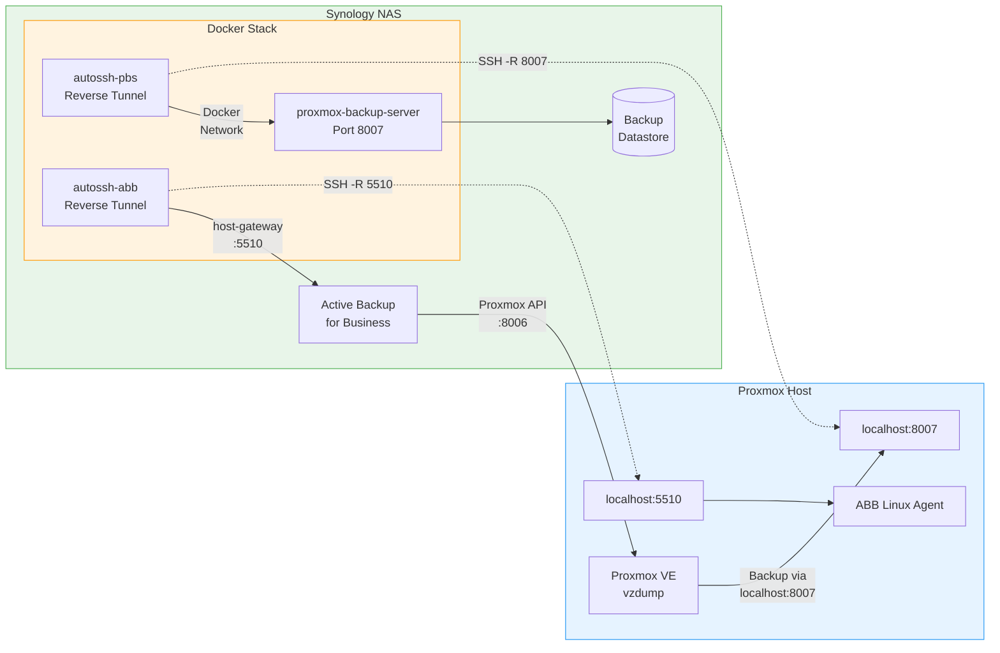
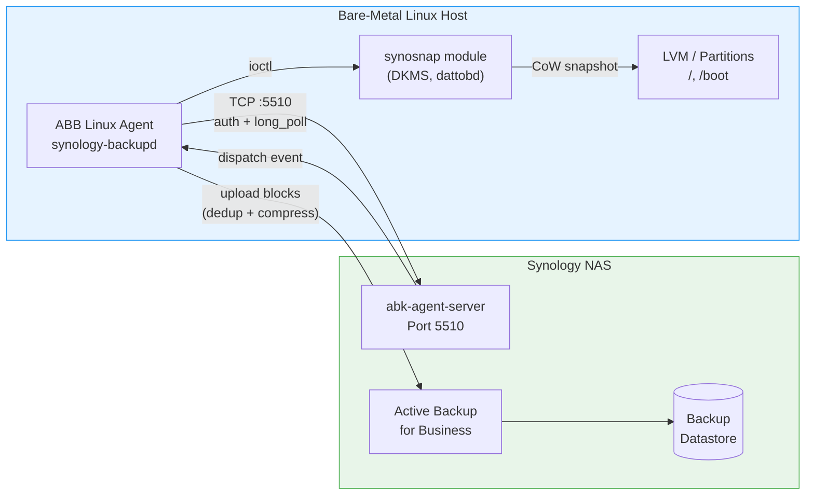

# IceBackup

[View on GitHub](https://github.com/icepaule/IceBackup){: .btn .btn-primary .fs-5 .mb-4 .mb-md-0 .mr-2 }

***

**IceBackup**

A multi-tier backup strategy using Synology Active Backup for Business (ABB) for both **Proxmox VE** hypervisors (with PBS) and **bare-metal Linux** hosts, backed by a Synology NAS.

## Architecture

### Proxmox VE: PBS + ABB via Reverse Tunnel



### Bare-Metal Linux: ABB Agent (Direct)



## Overview

| Tier | Method | Target | Frequency | Purpose |
|------|--------|--------|-----------|---------|
| **Tier 2** | PBS (incremental, dedup) | Proxmox VMs | Daily 01:00 | Fast VM-level backup |
| **Tier 3a** | ABB (hypervisor/agent) | Proxmox host | Weekly Sun 05:00 | Independent copy + bare-metal |
| **Tier 3b** | ABB Linux Agent | Bare-metal Linux | Daily 03:00 (weekdays) | Full host backup with snapshots |

**Proxmox challenge**: The Synology can reach the Proxmox host, but **not vice versa**. A **reverse SSH tunnel** from Synology to Proxmox enables push-mode backups via `localhost:8007`.

**Linux agent**: Bare-metal hosts with direct network access use the ABB Linux Agent with `synosnap` (dattobd-based) kernel module for block-level CoW snapshots. Supports LVM, ext4, btrfs, xfs.

## Documentation

### Proxmox PBS + ABB

- [Setup Guide](docs/01-setup.md) - Complete installation from scratch
- [Daily Operations](docs/02-operations.md) - Start, stop, monitor, manual backups
- [VM Restore](docs/03-restore-vm.md) - Restore individual VMs from PBS
- [Bare-Metal Restore](docs/04-restore-baremetal.md) - Full host recovery
- [ABB Integration](docs/05-abb-integration.md) - Active Backup for Business setup
- [Best Practices](docs/06-best-practices.md) - Retention, verification, secondary destinations
- [Troubleshooting](docs/07-troubleshooting.md) - Common issues and fixes
- [docker-compose.yml Reference](docs/08-docker-compose-reference.md) - Annotated compose file

### Bare-Metal Linux Agent

- [Linux Agent Setup](docs/09-linux-agent-bare-metal.md) - ABB on Debian/Ubuntu with synosnap, LVM, kernel 6.12+ support (Peppershade patch)

## Quick Start

```bash
# 1. Clone
git clone https://github.com/icepaule/IceBackup.git
cd IceBackup

# 2. For Proxmox PBS setup:
# See docs/01-setup.md

# 3. For bare-metal Linux agent:
# See docs/09-linux-agent-bare-metal.md
```

## Requirements

### Proxmox PBS Setup
- Synology NAS with DSM 7.2+
- Docker (Synology Container Manager)
- Proxmox VE 7.x or 8.x
- Active Backup for Business (free Synology package)
- SSH access between Synology and Proxmox host

### Bare-Metal Linux Agent
- Synology NAS with DSM 7.2+ and ABB
- Debian 12+ or Ubuntu 22.04+
- Direct network access to NAS (port 5510)
- Kernel 6.12+: [Peppershade synosnap patch](https://github.com/Peppershade/synosnap) required

## Stack

| Component | Image/Package | Purpose |
|-----------|--------------|---------|
| PBS | `ayufan/proxmox-backup-server` | Proxmox Backup Server (Docker) |
| autossh-pbs | `jnovack/autossh` | Reverse tunnel for PBS (port 8007) |
| autossh-abb | `jnovack/autossh` | Reverse tunnel for ABB agent (port 5510) |
| ABB Linux Agent | `synology-backupd` | Bare-metal host backup agent |
| synosnap | DKMS kernel module | Block-level CoW snapshots (dattobd-based) |

## License

MIT
