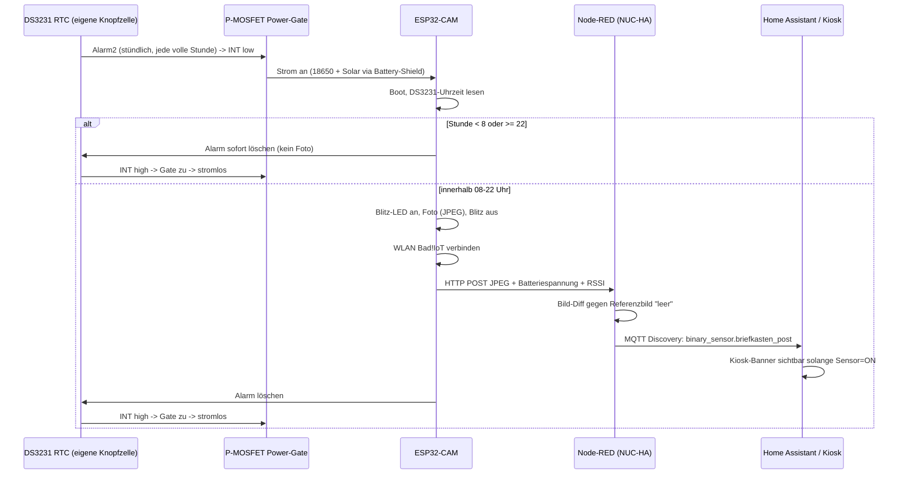

# IceBriefkasten

[View on GitHub](https://github.com/icepaule/IceBriefkasten){: .btn .btn-primary .fs-5 .mb-4 .mb-md-0 .mr-2 }

***

**IceBriefkasten**


Solar-/akkubetriebener ESP32-CAM am Briefkasten, der stündlich zwischen 08:00 und 22:00 Uhr
ein Foto macht und per Bildvergleich gegen ein Referenzbild ("leerer Briefkasten") erkennt,
ob Post eingeworfen wurde. Ergebnis geht per MQTT/Home-Assistant-Discovery in HA, inkl.
Dauer-Meldung auf dem Kiosk-Dashboard solange Post im Kasten liegt.

Kein Motion-getriggertes System (Briefkasten hat keinen Deckelsensor) — es wird bewusst
ein fester stündlicher Takt genutzt, damit die Kamera die meiste Zeit komplett stromlos
bleiben kann.

## Warum kein reiner ESP32-Deep-Sleep

Recherche vor dem Bau ([siehe unten](#recherche--vorarbeiten)) hat zwei Showstopper für
"ESP32-CAM Deep-Sleep + Solar/18650" ergeben:

1. Das AI-Thinker-Board zieht im Deep Sleep typischerweise mehrere **mA** statt der
   µA-Werte eines nackten ESP32-Chips (Onboard-LDO, Kamera-Power-Domain).
2. Günstige 18650-"Battery-Shields" (Powerbank-Stil mit Boost-Wandler) schalten bei zu
   niedrigem Ruhestrom oft automatisch ab, weil sie das als "Gerät abgezogen" werten —
   das würde den Wake-Zyklus komplett killen.

Ein bekanntes Referenzprojekt mit exakt diesem Ansatz (Pi Zero + Kamera + Deep Sleep +
Bildvergleich) ist nach ca. 2 Wochen am leeren Akku gescheitert und wurde auf reine
Reed-Sensoren umgestellt.

**Lösung hier: externes Hardware-Power-Gating.** Ein DS3231-RTC-Modul (eigene Knopfzelle,
µA-Bereich) schaltet per P-Kanal-MOSFET die komplette Stromversorgung zum ESP32-CAM hart
ab. Der ESP bootet stündlich komplett neu und ist danach komplett stromlos — kein
Deep-Sleep-Leck, kein Powerbank-Autoshutoff-Risiko. Die RTC übernimmt auch das
08–22-Uhr-Zeitfenster.

## Architektur

## Komponenten

- **Firmware** (`firmware/`): PlatformIO/Arduino, läuft auf ESP32-CAM (AI-Thinker).
  Jeder Boot ist ein kompletter Zyklus (Foto → Upload → RTC-Alarm löschen), kein
  `loop()`, keine Dauerverbindung.
- **Node-RED** (`docs/nodered-flow.md`): läuft auf NUC-HA, macht den eigentlichen
  Bildvergleich und die MQTT/HA-Discovery-Anbindung.
- **Home Assistant** (`docs/homeassistant.md`): Dashboard-Card + Kiosk-Banner, gekoppelt
  an `binary_sensor.briefkasten_post`.

## Netzwerk

- WLAN: `Bad!IoT` (VLAN 12), wie alle anderen Bad!IoT-Geräte
- MQTT: `10.10.12.100:1883`
- Zugangsdaten liegen NICHT im Repo (siehe `firmware/include/secrets.h.example`)

## Recherche / Vorarbeiten

- [vdBrink Smart Mailbox](https://vdbrink.github.io/projects/smart_mailbox.html) — exakt
  dieser Ansatz (Kamera + Deep Sleep + Bildvergleich) scheiterte nach ~2 Wochen an
  leerem Akku, Umstieg auf Zigbee-Reed-Sensoren. Grund für die Power-Gating-Entscheidung
  hier.
- [HA-Community: ESPHome Camera Image Comparison](https://community.home-assistant.io/t/esphome-camera-image-comparison-w-binary-sensor-result/661477) —
  Bildvergleich läuft nicht in ESPHome selbst, sondern Backend-seitig (hier: Node-RED).
- [ESP32 Power Consumption & Sleep Modes](https://deepbluembedded.com/esp32-sleep-modes-power-consumption/) —
  Hintergrund zum mA- statt µA-Verbrauch von ESP32-CAM-Boards im Deep Sleep.
- Frühere, andersartige Vorarbeit: [esp32cam-dataset-firmware](https://github.com/icepaule/esp32cam-dataset-firmware)
  (manueller AP-Datensatz-Collector für ein ML-Modell) — bewusst NICHT weiterverwendet,
  eigenständiges neues Repo stattdessen.

## Status

🚧 DS3231/MOSFET-Teile noch nicht bestellt, daher noch kein Power-Gating-Aufbau.
Zum Testen der Pipeline gibt es das PlatformIO-Environment `esp32cam_test`
(dauerhaft an USB-Strom, kein Power-Gating nötig, siehe
[firmware/platformio.ini](https://github.com/icepaule/IceBriefkasten/blob/main/firmware/platformio.ini)):

- WLAN bleibt verbunden, Uhrzeit kommt per NTP statt DS3231
- speichert `/master.jpg` (Referenz) und `/current.jpg` (letzte Aufnahme) auf der
  SD-Karte des ESP32-CAM
- kleiner Webserver auf Port 80 zeigt beide Bilder nebeneinander + Button
  "Aktuelles Bild als neues Master setzen" (setzt lokal auf der SD UND
  synchronisiert die Node-RED-Diff-Referenz per `&setmaster=1`, siehe
  [docs/nodered-flow.md](https://github.com/icepaule/IceBriefkasten/blob/main/docs/nodered-flow.md))
- Firmware nutzt auf der SD-Karte ausschließlich diese zwei Dateinamen -
  vorhandener Karteninhalt ist irrelevant, bei Bedarf vorher am PC formatieren

Flashen: `pio run -e esp32cam_test -t upload -t monitor` (oder Environment
`esp32cam` für den späteren Power-Gated-Betrieb). Die IP der Web-GUI erscheint
im Seriellen Monitor nach dem Boot.

