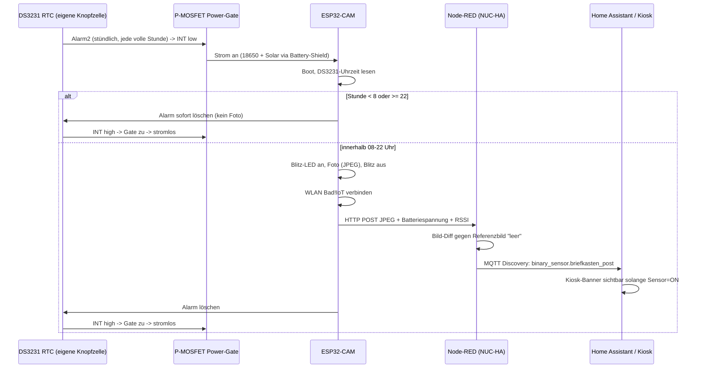

# IceBriefkasten

[View on GitHub](https://github.com/icepaule/IceBriefkasten){: .btn .btn-primary .fs-5 .mb-4 .mb-md-0 .mr-2 }

***

**IceBriefkasten**


Solar-/akkubetriebener ESP32-CAM am Briefkasten, der stündlich zwischen 08:00 und 22:00 Uhr
ein Foto macht und per Bildvergleich gegen ein Referenzbild ("leerer Briefkasten") erkennt,
ob Post eingeworfen wurde. Ergebnis geht per MQTT/Home-Assistant-Discovery in HA, inkl.
Dauer-Meldung auf dem Kiosk-Dashboard solange Post im Kasten liegt.

Kein Motion-getriggertes System (Briefkasten hat keinen Deckelsensor) — es wird bewusst
ein fester stündlicher Takt genutzt, damit die Kamera die meiste Zeit komplett stromlos
bleiben kann.

## Warum kein reiner ESP32-Deep-Sleep

Recherche vor dem Bau ([siehe unten](#recherche--vorarbeiten)) hat zwei Showstopper für
"ESP32-CAM Deep-Sleep + Solar/18650" ergeben:

1. Das AI-Thinker-Board zieht im Deep Sleep typischerweise mehrere **mA** statt der
   µA-Werte eines nackten ESP32-Chips (Onboard-LDO, Kamera-Power-Domain).
2. Günstige 18650-"Battery-Shields" (Powerbank-Stil mit Boost-Wandler) schalten bei zu
   niedrigem Ruhestrom oft automatisch ab, weil sie das als "Gerät abgezogen" werten —
   das würde den Wake-Zyklus komplett killen.

Ein bekanntes Referenzprojekt mit exakt diesem Ansatz (Pi Zero + Kamera + Deep Sleep +
Bildvergleich) ist nach ca. 2 Wochen am leeren Akku gescheitert und wurde auf reine
Reed-Sensoren umgestellt.

**Lösung hier: externes Hardware-Power-Gating.** Ein DS3231-RTC-Modul (eigene Knopfzelle,
µA-Bereich) schaltet per P-Kanal-MOSFET die komplette Stromversorgung zum ESP32-CAM hart
ab. Der ESP bootet stündlich komplett neu und ist danach komplett stromlos — kein
Deep-Sleep-Leck, kein Powerbank-Autoshutoff-Risiko. Die RTC übernimmt auch das
08–22-Uhr-Zeitfenster.

## Architektur

## Komponenten

- **Firmware** (`firmware/`): PlatformIO/Arduino, läuft auf ESP32-CAM (AI-Thinker).
  Jeder Boot ist ein kompletter Zyklus (Foto → Upload → RTC-Alarm löschen), kein
  `loop()`, keine Dauerverbindung.
- **Node-RED** (`docs/nodered-flow.md`): läuft auf NUC-HA, macht den eigentlichen
  Bildvergleich und die MQTT/HA-Discovery-Anbindung.
- **Home Assistant** (`docs/homeassistant.md`): Dashboard-Card + Kiosk-Banner, gekoppelt
  an `binary_sensor.briefkasten_post`.

## Netzwerk

- WLAN: `Bad!IoT` (VLAN 12), wie alle anderen Bad!IoT-Geräte
- MQTT: `10.10.12.100:1883`
- Zugangsdaten liegen NICHT im Repo (siehe `firmware/include/secrets.h.example`)

## Recherche / Vorarbeiten

- [vdBrink Smart Mailbox](https://vdbrink.github.io/projects/smart_mailbox.html) — exakt
  dieser Ansatz (Kamera + Deep Sleep + Bildvergleich) scheiterte nach ~2 Wochen an
  leerem Akku, Umstieg auf Zigbee-Reed-Sensoren. Grund für die Power-Gating-Entscheidung
  hier.
- [HA-Community: ESPHome Camera Image Comparison](https://community.home-assistant.io/t/esphome-camera-image-comparison-w-binary-sensor-result/661477) —
  Bildvergleich läuft nicht in ESPHome selbst, sondern Backend-seitig (hier: Node-RED).
- [ESP32 Power Consumption & Sleep Modes](https://deepbluembedded.com/esp32-sleep-modes-power-consumption/) —
  Hintergrund zum mA- statt µA-Verbrauch von ESP32-CAM-Boards im Deep Sleep.
- Frühere, andersartige Vorarbeit: [esp32cam-dataset-firmware](https://github.com/icepaule/esp32cam-dataset-firmware)
  (manueller AP-Datensatz-Collector für ein ML-Modell) — bewusst NICHT weiterverwendet,
  eigenständiges neues Repo stattdessen.

## Status

🚧 DS3231/MOSFET-Teile noch nicht bestellt, daher noch kein Power-Gating-Aufbau.
**Der Testbetrieb (`esp32cam_test`) läuft seit 23.08.2026 komplett end-to-end**,
inkl. Node-RED-Flow (live deployt) und Diff-Ergebnis-Rückgabe an die Test-GUI.

### Kalibrier-Fund: AEC/AGC-Einschwingzeit verursacht False-Positives

Zwei Fotos derselben unveränderten Szene zeigten anfangs einen Diff-Score von ~31 (bei
Schwellwert 18 → fälschlich "Post da"), obwohl visuell identisch. Ursache: die
Auto-Belichtung/-Verstärkung/-Weißabgleich des OV2640 braucht ein paar Frames nach
Kamera-Init, um sich einzupendeln — das allererste Frame ist oft leicht anders belichtet
als ein Frame kurz danach, rein durch die Sensor-Elektronik, nicht durch echte
Bildänderung. **Fix:** 6 Frames nach Init verwerfen, bevor das tatsächlich verwendete
Bild geholt wird (`firmware/src/main.cpp`, `captureAndUpload()`) — senkt den
Grundrauschen-Diff bei unveränderter Szene auf ~4-6 (bei realistischem Aufnahmeabstand,
nicht Rapid-Fire-Tests — schnelles Hintereinander-Fotografieren erhitzt den Sensor
minimal und verschiebt die Belichtung zusätzlich, das passiert im echten 5min/1h-Takt
mit Stromabschaltung dazwischen nicht).

### Wichtiger Fund beim ersten Testaufbau: Stromversorgung des Programmers

Zwei verschiedene ESP32-CAM-Boards zeigten denselben sofortigen Boot-Loop (Absturz
noch im ROM-Bootloader, bevor überhaupt Firmware-Code läuft) am selben
CH340-USB-Programmer. Ursache: der kleine Onboard-3,3V-Regler solcher Billig-Programmer
ist oft zu schwach für den vollen Boot inkl. WLAN. **Mit separater 5V-Stromversorgung
(nur noch TX/RX/GND vom Programmer) bootet es sauber.** Für den späteren
Power-Gated-Aufbau ist das ohnehin irrelevant (eigene Versorgung über Battery-Shield),
aber beim Testen mit einem USB-Programmer unbedingt beachten.

### Testbetrieb-Firmware (`esp32cam_test`)

Läuft dauerhaft an USB- oder externer Stromversorgung, kein Power-Gating nötig (siehe
[firmware/platformio.ini](https://github.com/icepaule/IceBriefkasten/blob/main/firmware/platformio.ini)):

- WLAN bleibt verbunden, Uhrzeit kommt per NTP statt DS3231
- speichert `/master.jpg` (Referenz) und `/current.jpg` (letzte Aufnahme) auf der
  SD-Karte des ESP32-CAM
- Web-Dashboard (Nerd-Style, dunkel/monospace) auf Port 80:
  - Live-Status (per JS alle 2s aktualisiert, kein Reload): WLAN/RSSI, IP,
    MQTT-Erreichbarkeit, SD-Status, Heap, Uptime, Batteriespannung, letzte Aufnahme
  - Fortschrittsbalken während ein Upload/Vergleich läuft
  - Ergebnis-Banner "📬 Briefkasten Gefüllt" / "📭 Briefkasten Leer" inkl. Diff-Score,
    kommt direkt aus der JSON-Antwort von Node-RED zurück (kein eigener Diff auf dem
    ESP32)
  - Diff-Schwellwert per Eingabefeld änderbar (wird bei jedem Upload als
    `&threshold=` mitgeschickt, siehe [docs/nodered-flow.md](https://github.com/icepaule/IceBriefkasten/blob/main/docs/nodered-flow.md))
  - Bilder (Master/Aktuell) halbiert dargestellt
  - `/status` (JSON), `/log` (Ringpuffer der letzten Log-Zeilen), `/console`
    (einfache Fernwartungskonsole: `status`, `log`, `capture`, `setmaster`,
    `interval <ms>`, `threshold <wert>`, `mqtt`, `sdlist`, `reboot`) — gedacht dafür,
    das Gerät auch ohne physischen/seriellen Zugriff per WLAN zu inspizieren, z.B.
    `curl "http://<ip>/cmd?cmd=status"`
- "Aktuelles Bild als neues Master setzen"-Button setzt lokal auf der SD UND
  synchronisiert die Node-RED-Diff-Referenz (`&setmaster=1`)
- Firmware nutzt auf der SD-Karte ausschließlich `/master.jpg`+`/current.jpg` -
  vorhandener Karteninhalt ist sonst irrelevant, bei Bedarf vorher am PC formatieren

**Dashboard** (live vom Testgerät, 23.08.2026 — korrekt erkannter "Leer"-Zustand nach
dem AEC/AGC-Fix oben, diff-score 6.41 bei Schwelle 18):

**Fernwartungskonsole** (`/console`, Befehl `status`):

Flashen: `pio run -e esp32cam_test -t upload` (oder Environment `esp32cam` für den
späteren Power-Gated-Betrieb). Die IP erscheint im seriellen Monitor nach dem Boot,
oder in UniFi unter dem Hostnamen `esp32-<MAC-Suffix>`.

### Node-RED-Backend

Live deployt (NUC-HA, Home-Assistant-Add-on-Container) — kompletter Aufbau
inkl. `sharp`-Installation und `functionGlobalContext`-Anpassung dokumentiert in
[docs/nodered-flow.md](https://github.com/icepaule/IceBriefkasten/blob/main/docs/nodered-flow.md), die Flow-Erzeugung selbst liegt als
nachvollziehbares Python-Skript in [nodered/build_flow.py](https://github.com/icepaule/IceBriefkasten/blob/main/nodered/build_flow.py) +
[nodered/patch_flow_response.py](https://github.com/icepaule/IceBriefkasten/blob/main/nodered/patch_flow_response.py) statt als
Klick-Anleitung.

