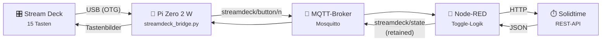
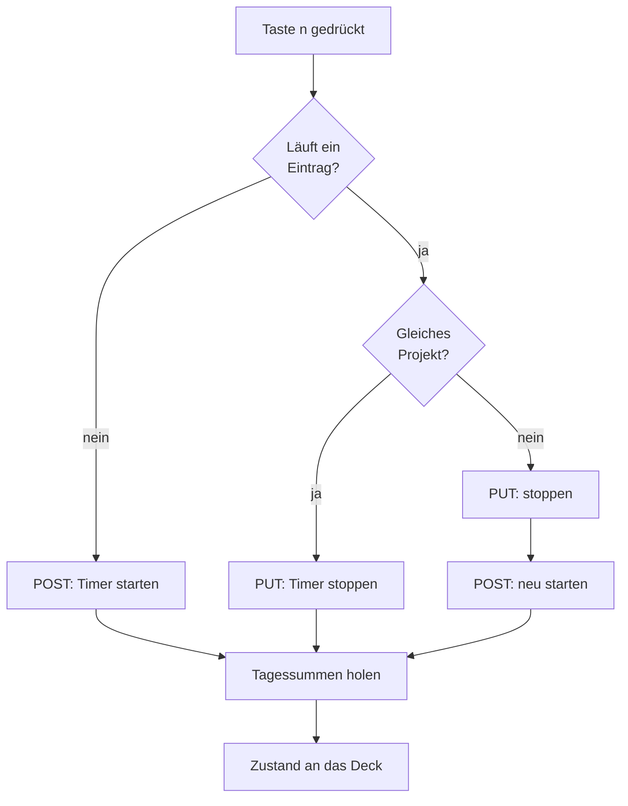

# IceDeck

[View on GitHub](https://github.com/icepaule/IceDeck){: .btn .btn-primary .fs-5 .mb-4 .mb-md-0 .mr-2 }

***

**IceDeck**


**Ein Elgato Stream Deck steuert die Zeiterfassung in einer selbst gehosteten
Solidtime-Instanz — ohne dass ein PC läuft.**

Das Deck hängt an einem Raspberry Pi Zero 2 W statt am Windows-Rechner. Ein
Tastendruck startet, stoppt oder wechselt die Zeiterfassung. Auf den Tasten
steht, woran heute wie lange gearbeitet wurde. Der Rechner darf aus bleiben.

*IceDeck im Betrieb. Grün umrandet und mit mitlaufender Zeit: das gerade
gebuchte Projekt. Blau oben rechts die Tagessumme. Rechts der Seitenstreifen
mit Uhrzeit, Tagessumme und Statusampel. Die Projektnamen sind hier
unkenntlich gemacht.*

## Warum überhaupt

Die Stream-Deck-Software von Elgato läuft nur unter Windows und macOS. Solange
sie die Buttons bedient, ist das Deck ein Zubehörteil des PCs — geht der PC aus,
ist die Zeiterfassung weg. IceDeck verlegt die Logik auf einen 15-Euro-Rechner,
der durchläuft.

Als Zugabe kann IceDeck etwas, das die Elgato-Software nicht kann: **die
laufende Zeit direkt auf die Taste rendern**.

## Architektur

Das Deck bleibt bewusst dumm. Es meldet „Taste *n* gedrückt" und rendert den
Zustand, den es zurückbekommt. Die gesamte Solidtime-Logik liegt in Node-RED.

Diese Aufteilung ist der Kern des Entwurfs und hat drei Konsequenzen:

| Eigenschaft | Warum das zählt |
|---|---|
| **Kein API-Token auf dem Pi** | Der Pi steht im IoT-Netz. Fällt er in falsche Hände, ist nichts zu holen. |
| **Umbelegung ohne Anfassen des Pi** | Ein anderes Projekt auf eine Taste zu legen, ist eine Flow-Änderung. |
| **Zustand liegt, wo er hingehört** | Node-RED kennt den laufenden Eintrag. Der Pi muss nichts wissen und nichts merken. |

Praktischer Nebeneffekt: In der hier beschriebenen Installation ist die
Solidtime-Instanz aus dem IoT-Netz **gar nicht erreichbar** — der Pi kommt nur
an den MQTT-Broker. Das stört nicht, weil er mit Solidtime ohnehin nie spricht.

## Was auf den Tasten steht

Projekttasten zeigen die **heutige Gesamtzeit auf diesem Projekt** — nicht den
gerade laufenden Abschnitt. Wer vormittags dreimal zwischen Projekten wechselt,
will auf der Taste sehen, was insgesamt zusammengekommen ist.

Eine Taste ist als **Tagesanzeige** konfiguriert und löst bewusst nichts aus.
Sie zeigt die Summe über alle Projekte — auch über Einträge, die gar kein
Projekt haben.

## Toggle-Logik

Das Stream Deck kennt von Haus aus keinen Toggle; das war reine Logik der
Windows-Software. Hier entscheidet Node-RED anhand des laufenden Eintrags:

Zusätzlich fragt ein Timer **alle 60 Sekunden** den echten Zustand ab. Dadurch
wirken auch Änderungen, die nicht vom Deck kommen: Korrekturen im Webinterface,
ein an einem anderen Gerät gestarteter Timer, nachträglich zugewiesene Projekte.

## Hardware

| Teil | Anmerkung |
|---|---|
| Stream Deck | Elgato 15 Tasten (`0fd9:006d`) **oder** MiraBox Visual Stream Deck Black, Verpackung `HSV 239S`, meldet sich als Stream Dock 293S (`5548:6670`) |
| Raspberry Pi Zero 2 W | 2,4 GHz WLAN, ARM64-fähig |
| Micro-USB-OTG-Adapter | für den Port `USB` |
| Netzteil 5 V / mindestens 2,5 A | **nicht** der USB-Port eines Rechners, siehe unten |
| microSD-Karte | 8 GB genügen |

> **Die häufigste Fehlerquelle ist der Strom.** Der Pi Zero 2 W hat genau *einen*
> datenfähigen USB-Port. Der zweite Micro-USB-Anschluss (`PWR IN`) führt nur
> Strom. Deck und Pi zusammen ziehen rund 1 A, und dieser Strom fließt durch die
> Platine des Zero. Ein USB-Port am Rechner liefert 0,5 bis 0,9 A — zu wenig.
> Das Ergebnis ist eine Bootschleife mit gleichmäßig blinkender grüner LED.

Ein ESP32 kommt übrigens nicht in Frage: ESP32, C3 und C6 haben überhaupt keinen
USB-Host, und für den S3 gibt es keine brauchbare HID-Host-Bibliothek für
herstellerspezifische Geräte wie das Stream Deck.

**Auch ein MiraBox Stream Dock 293S funktioniert** — mit derselben Bridge und
demselben Flow, weil es ebenfalls 15 Tasten in 5×3 hat. Auf USB-Ebene ist es
allerdings kein bisschen Elgato-kompatibel, egal was die Verpackung sagt. Was
dafür nötig ist, steht in [Kapitel 9](https://github.com/icepaule/IceDeck/blob/main/docs/09-mirabox.md).

**Ohne Heim-WLAN geht es auch.** Findet der Pi sein gewohntes Netz nicht, hängt
er sich an einen Handy-Hotspot und holt sich den MQTT-Broker über einen engen
WireGuard-Split-Tunnel nach Hause. Damit lassen sich Zeiten auch im Büro
buchen — [Kapitel 10](https://github.com/icepaule/IceDeck/blob/main/docs/10-wlan-vpn.md).

## Schritt-für-Schritt-Anleitung

Die vollständige Anleitung erklärt **jeden einzelnen Befehl**:

| Kapitel | Inhalt |
|---|---|
| [1 — Hardware und Stromversorgung](https://github.com/icepaule/IceDeck/blob/main/docs/01-hardware.md) | Was zusammengesteckt wird und warum es sonst nicht läuft |
| [2 — SD-Karte sichern und beschreiben](https://github.com/icepaule/IceDeck/blob/main/docs/02-sdkarte.md) | Backup einer vorhandenen Karte, Image aufspielen |
| [3 — Raspberry Pi einrichten](https://github.com/icepaule/IceDeck/blob/main/docs/03-raspberry-pi.md) | Erster Start, WLAN, SSH, Grundkonfiguration |
| [4 — Die Bridge installieren](https://github.com/icepaule/IceDeck/blob/main/docs/04-bridge.md) | Python-Dienst, udev, systemd |
| [5 — Node-RED einrichten](https://github.com/icepaule/IceDeck/blob/main/docs/05-nodered.md) | Flow importieren, Token sicher hinterlegen |
| [6 — Die Solidtime-API](https://github.com/icepaule/IceDeck/blob/main/docs/06-solidtime-api.md) | Vier Fallen, die Zeit kosten |
| [7 — Fehlersuche](https://github.com/icepaule/IceDeck/blob/main/docs/07-fehlersuche.md) | Symptome, Ursachen, Kommandos |
| [8 — Was schiefging](https://github.com/icepaule/IceDeck/blob/main/docs/08-lessons-learned.md) | Die Fehler dieses Projekts, ehrlich aufgeschrieben |
| [9 — MiraBox statt Elgato](https://github.com/icepaule/IceDeck/blob/main/docs/09-mirabox.md) | Anderes Gerät, andere Bibliothek, ein Seitenstreifen dazu |
| [10 — Unterwegs: Hotspot und VPN](https://github.com/icepaule/IceDeck/blob/main/docs/10-wlan-vpn.md) | Zeiten auch im Büro buchen, ohne das Heim-WLAN |

## Dateien

| Datei | Zweck |
|---|---|
| [`src/streamdeck_bridge.py`](https://github.com/icepaule/IceDeck/blob/main/src/streamdeck_bridge.py) | Tastendrücke → MQTT, Zustand → Tastenbild |
| [`src/config.example.json`](https://github.com/icepaule/IceDeck/blob/main/src/config.example.json) | MQTT-Zugang und Tastenbelegung |
| [`src/install.sh`](https://github.com/icepaule/IceDeck/blob/main/src/install.sh) | venv, Pakete, udev, systemd in einem Durchgang |
| [`src/icedeck.service`](https://github.com/icepaule/IceDeck/blob/main/src/icedeck.service) | systemd-Unit mit `Restart=always` |
| [`src/99-streamdeck.rules`](https://github.com/icepaule/IceDeck/blob/main/src/99-streamdeck.rules) | udev-Regel für Elgato, damit kein root nötig ist |
| [`src/99-mirabox.rules`](https://github.com/icepaule/IceDeck/blob/main/src/99-mirabox.rules) | udev-Regel für MiraBox Stream Dock |
| [`src/nodered-flow.json`](https://github.com/icepaule/IceDeck/blob/main/src/nodered-flow.json) | Toggle-Logik zum Importieren |
| [`src/wg0.example.conf`](https://github.com/icepaule/IceDeck/blob/main/src/wg0.example.conf) | WireGuard-Split-Tunnel ins Heimnetz |
| [`src/90-icedeck-vpn`](https://github.com/icepaule/IceDeck/blob/main/src/90-icedeck-vpn) | Dispatcher: Tunnel nur außerhalb des Heim-WLANs |
| [`tools/solidtime-audit.py`](https://github.com/icepaule/IceDeck/blob/main/tools/solidtime-audit.py) | findet Einträge ohne Projekt |
| [`tools/sd-backup.sh`](https://github.com/icepaule/IceDeck/blob/main/tools/sd-backup.sh) | dateisystembewusstes Karten-Backup |

## Platzhalter

In diesem Repository sind **alle Kennungen und Zugangsdaten durch Platzhalter
ersetzt**. Vor dem Einsatz zu füllen:

| Platzhalter | Bedeutung |
|---|---|
| `solidtime.example.lan:8000` | Adresse der Solidtime-Instanz |
| `mqtt.example.lan` | Adresse des MQTT-Brokers |
| `00000000-…-00000000ORG1` | Organisations-ID |
| `00000000-…-0000000MEMB1` | eigene `member_id` in dieser Organisation |
| `00000000-…-0000000USER1` | eigene `user_id` |
| `00000000-…-00000000PRJ0` … | Projekt-IDs je Taste |
| `MEIN_HEIM_WLAN` | SSID des Heim-WLANs im Dispatcher-Skript |
| `MEIN_DYNDNS_NAME` | DynDNS-Name des heimischen Anschlusses |
| `HEIMNETZ/24` | Netz hinter dem VPN-Server, z. B. `192.168.178.0/24` |
| `Projekt A` … `Projekt J` | Beschriftungen und Beschreibungstexte |

Wie man die echten IDs ermittelt, steht in [Kapitel 6](https://github.com/icepaule/IceDeck/blob/main/docs/06-solidtime-api.md).

## Stand

Vollständig in Betrieb und gegen eine laufende Solidtime-Instanz verifiziert:
Tastendruck, Start, Stopp, Projektwechsel, Tagessummen, Rendern auf dem Deck,
Neustartfestigkeit. Was noch fehlt, steht in
[Kapitel 8](https://github.com/icepaule/IceDeck/blob/main/docs/08-lessons-learned.md#offen).

## Lizenz

[MIT](https://github.com/icepaule/IceDeck/blob/main/LICENSE)

