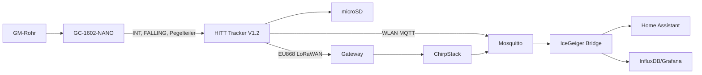

# IceGeigerCounter

[View on GitHub](https://github.com/icepaule/IceGeigerCounter){: .btn .btn-primary .fs-5 .mb-4 .mb-md-0 .mr-2 }

***

**IceGeigerCounter**


Mobiler Geigerzähler/Strahlungslogger mit **Home Assistant, WLAN/MQTT, GNSS, microSD und EU868-LoRaWAN**.

> IceGeiger ist kein geeichtes Dosimeter. CPM/Impulse bleiben der Primärmesswert; µSv/h ist eine röhrenabhängige Ableitung.

## V2 – aktueller Aufbau

- **GC-1602-NANO** als eigenständige Geigerplattform mit Nano/LCD/Buzzer
- gelieferter **HITT-Tracker V1.2** mit ESP32-S3-Familie, **SX1262** und **UC6580**
- 2× wechselbare Samsung INR18650-25R, **1S2P**
- microSD für Offline-Routen
- WLAN/MQTT für Livewerte und Backfill zuhause
- EU868 LoRaWAN/ChirpStack für mobile Telemetrie bei Gateway-Abdeckung
- kompaktes, gedichtetes Field Case mit Beta-Fenster + Schutzkappe

## Gekaufter Geiger-Bausatz

Amazon: https://amzn.eu/d/0cK2H3rO

## Architektur

## Dokumentation

1. [BOM](https://github.com/icepaule/IceGeigerCounter/blob/main/docs/v2/01-bom.md)
2. [Elektrik](https://github.com/icepaule/IceGeigerCounter/blob/main/docs/v2/02-electrical-wiring.md)
3. [Firmware](https://github.com/icepaule/IceGeigerCounter/blob/main/docs/v2/03-firmware.md)
4. [Offline-Logging/Backfill](https://github.com/icepaule/IceGeigerCounter/blob/main/docs/v2/04-mobile-logging-sync.md)
5. [LoRaWAN/ChirpStack](https://github.com/icepaule/IceGeigerCounter/blob/main/docs/v2/05-lorawan-chirpstack.md)
6. [Home Assistant](https://github.com/icepaule/IceGeigerCounter/blob/main/docs/v2/06-home-assistant.md)
7. [Field Case / OpenSCAD / STL](https://github.com/icepaule/IceGeigerCounter/blob/main/docs/v2/07-enclosure.md)
8. [Assembly](https://github.com/icepaule/IceGeigerCounter/blob/main/docs/v2/08-assembly.md)
9. [Testplan](https://github.com/icepaule/IceGeigerCounter/blob/main/docs/v2/09-commissioning-test.md)
10. [Kalibrierung](https://github.com/icepaule/IceGeigerCounter/blob/main/docs/v2/10-calibration-data-quality.md)
11. [Schuppenbetrieb](https://github.com/icepaule/IceGeigerCounter/blob/main/docs/v2/11-shed-operation.md)
12. [Quellen](https://github.com/icepaule/IceGeigerCounter/blob/main/docs/v2/12-sources.md)
13. [Validierungsstatus](https://github.com/icepaule/IceGeigerCounter/blob/main/docs/v2/13-validation-status.md)

## CAD

Aktueller Stand: `hardware/v2/field_case_v12/`.

Der gelieferte Tracker ist mechanisch verifiziert. GC-1602-spezifische Standoffs und das Beta-Fenster bleiben **PRELIMINARY**, bis der bestellte GC-1602 physisch vermessen ist. Die aktuelle konservative Kollisionsprüfung ist bestanden.

## Sicherheit

- GC-1602 erzeugt intern mehrere hundert Volt.
- GC-INT nie direkt an 3,3-V-GPIO; Pegel zuerst messen und teilen.
- Zwei 18650 nur parallel mit nahezu gleicher Zellspannung und 1S-Schutz/BMS einsetzen.
- keine LoRaWAN-/WLAN-/MQTT-Schlüssel committen; siehe `SECURITY.md`.

