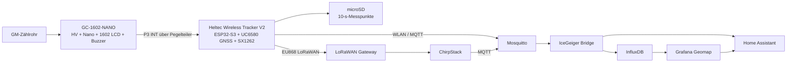

# IceGeigerCounter

[View on GitHub](https://github.com/icepaule/IceGeigerCounter){: .btn .btn-primary .fs-5 .mb-4 .mb-md-0 .mr-2 }

***

**IceGeigerCounter**


DIY-Geigerzähler und mobiler Strahlungslogger mit **Home Assistant, WLAN/MQTT, GNSS, microSD und LoRaWAN**.

> **Wichtig:** IceGeiger ist kein geeichtes Dosimeter und kein Ersatz für behördliche oder professionelle Strahlenschutzmesstechnik. **CPM/Impulse sind der Primärmesswert.** Die Umrechnung in µSv/h hängt vom tatsächlich gelieferten Zählrohr und dessen Kalibrierung ab.

## Versionen

| Version | Status | Kurzbeschreibung |
|---|---|---|
| **V2 – GC-1602-NANO Mobile Logger** | **komplett dokumentiert; reale Hardware-Verifikation nach Lieferung offen** | GC-1602-NANO + originaler Arduino Nano/LCD + Heltec Wireless Tracker V2 + GNSS + EU868 LoRaWAN + WLAN/MQTT + microSD + 2×18650 |
| V1 – Custom-HV / ESP8266 | dokumentiert, unverändert erhalten | Wemos ESP-WROOM-02, eigene HV-Schaltung, OLED, Piezo; siehe `docs/01-...` bis `docs/07-...` |

## Gekaufter V2-Bausatz

Der V2-Aufbau basiert auf dem gekauften **GC-1602-NANO Geiger Counter Kit**. **Amazon:** https://amzn.eu/d/0cK2H3rO

Der GC-1602 bleibt weitgehend unverändert. Der zusätzliche ESP32-S3 liest nur den vorhandenen **P3/INT-Pulsausgang** und ergänzt Datenlogging und Funk. LCD und Klickton des Geigerzählers funktionieren dadurch unabhängig weiter.

## Architektur

## Betriebsarten

### Schuppen / stationär
WLAN/MQTT ist der bevorzugte Live-Pfad. LoRaWAN sendet nur einen langsamen Heartbeat/Fallback. Die SD-Karte zeichnet weiter auf, damit kurzzeitige Netzausfälle keine Messlücken erzeugen.

### Mobil / Auto
Alle 10 Sekunden wird lokal auf microSD protokolliert. Bei fehlendem WLAN werden verdichtete Live-Daten in einem konfigurierbaren Intervall per LoRaWAN gesendet, **wenn ein passendes LoRaWAN-Gateway erreichbar ist**. Außerhalb der Reichweite eines Gateways gibt es keinen Live-Uplink; die SD-Aufzeichnung läuft trotzdem weiter.

### Rückkehr ins WLAN
Der aktuelle Wert wird sofort per MQTT veröffentlicht. Danach werden noch nicht synchronisierte SD-Datensätze mit ihren ursprünglichen GNSS-Zeitstempeln über `icegeiger/<device>/history` nachgesendet. Der lokale Sync-Cursor wird erst nach erfolgreichem MQTT-QoS-1-Publish fortgeschrieben.

### Historische Karte
Aktuelle Position und Strahlungswert werden als Home-Assistant-Entities publiziert. Historische/Backfill-Messpunkte werden mit Originalzeitstempel nach InfluxDB geschrieben und in Grafana Geomap dargestellt.

## V2-Dokumentation
1. [Überblick und Designentscheidungen](https://github.com/icepaule/IceGeigerCounter/blob/main/docs/v2/00-overview.md)
2. [BOM / Einkaufsliste](https://github.com/icepaule/IceGeigerCounter/blob/main/docs/v2/01-bom.md)
3. [Elektrik und Verdrahtung](https://github.com/icepaule/IceGeigerCounter/blob/main/docs/v2/02-electrical-wiring.md)
4. [Firmware installieren und konfigurieren](https://github.com/icepaule/IceGeigerCounter/blob/main/docs/v2/03-firmware.md)
5. [Offline-Logging und WLAN-Backfill](https://github.com/icepaule/IceGeigerCounter/blob/main/docs/v2/04-mobile-logging-sync.md)
6. [LoRaWAN + ChirpStack Schritt für Schritt](https://github.com/icepaule/IceGeigerCounter/blob/main/docs/v2/05-lorawan-chirpstack.md)
7. [Home Assistant, MQTT, InfluxDB und Karte](https://github.com/icepaule/IceGeigerCounter/blob/main/docs/v2/06-home-assistant.md)
8. [Gehäuse / OpenSCAD / STL](https://github.com/icepaule/IceGeigerCounter/blob/main/docs/v2/07-enclosure.md)
9. [Zusammenbau Schritt für Schritt](https://github.com/icepaule/IceGeigerCounter/blob/main/docs/v2/08-assembly.md)
10. [Inbetriebnahme und Testplan](https://github.com/icepaule/IceGeigerCounter/blob/main/docs/v2/09-commissioning-test.md)
11. [Kalibrierung und Datenqualität](https://github.com/icepaule/IceGeigerCounter/blob/main/docs/v2/10-calibration-data-quality.md)
12. [Stationärer Betrieb im Schuppen](https://github.com/icepaule/IceGeigerCounter/blob/main/docs/v2/11-shed-operation.md)
13. [Quellen und verifizierte Daten](https://github.com/icepaule/IceGeigerCounter/blob/main/docs/v2/12-sources.md)
14. [Validierungsstatus](https://github.com/icepaule/IceGeigerCounter/blob/main/docs/v2/13-validation-status.md)

## Projektdateien
- Firmware: `firmware/icegeiger_v2/`
- ChirpStack Payload-Codec: `integrations/chirpstack/codec.js`
- MQTT/InfluxDB/Home-Assistant Bridge: `integrations/bridge/`
- Home-Assistant-Dashboard-Beispiel: `integrations/home-assistant/`
- OpenSCAD: `hardware/v2/openscad/icegeiger_v2_enclosure.scad`
- STL: `hardware/v2/stl/`
- Renderings und Verdrahtungsbilder: `docs/v2/images/`

## Gehäuse-Status
Die veröffentlichten Außenmaße des GC-1602-NANO sind nicht ausreichend, um Befestigungsbohrungen, LCD-Position und Überstände sicher zu bestimmen. Deshalb sind die ersten STL-Dateien ausdrücklich mit **`PRELIMINARY`** gekennzeichnet. Sie sind Fit-/Layout-Prototypen, **keine Druckfreigabe**. Das eigenständige OpenSCAD-Modell enthält die detaillierte parametrierbare Geometrie.

Nach Lieferung zuerst [`hardware/v2/MEASURE_AFTER_DELIVERY.md`](https://github.com/icepaule/IceGeigerCounter/blob/main/hardware/v2/MEASURE_AFTER_DELIVERY.md) abarbeiten, Werte in der `.scad`-Datei eintragen, `./scripts/build-stl.sh` ausführen und zuerst den Fit-Jig prüfen.

## Sicherheit
- Der GC-1602 erzeugt intern mehrere hundert Volt. Gehäuse nur spannungsfrei öffnen; HV-Bereich nicht berühren.
- P3/INT wird **nicht direkt** an den 3,3-V-ESP32 angeschlossen. Vorgesehen ist ein 10-kΩ/20-kΩ-Pegelteiler; realen Pegel zuerst messen.
- Zwei 18650 werden nur als **1S2P** mit zwei gleichen, auf gleiche Spannung gebrachten Zellen und geeigneter Schutz-/Ladeelektronik betrieben.
- Keine realen Zugangsdaten in Git speichern. Siehe [SECURITY.md](https://github.com/icepaule/IceGeigerCounter/blob/main/SECURITY.md).

