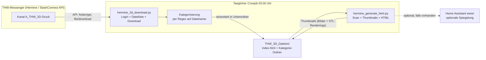
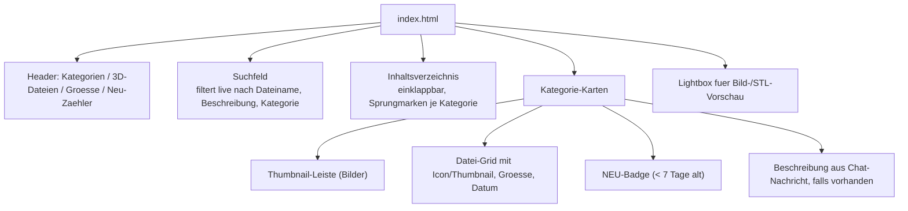
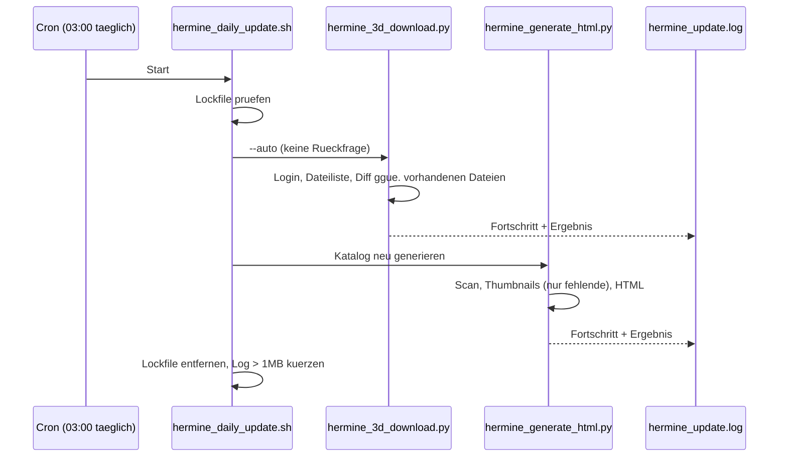

# IceHermine3D

[View on GitHub](https://github.com/icepaule/IceHermine3D){: .btn .btn-primary .fs-5 .mb-4 .mb-md-0 .mr-2 }

***

**THW Hermine 3D-Druck-Kanal: Download, Kategorisierung und HTML-Katalog-Generierung**


Automatisches Archiv fuer den THW-Hermine-Kanal **A_THW_3D-Druck**: laedt alle 3D-Druck-Dateien (STL, STEP, 3MF, ...), sortiert sie automatisch nach Themen-Kategorien und erzeugt daraus einen durchsuchbaren, statischen HTML-Katalog mit Vorschaubildern.

Der THW-Messenger *Hermine* (StashConnect) hat keine brauchbare Such- oder Katalogfunktion fuer Dateikanaele. Ueber Monate sammeln sich hunderte 3D-Druckvorlagen von Kameradinnen und Kameraden an, die im Chat kaum wiederzufinden sind. IceHermine3D macht daraus taeglich automatisch einen browsbaren Katalog mit Thumbnails, Volltextsuche und "Neu"-Badges.

## Funktionsweise



## Screenshot


Live-Katalog (Home-Assistant-Spiegelung): Header mit Statistik (Kategorien, 3D-Dateien, Gesamtgröße), Volltextsuche und die einklappbare Kategorien-Übersicht — direkt darunter die Datei-Karten mit echten Vorschaubildern (STL-Renderings + Fotos).

## Komponenten

| Datei | Zweck |
|---|---|
| `hermine_3d_download.py` | Meldet sich per [`stashconnect`](https://pypi.org/project/stashconnect/) am THW-Messenger an, liest alle Dateien aus dem 3D-Druck-Kanal (paginiert), filtert auf 3D-Formate + Archive, kategorisiert per Regex und laedt sie in `~/THW_3D_Dateien/<Kategorie>/` herunter. Entschluesselt Ende-zu-Ende-verschluesselte Dateien automatisch. |
| `hermine_generate_html.py` | Scannt das Zielverzeichnis, erzeugt Thumbnails (Bilder werden verkleinert, STL-Dateien werden mit `numpy-stl` + `matplotlib` als 3D-Rendering dargestellt) und baut daraus eine einzelne, portable `index.html` mit Suche, Kategorien-Uebersicht und "Neu"-Badges fuer Dateien der letzten 7 Tage. |
| `hermine_daily_update.sh` | Cron-Wrapper: fuehrt Download (`--auto`, ohne Rueckfrage) und HTML-Generierung nacheinander aus, mit Lockfile gegen parallele Laeufe und Log-Rotation. |
| `hermine_credentials.ini.example` | Vorlage fuer die Zugangsdaten-Datei (siehe [Einrichtung](#einrichtung)). |

## Kategorisierung

Dateien werden anhand ihres Namens per Regex-Liste automatisch einer von ~17 THW-spezifischen Kategorien zugeordnet (z. B. `Funk_Halterungen`, `Rettung_Krankentrage`, `Elektro_Stecker`, `Absperrung`). Passt kein Muster, greift ein Fallback nach Dateityp (`Bilder`, `Videos`, `Dokumente`, `Sonstiges`). Die Regeln stehen zentral in `CATEGORIES` in `hermine_3d_download.py` und lassen sich dort erweitern.

`THW_3D_Dateien_Beispielstruktur/` zeigt die resultierende Ordnerstruktur als leeres Geruest (nur `.gitkeep`-Dateien) — die eigentlichen 3D-Modelle stammen von anderen THW-Mitgliedern aus dem privaten Hermine-Kanal und werden hier bewusst **nicht** veroeffentlicht.

## Katalog-Funktionen



- **Portabel**: `index.html` + `thw_3d_thumbs/` nutzen ausschliesslich relative Pfade und lassen sich 1:1 kopieren.
- **STL-Vorschau**: STL-Dateien werden serverseitig mit `matplotlib` als schattiertes 3D-Rendering vorgerendert (keine Live-3D-Ansicht im Browser noetig).
- **Home-Assistant-Spiegelung**: optional wird der Katalog zusaetzlich nach `www/` einer bestehenden Home-Assistant-Instanz kopiert (Pfade dabei auf `/local/...` umgeschrieben) und ist dann per Dashboard-Karte einbindbar.
- **Beschreibungen**: `hermine_generate_html.py` kann Datei-Beschreibungen aus einer optionalen JSON-Datei (Chat-Nachrichten zur Datei) einblenden, falls diese separat aus dem Kanal exportiert werden.

## Betrieb



Bereits heruntergeladene Dateien werden anhand des Zielpfads erkannt und uebersprungen (`SKIP ... (existiert)`); Namenskollisionen werden durch Anhaengen der Datei-ID aufgeloest.

## Einrichtung

```bash
python3 -m venv hermine_venv
hermine_venv/bin/pip install -r requirements.txt

cp hermine_credentials.ini.example ~/hermine_credentials.ini
# ~/hermine_credentials.ini mit echten Hermine-Zugangsdaten fuellen (siehe Kommentare in der Datei)
chmod 600 ~/hermine_credentials.ini

# Einmaliger Testlauf, nur auflisten (kein Download):
hermine_venv/bin/python3 hermine_3d_download.py --list

# Erster echter Download:
hermine_venv/bin/python3 hermine_3d_download.py

# Katalog erzeugen:
hermine_venv/bin/python3 hermine_generate_html.py
```

**Cronjob** (taeglich 03:00 Uhr):

```
0 3 * * * /pfad/zu/hermine_daily_update.sh >> /pfad/zu/hermine_update.log 2>&1
```

### Optionen

- `hermine_3d_download.py --list` — nur auflisten, nichts herunterladen.
- `hermine_3d_download.py --all` — alle Dateitypen (auch Bilder/Videos/Dokumente), nicht nur 3D-Formate.
- `hermine_3d_download.py --auto` — keine interaktive Rueckfrage vor dem Download (fuer Cron).
- `hermine_3d_download.py /eigener/pfad` — abweichendes Zielverzeichnis statt `~/THW_3D_Dateien`.

In `hermine_generate_html.py` lassen sich `BASE_DIR`, `HA_WWW_DIR` und `HA_COPY` am Dateianfang an die eigene Umgebung anpassen.

## Sicherheitshinweise

- Zugangsdaten liegen **ausschliesslich** in `~/hermine_credentials.ini` (per `.gitignore` von Versionskontrolle ausgeschlossen) — niemals im Code oder in Commits.
- Die heruntergeladenen 3D-Dateien selbst (`THW_3D_Dateien/`) sind **nicht** Teil dieses Repos: sie stammen von THW-Mitgliedern aus einem internen Kanal und werden bewusst nicht oeffentlich verteilt.
- Ende-zu-Ende-verschluesselte Dateien werden lokal mit der eigenen `encryption_passphrase` entschluesselt, bevor sie auf Platte geschrieben werden.

## Abhaengigkeiten

Siehe `requirements.txt`. Kernbibliothek ist [`stashconnect`](https://pypi.org/project/stashconnect/) fuer die Hermine/StashConnect-API, `numpy-stl` + `matplotlib` fuer STL-Thumbnails und `Pillow` fuer Bild-Thumbnails.

