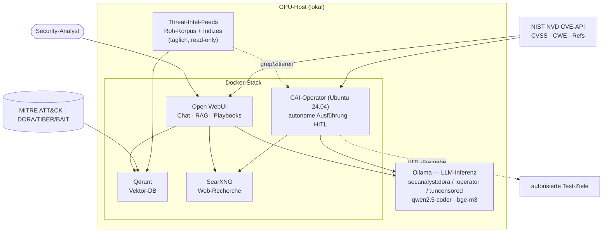

# IceITSOAI

[View on GitHub](https://github.com/icepaule/IceITSOAI){: .btn .btn-primary .fs-5 .mb-4 .mb-md-0 .mr-2 }

***

**IceITSOAI**


Selbst-gehostete, nicht-zensierte LLM-Plattform für **autorisiertes internes
Security-Testing** im Finanzsektor. Erzeugt zu jedem Befund ein Bedrohungsszenario,
den realen Attack-Path (mit MITRE ATT&CK), einen PoC sowie ein
**DORA-/TIBER-EU-/BaFin-/EZB-Mapping** — vollständig on-premise, ohne Cloud-LLM.

> **Hinweis:** Dieses Repo ist die **öffentliche Dokumentation** der Architektur und
> Methodik. Es enthält **keine** internen IPs, Hostnamen, Zugangsdaten, Scope-Daten
> oder Engagement-Artefakte. Platzhalter wie `<KI02_HOST>` sind beim Eigenbetrieb zu
> ersetzen. Siehe [Security & Sanitization](https://github.com/icepaule/IceITSOAI/blob/main/docs/07-security-sanitization.md).

## Warum self-hosted
Ein lokales Modell ist **kein ICT-Drittdienstleister** i. S. v. DORA Art. 28–30:
keine Auslagerung, kein Konzentrationsrisiko, keine Datenweitergabe. Cloud-LLMs sind
für PoC-/Exploit-Generierung zudem durch Guardrails beschnitten und meldepflichtig.

## Fähigkeiten
- **Compliance-Befunde** im festen Schema (Threat → Attack-Path → PoC → Regulatorik → Remediation).
- **Agentischer Operator** (CAI): autonome Befehlsausführung mit Human-in-the-Loop, Tool-Nachladen, Web-Recherche.
- **Open-WebUI-Sektion** mit Playbooks — nur Ziel/Netz/App eintragen.
- **RAG-Wissensbasis**: MITRE ATT&CK + regulatorische Dokumente.
- **NVD-Anreicherung**: automatische CVE-Fakten (CVSS/CWE/Referenzen) aus NIST NVD.
- **Threat-Intel-/Exploit-Feeds**: täglich aktualisierte lokale Roh-Korpora (Exploit-DB,
  Nuclei, PoC-in-GitHub, Metasploit) + High-Signal-Indizes (CISA KEV, EPSS, ThreatFox, OTX)
  — eingebettet ins RAG und vom Operator referenzierbar.
- **Web-Recherche** über self-hosted SearXNG (keine Cloud-API).

## Architektur

## Dokumentation
1. [Architektur](https://github.com/icepaule/IceITSOAI/blob/main/docs/01-architecture.md)
2. [Setup & Deployment](https://github.com/icepaule/IceITSOAI/blob/main/docs/02-setup.md)
3. [Modell-Stack & Abliteration](https://github.com/icepaule/IceITSOAI/blob/main/docs/03-models.md)
4. [Open-WebUI-Sektion & Playbooks](https://github.com/icepaule/IceITSOAI/blob/main/docs/04-openwebui-section.md)
5. [CAI-Operator & Netz-Isolation](https://github.com/icepaule/IceITSOAI/blob/main/docs/05-cai-operator.md)
6. [Compliance-Mapping (DORA/TIBER/MITRE)](https://github.com/icepaule/IceITSOAI/blob/main/docs/06-compliance.md)
7. [Security & Sanitization](https://github.com/icepaule/IceITSOAI/blob/main/docs/07-security-sanitization.md)
8. [NVD-Anreicherung](https://github.com/icepaule/IceITSOAI/blob/main/docs/08-nvd-enrichment.md)
9. [Threat-Intel-/Exploit-Feeds & täglicher Refresh](https://github.com/icepaule/IceITSOAI/blob/main/docs/09-threat-intel-feeds.md)

## Wichtige Abgrenzung
Diese Plattform ist ein **Werkzeug** für internes Testing, Scoping und Reporting —
**kein** akkreditiertes DORA-TLPT. Formales TLPT (Art. 26/27, TIBER-EU über
Bundesbank/BaFin bzw. EZB) erfordert externe, akkreditierte Tester sowie Control-/
White-Team. Uncensored-/abliterierte Modelle können falsche CVEs/PoCs erzeugen —
**jeder PoC ist vor Einsatz im Labor zu validieren.**

## Lizenz / Nutzung
Nur für **autorisiertes, rechtskonformes** Security-Testing eigener bzw. ausdrücklich
beauftragter Systeme. Siehe [Security & Sanitization](https://github.com/icepaule/IceITSOAI/blob/main/docs/07-security-sanitization.md).

