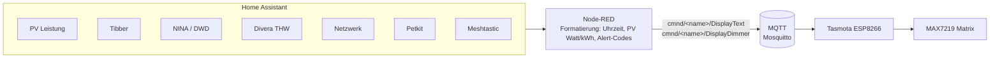

<!-- manually-curated -->

# IceMatrix

[View on GitHub](https://github.com/icepaule/IceMatrix){: .btn .btn-primary .fs-5 .mb-4 .mb-md-0 .mr-2 }

***

**IceMatrix**


LED-Matrix-Displays fürs Zuhause — von seriellen MAX7219-Dot-Matrix-Anzeigen (Tasmota + Node-RED + Home Assistant) bis zu einem eigenständigen RGB-HUB75-Panel-Projekt auf einem Raspberry Pi Zero 2W.

## Hardware

| Display | Module | Farbe | Controller | Funktion |
|---------|--------|-------|-----|----------|
| Matrix1 (PV-Matrix) | 4x MAX7219 (32x8) | Rot | ESP-12F | PV-Leistung (Sonnenstand-basiert) |
| Matrix2 | 4x MAX7219 (32x8) | Rot | ESP-12F | Uhrzeit + PV-Leistung |
| Matrix3 | 8x MAX7219 (64x8) | 4x Rot + 4x Blau | Wemos D1 Mini | Uhrzeit + PV + Alerts |
| Matrix4 (Strompreis) | 4x MAX7219 (32x8) | Rot | Wemos D1 Mini | Tibber Strompreis + Trend |
| Matrix5 (2FA-Anzeige) | 1x HUB75 P4-2121-64x32-16S | RGB | Raspberry Pi Zero 2W | TOTP/2FA-Codes, Auswahl per Home Assistant |

> ESP-12F (Matrix1/2) und Wemos D1 Mini (Matrix3/4) haben unterschiedliche GPIO-Zuordnungen — Details in der Repo-Doku.

## Architektur (Matrix1-4)

**Matrix5** läuft komplett unabhängig von Tasmota/Node-RED auf einem eigenen Raspberry Pi Zero 2W (Python-Service + `rpi-rgb-led-matrix`) — HUB75-RGB-Panels brauchen eine kontinuierliche DMA-Ansteuerung, die Tasmota nicht unterstützt. Ursprünglich als ESP32-S3-Firmware geplant; ein Vergleichstest mit dem Pi deckte einen ESP32-seitigen Pin-Vertauschungs-Bug auf (LAT/OE) und der Pi lief bereits sauber, daher blieb er dauerhaft der Controller. Home Assistant wählt per 4 Dropdown-Helfern + MQTT, welche Accounts gerade auf dem Panel stehen; die eigentlichen TOTP-Secrets liegen ausschließlich lokal auf dem Pi.

**Stromversorgung mit nur einem Netzteil**: Panel-Strom nicht durchs Controller-Board leiten (der 5V-Pin eines Dev-Boards/Moduls ist dafür meist nicht ausgelegt) — stattdessen das Netzteil auf einen gemeinsamen 5V/GND-Knotenpunkt führen und von dort zwei getrennte Leitungen abgehen lassen: eine zum Pi, eine direkt zum Panel-Steckverbinder. So läuft der höhere Panel-Strom nie durchs Modul selbst. Details inkl. Leitungsquerschnitt und Dimensionierung in der Repo-Doku.

## Custom Firmware (Pflicht für Matrix1-4!)

Die Standard-Tasmota-Firmware enthält **nicht** den MAX7219-Dot-Matrix-Treiber (nur den 7-Segment-Treiber) — ohne Custom-Build (`USE_DISPLAY_MAX7219_MATRIX`) leuchten alle LEDs permanent.

## Alert-System (Matrix3)

14 priorisierte Alert-Codes über 4 Prioritätsstufen (THW-Alarm, Wetter-/Hochwasserwarnungen, Netzwerkstatus, Haushaltsgeräte, Strompreis) — jeder einzeln per Home-Assistant-Toggle ein-/ausschaltbar, alle standardmäßig aus.

## Dokumentation

| Dokument | Inhalt |
|---|---|
| [docs/custom-build.md](https://github.com/icepaule/IceMatrix/blob/main/docs/custom-build.md) | Custom-Tasmota-Build für MAX7219 Dot-Matrix (Matrix1-4) |
| [docs/nodered-config.md](https://github.com/icepaule/IceMatrix/blob/main/docs/nodered-config.md) | Node-RED-Flows, MQTT-Topics, Alert-System, alle 4 Displays im Detail |
| [docs/matrix5-totp.md](https://github.com/icepaule/IceMatrix/blob/main/docs/matrix5-totp.md) | Matrix5: HUB75/Raspberry Pi Zero 2W, Verkabelungsplan, Architektur, Account-Provisionierung |

## Status

- [x] Matrix1-4 produktiv im Einsatz (Tasmota + Node-RED + Home Assistant)
- [x] Matrix5: produktiv auf Raspberry Pi Zero 2W, HA-Auswahl (4 Slots) + MQTT, echte Accounts
- [ ] Matrix5: vollständige "Dienst: Konto"-Bezeichnungen (aktuell teils generische Namen bei Mehrfach-Accounts)
- [ ] Matrix5: zweites Panel anketten für mehr gleichzeitig sichtbare Accounts
- [ ] Fotos aller 5 Displays

## Keine sensiblen Daten in diesem Repo

Interne IPs sowie WLAN-/MQTT-Zugangsdaten werden in der Doku durch Platzhalter ersetzt.
Ein früherer Commit hatte versehentlich echte Zugangsdaten im Klartext enthalten — ein
Folgecommit hatte nur den *aktuellen* Dateiinhalt redigiert, die Klartext-Version blieb aber
über die Git-History abrufbar. Die komplette History wurde inzwischen bereinigt
(`git filter-repo` + Force-Push), betroffene interne Referenzen sind durchgängig durch
Platzhalter ersetzt.

