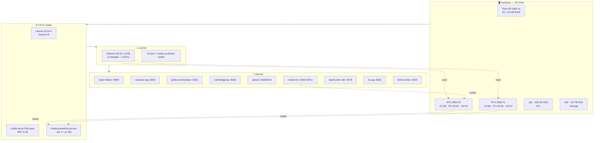
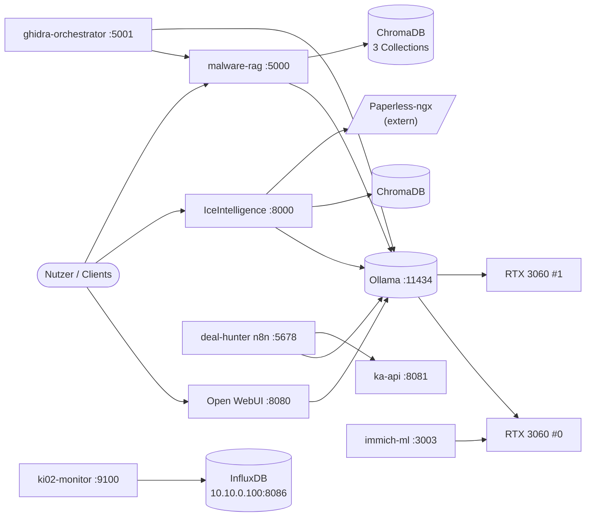
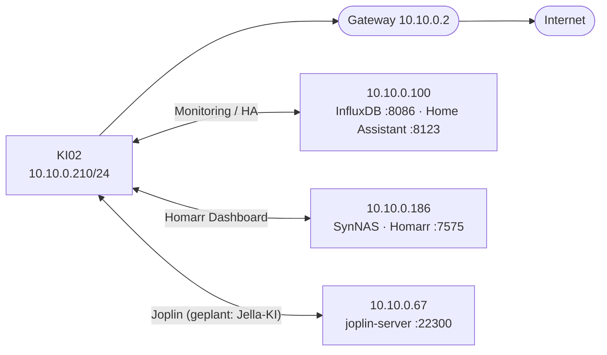

# IceMultiGPUAI

[View on GitHub](https://github.com/icepaule/IceMultiGPUAI){: .btn .btn-primary .fs-5 .mb-4 .mb-md-0 .mr-2 }

***

**IceMultiGPUAI**


Vollständige, faktenbasierte Setup‑ und **Disaster‑Recovery‑Dokumentation** des Hosts **KI02**: einer HP Z440 Workstation mit **2× NVIDIA RTX 3060 (24 GB VRAM gesamt)**, die als lokaler Multi‑LLM‑ / Multi‑GPU‑Server (Ollama) plus diverse KI‑Dienste betrieben wird. KI02 hat das alte „KI01" abgelöst und dessen IP `10.10.0.210` übernommen.

> **Zweck:** Aus diesem Repo lässt sich der Host im Katastrophenfall **Schritt für Schritt vollständig wiederherstellen**. Siehe **[docs/07-disaster-recovery.md](https://github.com/icepaule/IceMultiGPUAI/blob/main/docs/07-disaster-recovery.md)**.

> ⚠️ **Keine Geheimnisse im Repo.** Passwörter, Tokens und Schlüssel sind bewusst **nicht** enthalten und im Text durch `<PLATZHALTER>` ersetzt. Interne RFC‑1918‑IPs sind enthalten, weil sie für die Wiederherstellung benötigt werden.

---

## 1. Eckdaten (Stand 2026‑06‑27)

| Bereich | Wert |
|---|---|
| Modell | HP Z440 Workstation, BIOS **M60 v02.41** |
| CPU | Intel Xeon **E5‑1650 v4** @ 3.60 GHz (6 Cores / 6 Threads) |
| RAM | 16 GB DDR4 + 4 GB Swap |
| GPU | **2× NVIDIA GeForce RTX 3060**, je 12 GB (24 GB gesamt), Compute 8.6, PCI `02:00.0` + `03:00.0`, Power‑Limit **130 W** je Karte |
| OS | **Ubuntu 24.04.4 LTS**, Kernel `6.8.0-124-generic` |
| GPU‑Treiber | **nvidia-driver-595-open** `595.71.05` |
| Python | 3.12.3 |
| LLM‑Runtime | **Ollama 0.30.10** (`0.0.0.0:11434`) + **14 Modelle** |
| Container | Docker + `nvidia-container-toolkit` + docker‑compose‑v2 |
| OS‑Disk | `sda` 238 GB Micron SSD (LVM `ubuntu-vg`, ext4 `/`) |
| Daten‑Disk | `sdb` 3.6 TB Seagate (LVM `storage`, ext4 `/storage`, 2.9 TB) |
| Netz | `eno1` statisch **10.10.0.210/24**, GW `10.10.0.2`, DNS `10.10.0.2` + `x.x.x.x` |

---

## 2. Architektur — Schichten



## 3. Dienste, Ports & Datenfluss

| Dienst | Port | Typ | Persistenz | Nutzt |
|---|---|---|---|---|
| Ollama | 11434 | systemd | `/usr/share/ollama/.ollama` | beide GPUs |
| Open WebUI | 8080 | Docker (host‑net) | Volume `open-webui` | Ollama |
| malware-rag | 5000 | systemd (Flask) | `/opt/malware-rag/chroma_db` (7.5 GB) | Ollama (`qwen2.5-coder:14b`), ChromaDB |
| ghidra-orchestrator | 5001 | systemd (Flask) | `/opt/ghidra`, malware‑rag‑venv, JDK 21 | Ollama, malware-rag |
| gpu-monitor | — | systemd | — | NVML, Ollama |
| IceIntelligence | 8000 | systemd (FastAPI) | `/root/IceIntelligence` (13 GB) | Ollama (`llama3.1:8b` + `nomic-embed-text`), ChromaDB, Paperless |
| qdrant | 6333/6334 | Docker | `/opt/qdrant/qdrant_storage` | — |
| immich-ml | 3003 | Docker (GPU) | Volume `model-cache` | CUDA (externer Immich‑Server) |
| deal-hunter n8n | 5678 | Docker | Volume `deal-hunter-n8n-data` | Ollama, ka-api |
| ka-api (Kleinanzeigen) | 8081 | Docker | — | — |
| ki02-monitor | 9100 | systemd | — | NVML, Docker, InfluxDB `10.10.0.100:8086` |



## 4. Multi‑GPU‑Modell‑Scheduling

Ollama wird **ohne** `OLLAMA_SCHED_SPREAD` betrieben → flexibles Scheduling:

- **Kleine Modelle** werden je nach VRAM auf **eine** der beiden Karten geladen (mehrere Modelle parallel, je eines pro GPU).
- **Große Modelle** (z. B. `qwen2.5:14b`, ~9 GB) werden bei Bedarf **über beide Karten gesplittet**.
- Gesteuert über die systemd‑Override (siehe `etc/systemd/ollama.service.d-override.conf`):
  `OLLAMA_MAX_LOADED_MODELS=3`, `OLLAMA_NUM_PARALLEL=2`, `OLLAMA_KEEP_ALIVE=30m`.

## 5. Netzwerk‑Einbettung



## 6. Repo‑Struktur

```
IceMultiGPUAI/
├── README.md                      ← diese Übersicht
├── docs/
│   ├── 01-hardware-bios.md        Hardware, PSU/GPU-Kabel, BIOS „Headless Boot"
│   ├── 02-os-driver-gpu.md        Ubuntu, NVIDIA-Treiber, Power-Limit
│   ├── 03-ollama-multigpu.md      Ollama-Install, Override, Modelle
│   ├── 04-services.md             Alle Dienste im Detail
│   ├── 05-storage-network.md      LVM/Disks, /storage, Netplan
│   ├── 06-monitoring.md           ki02-monitor + InfluxDB
│   └── 07-disaster-recovery.md    ⭐ Schritt-für-Schritt Wiederherstellung
├── etc/                           Verbatim-Konfigs (secret-frei)
│   ├── systemd/*.service
│   ├── netplan/50-cloud-init.yaml
│   └── cloud-init/99-disable-network-config.cfg
├── compose/                       docker-compose-Dateien je Dienst
├── scripts/ki02_monitor.py        Monitoring-Dienst
└── screenshots/                   (GUI-Screenshots manuell zu ergänzen)
```

## 7. Im Katastrophenfall

➡️ Direkt zu **[docs/07-disaster-recovery.md](https://github.com/icepaule/IceMultiGPUAI/blob/main/docs/07-disaster-recovery.md)** — dort steht die vollständige Reihenfolge: BIOS → Ubuntu → Treiber → Ollama → Docker → Dienste → Daten zurückspielen → Verifikation.

---
*Erstellt 2026‑06‑27. Alle Werte stammen aus dem laufenden System (live erhoben), nicht aus Annahmen.*

