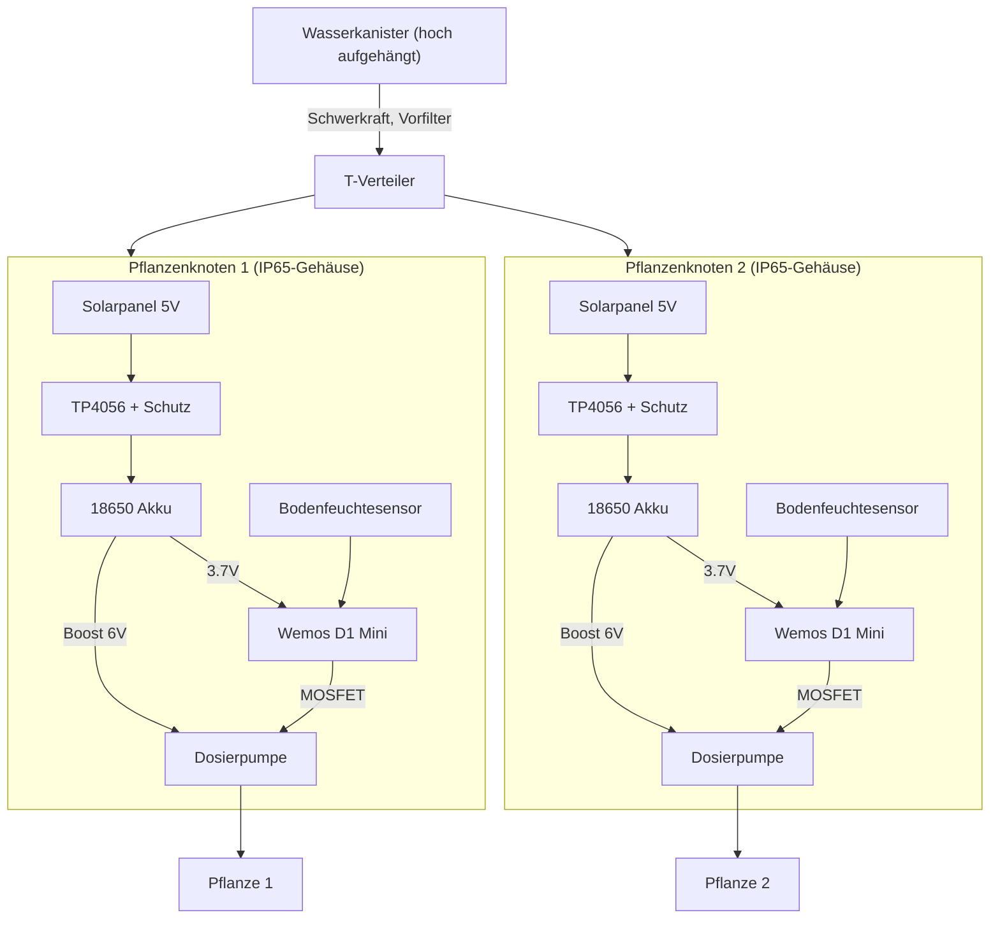

# IcePlantWatering

[View on GitHub](https://github.com/icepaule/IcePlantWatering){: .btn .btn-primary .fs-5 .mb-4 .mb-md-0 .mr-2 }

***

**IcePlantWatering**


Solarbetriebenes Bewässerungssystem auf Basis von Wemos ESP8266-Boards mit 18650-Akku. Ziel: mindestens 2 Pflanzen aus einem hoch aufgehängten Wasserkanister (Schwerkraftgefälle) bewässern, **jede Pflanze mit eigenem Bodenfeuchtesensor unabhängig überwacht und einzeln dosiert bewässert**. Die Sensor-/Steuerlogik sitzt dafür in einem kleinen externen Gehäuse direkt bei der jeweiligen Pflanze. Durch Solar-Nachladung des 18650 soll das System netzunabhängig "ins Feld" gebracht werden können.

> ⚠️ In dieses Repo werden **keine sensiblen Daten** (Passwörter, Tokens, WLAN-Zugangsdaten o.ä.) gepusht.

## Status

Firmware-Grundgerüst und Schaltplan stehen (Stand 10.08.2026), noch kein physischer Aufbau.

## Geplante Architektur

Jede Pflanze bekommt einen eigenen, autarken Knoten (Sensor + Dosierpumpe + Akku + Solar in einem IP65-Gehäuse). Die Knoten hängen nur wasserseitig über einen gemeinsamen Schlauch am Kanister, elektrisch/logisch sind sie unabhängig voneinander.

## Kernentscheidungen (Stand jetzt)

- **Ein autarker Knoten pro Pflanze**: eigener Sensor, eigene Dosierpumpe, eigener Akku+Solar in einem kleinen Gehäuse direkt bei der Pflanze — unabhängige Trockenheitserkennung und Wassergabe je Pflanze, beliebig erweiterbar.
- **Dosierpumpe statt Magnetventil**: Schwerkraft aus dem Kanister liefert oft nicht genug Differenzdruck für normale Bewässerungsventile; eine Mini-Peristaltikpumpe dosiert über die Laufzeit exakt kleine Mengen, braucht keinen Mindestdruck und ist im Stillstand dicht (Details siehe [BOM.md](https://github.com/icepaule/IcePlantWatering/blob/main/BOM.md)).
- **Deep Sleep**: jeder ESP wacht nur periodisch auf, misst Bodenfeuchte, dosiert bei Bedarf in kleinen Schritten (mehrfach kurz pumpen + zwischendurch neu messen statt einmal lange), schläft wieder.
- **Konnektivität offen**: WLAN (Bad!IoT-VLAN) nur sinnvoll, wenn der Standort in Reichweite ist; alternativ ESP-NOW zu einem Gateway oder komplett autarke Logik ohne Funk.

## Referenzprojekte (Recherche 10.08.2026)

- [Lumics/Plantwatery](https://github.com/Lumics/Plantwatery) — ESP32 + 18650 + TP4056 + 5V/200mA-Solar, Deep Sleep 2×/Tag, Pumpe + Y-Verteiler zu mehreren Pflanzen. Wichtige Lessons: Standard-Devkits verbrauchen unnötig Strom (USB-Chip, Power-LED ~2mA), Solarpanel-Dimensionierung bei Bewölkung beachten.
- [Battery-powered ESP8266 Irrigation Controller (Hackaday.io)](https://hackaday.io/project/189361-battery-powered-esp8266-irrigation-controller) — Latching-Solenoide statt Dauerstrom-Ventile, Ansteuerung über L293D-Treiber, aggressives Deep Sleep, bis zu 4 Zonen.
- [lrswss/esp32-irrigation-automation](https://github.com/lrswss/esp32-irrigation-automation) — Multi-Zonen-Logik (immer nur ein Ventil gleichzeitig offen, um Druck zu halten), kapazitive Bodensensoren mit TLC555 (läuft mit 3,3V — NE555-Variante braucht 4,5V+ und scheidet aus).

## Stückliste

Siehe [BOM.md](https://github.com/icepaule/IcePlantWatering/blob/main/BOM.md). Bestellfertige, nach Shop gruppierte Einkaufsliste: [ORDER.md](https://github.com/icepaule/IcePlantWatering/blob/main/ORDER.md).

## Firmware

Siehe [firmware/](https://github.com/icepaule/IcePlantWatering/blob/main/firmware/) — PlatformIO-Projekt (ESP8266/Arduino), Deep Sleep + Bodenfeuchtemessung + Dosierpumpen-Steuerung inkl. Kalibriermodus und Tages-Sicherheitslimit. Details und Verkabelungs-Annahmen im [firmware/README.md](https://github.com/icepaule/IcePlantWatering/blob/main/firmware/README.md).

## Schaltplan

Siehe [SCHEMATIC.md](https://github.com/icepaule/IcePlantWatering/blob/main/SCHEMATIC.md) — Mermaid-Diagramme (Leistungsteil, Steuerung/Sensorik) plus verbindliche Verdrahtungstabelle.

## Offene Punkte

- [ ] Bestellung auslösen (siehe [ORDER.md](https://github.com/icepaule/IcePlantWatering/blob/main/ORDER.md), muss manuell erfolgen)
- [ ] Physischer Aufbau/Verkabelung nach Schaltplan
- [ ] Kalibrierung Bodensensor + Pumpendurchfluss (ml/s) am realen Board
- [ ] Boost-Trimmer vor Erstinbetriebnahme auf 6V einstellen
- [ ] Konnektivität (WLAN vs. ESP-NOW vs. autark) je nach finalem Standort

