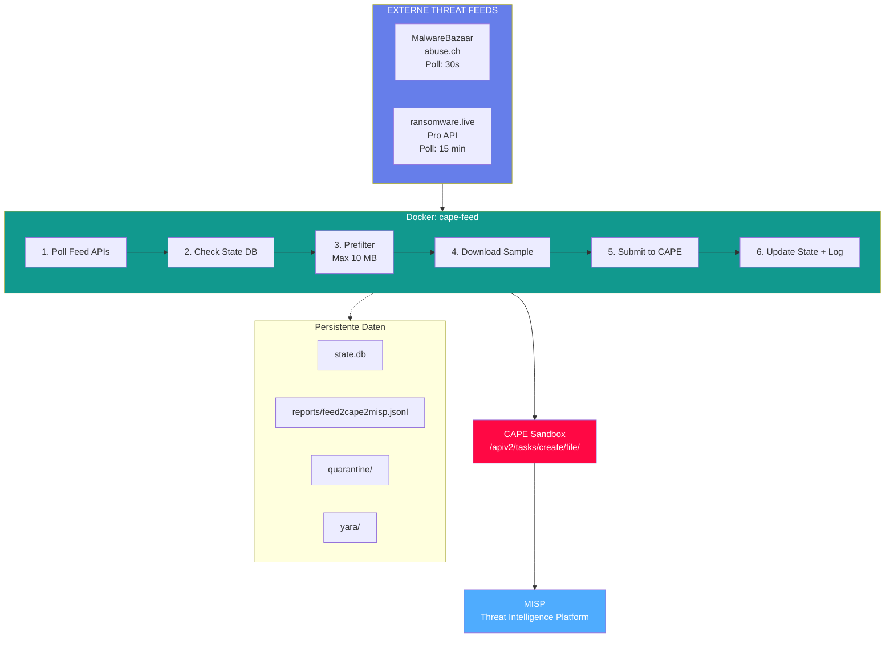

# IcePorge-CAPE-Feed

[View on GitHub](https://github.com/icepaule/IcePorge-CAPE-Feed){: .btn .btn-primary .fs-5 .mb-4 .mb-md-0 .mr-2 }

***

**MalwareBazaar → CAPE → MISP Automated Pipeline**

[](LICENSE)

***

# Betriebshandbuch CAPE Feed - Threat Intelligence Feed Integration

***

**Dokumenteninformationen**

| Attribut | Wert |
|----------|------|
| Dokumentenversion | 1.0 |
| Erstellungsdatum | 2026-01-19 |
| Letzte Änderung | 2026-01-19 |
| Klassifizierung | INTERN |
| Zielgruppe | ITSO / Cyber Security Analyst Level 3 |
| Dokumentenverantwortlicher | IT-Sicherheitsbetrieb |
| Review-Zyklus | Quartalsweise |

***

## Inhaltsverzeichnis

1. [Zweck und Geltungsbereich](#1-zweck-und-geltungsbereich)
2. [Systemübersicht und Architektur](#2-systemübersicht-und-architektur)
3. [Regulatorische Anforderungen](#3-regulatorische-anforderungen)
4. [Installation und Konfiguration](#4-installation-und-konfiguration)
5. [Betriebsverfahren](#5-betriebsverfahren)
6. [Wartungsverfahren](#6-wartungsverfahren)
7. [Incident Response Prozeduren](#7-incident-response-prozeduren)
8. [Troubleshooting](#8-troubleshooting)
9. [Sicherheitsaspekte](#9-sicherheitsaspekte)
10. [Anhänge](#10-anhänge)

***

## 1. Zweck und Geltungsbereich

### 1.1 Zweck des Dokuments

Dieses Betriebshandbuch dokumentiert den Betrieb des CAPE Feed Systems - einer automatisierten Pipeline zur Integration externer Threat Intelligence Feeds mit der CAPE Malware-Analyse-Plattform.

### 1.2 Geltungsbereich

Das Handbuch gilt für:
- Die CAPE Feed-Installation unter `/opt/cape-feed/`
- Die Docker-Container-Infrastruktur
- Die Anbindung an MalwareBazaar (abuse.ch)
- Die Anbindung an ransomware.live

### 1.3 Systemzweck

CAPE Feed automatisiert die kontinuierliche Beschaffung und Analyse aktueller Malware-Samples:

1. **Polling**: Regelmäßiger Abruf neuer Samples von Threat Intelligence Feeds
2. **Prefiltering**: Optionale Vorfilterung nach Dateityp und Größe
3. **Download**: Sichere Beschaffung der Malware-Samples
4. **Submission**: Automatische Einreichung an CAPE Sandbox
5. **State Management**: SQLite-basierte Deduplizierung
6. **Reporting**: JSONL-Logging für SIEM-Integration

**Quelle**: `/opt/cape-feed/app/feed2cape2misp.py:4-18`

***

## 2. Systemübersicht und Architektur

### 2.1 Architektur-Diagramm


<details>
<summary>Mermaid-Diagramm (klicken zum Ausklappen)</summary>


</details>

<details>
<summary>ASCII-Diagramm (Legacy)</summary>

```
┌────────────────────────────────────────────────────────────────────────┐
│                     CAPE Feed Pipeline (v1.7.0)                        │
├────────────────────────────────────────────────────────────────────────┤
│                                                                        │
│   ┌─────────────────────────────────────────────────────────────┐     │
│   │                  Externe Threat Feeds                        │     │
│   ├──────────────────────────┬──────────────────────────────────┤     │
│   │   MalwareBazaar          │   ransomware.live                │     │
│   │   (abuse.ch)             │   (Pro API)                      │     │
│   │   Poll: 30s              │   Poll: 900s                     │     │
│   └──────────────────────────┴──────────────────────────────────┘     │
│                               │                                        │
│                               ▼                                        │
│   ┌─────────────────────────────────────────────────────────────┐     │
│   │              Docker Container: cape-feed                     │     │
│   │              /opt/cape-feed/app/feed2cape2misp.py           │     │
│   ├─────────────────────────────────────────────────────────────┤     │
│   │  1. Poll Feed APIs                                          │     │
│   │  2. Check State DB (Deduplizierung)                        │     │
│   │  3. Prefilter (Größe, Typ)                                 │     │
│   │  4. Download Sample                                         │     │
│   │  5. Submit to CAPE                                          │     │
│   │  6. Update State + Log                                      │     │
│   └─────────────────────────────────────────────────────────────┘     │
│                               │                                        │
│                               ▼                                        │
│   ┌─────────────────────────────────────────────────────────────┐     │
│   │                    CAPE Sandbox                              │     │
│   │                    /apiv2/tasks/create/file/                │     │
│   └─────────────────────────────────────────────────────────────┘     │
│                                                                        │
│   ┌─────────────────────────────────────────────────────────────┐     │
│   │                    Persistente Daten                         │     │
│   │  /opt/cape-feed/work/                                       │     │
│   │  ├── state.db        (SQLite State)                        │     │
│   │  ├── reports/        (JSONL Logs)                          │     │
│   │  ├── quarantine/     (Fehlgeschlagene Downloads)           │     │
│   │  └── yara/           (Ransomware.live YARA Rules)          │     │
│   └─────────────────────────────────────────────────────────────┘     │
│                                                                        │
└────────────────────────────────────────────────────────────────────────┘
```
</details>

### 2.2 Threat Intelligence Feeds

| Feed | URL | Polling-Intervall | Authentifizierung |
|------|-----|-------------------|-------------------|
| MalwareBazaar | https://mb-api.abuse.ch/api/v1/ | 30 Sekunden | API-Key |
| ransomware.live | https://api-pro.ransomware.live | 900 Sekunden | API-Key |

**Quelle**: `/opt/cape-feed/.env:1-35`

### 2.3 Verzeichnisstruktur

```
/opt/cape-feed/
├── app/
│   ├── feed2cape2misp.py       # Hauptskript (v1.7.0)
│   └── requirements.txt        # Python Dependencies
├── work/                       # Persistente Daten (Volume)
│   ├── state.db               # SQLite State-Datenbank
│   ├── reports/               # JSONL-Reports
│   │   └── feed2cape2misp.jsonl
│   ├── quarantine/            # Quarantäne bei Fehlern
│   └── yara/                  # YARA-Rules von ransomware.live
├── .env                        # Konfiguration
├── docker-compose.yml         # Docker-Compose-Datei
└── Dockerfile                 # Container-Image-Definition
```

***

## 3. Regulatorische Anforderungen

### 3.1 BaFin / MaRisk

| MaRisk-Anforderung | Umsetzung |
|-------------------|-----------|
| AT 7.2 (IT-Risikomanagement) | Proaktive Threat Intelligence Integration |
| AT 4.3.2 (Risikoidentifikation) | Kontinuierliche Erfassung neuer Bedrohungen |

### 3.2 BAIT

| BAIT-Kapitel | Relevanz | Maßnahme |
|--------------|----------|----------|
| IV. Informationssicherheit | Threat Intelligence | Automatisierte Feed-Integration |
| VIII. Outsourcing | Externe Dienste | abuse.ch und ransomware.live dokumentiert |

### 3.3 DORA

| DORA-Artikel | Anforderung | Umsetzung |
|--------------|-------------|-----------|
| Art. 5 | IKT-Risikomanagement | Automatische Threat-Erkennung |
| Art. 13 | Threat Intelligence | Integration externer Feeds |

### 3.4 ISO 27001

| Control | Umsetzung |
|---------|-----------|
| A.5.7 Threat Intelligence | Automatisierte Feed-Integration |
| A.12.2 Schutz vor Malware | Proaktive Sample-Analyse |

***

## 4. Installation und Konfiguration

### 4.1 Docker-Voraussetzungen

```bash
# Docker und Docker Compose prüfen
docker --version
docker-compose --version

# Container-Status
docker ps | grep cape-feed
```

### 4.2 Umgebungsvariablen

Die Konfiguration erfolgt über `/opt/cape-feed/.env`:

**MalwareBazaar-Konfiguration**:
```bash
# /opt/cape-feed/.env:1-6
MB_URL=https://mb-api.abuse.ch/api/v1/
MB_AUTH_KEY=316cbb787c01ca3eea2ec6899dd77c67ede2273c2b797e92
MB_QUERY=get_recent
MB_SELECTOR=time
MB_LIMIT=10
```

**Polling-Konfiguration**:
```bash
# /opt/cape-feed/.env:8-11
POLL_SECONDS=30              # Polling-Intervall MalwareBazaar
PREFILTER_ENABLED=true       # Vorfilterung aktiviert
MAX_MB_PER_FILE=10           # Max. 10 MB pro Datei
```

**CAPE-Integration**:
```bash
# /opt/cape-feed/.env:13-20
CAPE_SUBMIT_URL=https://127.0.0.1/apiv2/tasks/create/file/
CAPE_TLS_VERIFY=false        # Selbstsigniertes Zertifikat
CAPE_TAGS_DEFAULT=win11,x64  # Standard-Tags
CAPE_ALLOWED_TAGS=dotnet,dotnet6-9,java,pdf,vcredist,win11,x64
CAPE_RETRY_MAX=5             # Max. Retry-Versuche
CAPE_RETRY_BACKOFF_SECONDS=60
```

**Ransomware.live-Integration**:
```bash
# /opt/cape-feed/.env:28-35
RWL_ENABLED=true
RWL_BASE_URL=https://api-pro.ransomware.live
RWL_API_KEY=b2963856-5ed9-4141-bdd9-93e1a4bb01bc
RWL_POLL_SECONDS=900         # Alle 15 Minuten
RWL_TIMEOUT_SECONDS=20
RWL_YARA_SYNC=false          # YARA-Sync deaktiviert
RWL_YARA_DIR=/work/yara
```

**Quelle**: `/opt/cape-feed/.env`

### 4.3 Docker-Compose-Konfiguration

```yaml
# /opt/cape-feed/docker-compose.yml
version: "3.9"

services:
  cape-feed:
    image: cape-feed-cape-feed
    container_name: cape-feed
    restart: unless-stopped

    env_file:
      - .env

    volumes:
      - ./work:/work           # Persistente Daten

    network_mode: host         # Für localhost->CAPE Zugriff

    stop_grace_period: 30s     # Sauberes Shutdown
```

**Quelle**: `/opt/cape-feed/docker-compose.yml`

***

## 5. Betriebsverfahren

### 5.1 Container-Start

```bash
cd /opt/cape-feed

# Container starten
docker-compose up -d

# Logs verfolgen
docker-compose logs -f cape-feed

# Container-Status
docker-compose ps
```

### 5.2 Container-Stop

```bash
cd /opt/cape-feed

# Graceful Stop (30s Wartezeit)
docker-compose down

# Sofortiger Stop
docker-compose kill
```

### 5.3 Monitoring

**Container-Logs**:
```bash
# Live-Logs
docker logs -f cape-feed

# Letzte 100 Zeilen
docker logs --tail 100 cape-feed
```

**JSONL-Reports**:
```bash
# Aktuelle Einträge
tail -f /opt/cape-feed/work/reports/feed2cape2misp.jsonl

# Statistik (letzte 24h)
cat /opt/cape-feed/work/reports/feed2cape2misp.jsonl | \
    jq -r 'select(.event=="sample_submitted") | .sha256' | \
    wc -l
```

**State-Datenbank**:
```bash
# SQLite-Statistiken
sqlite3 /opt/cape-feed/work/state.db "SELECT COUNT(*) FROM samples;"

# Letzte 10 Samples
sqlite3 /opt/cape-feed/work/state.db \
    "SELECT sha256, first_seen FROM samples ORDER BY first_seen DESC LIMIT 10;"
```

### 5.4 Feed-Statistiken

```bash
# MalwareBazaar-Samples heute
cat /opt/cape-feed/work/reports/feed2cape2misp.jsonl | \
    grep "$(date +%Y-%m-%d)" | \
    jq -r 'select(.source=="malwarebazaar") | .sha256' | \
    sort -u | wc -l

# ransomware.live-Samples heute
cat /opt/cape-feed/work/reports/feed2cape2misp.jsonl | \
    grep "$(date +%Y-%m-%d)" | \
    jq -r 'select(.source=="ransomware.live") | .sha256' | \
    sort -u | wc -l
```

***

## 6. Wartungsverfahren

### 6.1 State-Datenbank-Wartung

Die SQLite-Datenbank wächst kontinuierlich:

```bash
# Datenbankgröße prüfen
ls -lh /opt/cape-feed/work/state.db

# Alte Einträge bereinigen (> 90 Tage)
sqlite3 /opt/cape-feed/work/state.db "
    DELETE FROM samples
    WHERE first_seen < datetime('now', '-90 days');
    VACUUM;
"
```

### 6.2 Log-Rotation

```bash
# JSONL-Logs komprimieren (älter als 7 Tage)
find /opt/cape-feed/work/reports -name "*.jsonl" -mtime +7 -exec gzip {} \;

# Alte komprimierte Logs löschen (älter als 180 Tage)
find /opt/cape-feed/work/reports -name "*.jsonl.gz" -mtime +180 -delete
```

### 6.3 Container-Update

```bash
cd /opt/cape-feed

# Container stoppen
docker-compose down

# Image neu bauen
docker-compose build --no-cache

# Container starten
docker-compose up -d
```

### 6.4 API-Key-Rotation

Bei Kompromittierung oder planmäßiger Rotation:

```bash
# 1. Neuen Key in .env eintragen
nano /opt/cape-feed/.env

# 2. Container neu starten
docker-compose restart cape-feed

# 3. Logs auf Auth-Fehler prüfen
docker logs --tail 50 cape-feed | grep -i "auth\|error"
```

***

## 7. Incident Response Prozeduren

### 7.1 Feed-Ausfall

**Symptome**: Keine neuen Samples, Fehler in Logs

**Diagnose**:
```bash
# API-Erreichbarkeit testen
curl -X POST https://mb-api.abuse.ch/api/v1/ \
    -d "query=get_recent&selector=time"

# Container-Logs prüfen
docker logs --tail 100 cape-feed | grep -i error
```

**Maßnahmen**:
1. API-Erreichbarkeit prüfen (Firewall, DNS)
2. API-Key-Gültigkeit verifizieren
3. Bei persistentem Ausfall: Alternative Feeds aktivieren

### 7.2 CAPE-Submission-Fehler

**Symptome**: Downloads erfolgreich, aber keine CAPE-Tasks

```bash
# Quarantäne-Verzeichnis prüfen
ls -la /opt/cape-feed/work/quarantine/

# CAPE-API-Erreichbarkeit testen
curl -k https://127.0.0.1/apiv2/cuckoo/status/
```

**Maßnahmen**:
1. CAPE-Services prüfen (`systemctl status cape*`)
2. CAPE-Queue-Status prüfen
3. Quarantäne-Samples manuell einreichen

### 7.3 Speicherplatz-Probleme

```bash
# Speicherverbrauch
du -sh /opt/cape-feed/work/*

# Quarantäne bereinigen
rm -rf /opt/cape-feed/work/quarantine/*

# State-DB optimieren
sqlite3 /opt/cape-feed/work/state.db "VACUUM;"
```

***

## 8. Troubleshooting

### 8.1 Häufige Fehler

| Fehler | Ursache | Lösung |
|--------|---------|--------|
| `Connection refused` | CAPE nicht erreichbar | CAPE-Services prüfen |
| `401 Unauthorized` | Ungültiger API-Key | Key in .env aktualisieren |
| `Sample already known` | Deduplizierung aktiv | Erwartetes Verhalten |
| `Prefilter: size exceeded` | Sample zu groß | MAX_MB_PER_FILE anpassen |
| `Download failed` | Feed-API-Problem | Retry-Mechanismus wartet ab |

### 8.2 Debug-Modus

```bash
# Container mit interaktiver Shell starten
docker-compose run --rm cape-feed /bin/sh

# Manueller Python-Test
python3 /app/feed2cape2misp.py
```

### 8.3 State-Reset

Bei Korruption der State-Datenbank:

```bash
# Container stoppen
docker-compose down

# State-DB sichern und löschen
mv /opt/cape-feed/work/state.db /opt/cape-feed/work/state.db.backup
rm -f /opt/cape-feed/work/state.db-journal

# Container neu starten (erstellt neue DB)
docker-compose up -d
```

***

## 9. Sicherheitsaspekte

### 9.1 Netzwerk-Isolation

- Container läuft im `host`-Netzwerk für lokalen CAPE-Zugriff
- Externe Verbindungen nur zu dokumentierten APIs

### 9.2 Credential-Management

| Credential | Speicherort | Schutz |
|------------|-------------|--------|
| MB_AUTH_KEY | .env | Dateiberechtigung 640 |
| RWL_API_KEY | .env | Dateiberechtigung 640 |

### 9.3 TLS-Konfiguration

- MalwareBazaar: HTTPS (TLS 1.2+)
- ransomware.live: HTTPS (TLS 1.2+)
- CAPE-API: Selbstsigniert (`CAPE_TLS_VERIFY=false`)

### 9.4 Quarantäne-Handling

Fehlgeschlagene Downloads werden in `/opt/cape-feed/work/quarantine/` isoliert:
- Automatische Quarantäne bei Download-Fehlern
- Manuelle Prüfung vor Wiedereinsendung erforderlich

***

## 10. Anhänge

### 10.1 Konfigurationsdateien-Referenz

| Datei | Zweck |
|-------|-------|
| `/opt/cape-feed/.env` | Umgebungsvariablen |
| `/opt/cape-feed/docker-compose.yml` | Container-Orchestrierung |
| `/opt/cape-feed/Dockerfile` | Image-Definition |
| `/opt/cape-feed/work/state.db` | SQLite State-Datenbank |

### 10.2 Kommandoreferenz

```bash
# Container-Management
docker-compose up -d                    # Starten
docker-compose down                     # Stoppen
docker-compose restart cape-feed        # Neustart
docker-compose logs -f cape-feed        # Logs

# Monitoring
docker ps | grep cape-feed              # Status
tail -f /opt/cape-feed/work/reports/feed2cape2misp.jsonl  # Reports

# State-DB
sqlite3 /opt/cape-feed/work/state.db "SELECT COUNT(*) FROM samples;"
```

### 10.3 Feed-Quellen

| Feed | Beschreibung | Lizenz |
|------|--------------|--------|
| MalwareBazaar | abuse.ch Malware-Repository | Kostenlos (Community) |
| ransomware.live | Ransomware Threat Intelligence | Pro API (kostenpflichtig) |

### 10.4 Änderungshistorie

| Version | Datum | Autor | Änderung |
|---------|-------|-------|----------|
| 1.0 | 2026-01-19 | IT-Sicherheit | Initiale Erstellung |

***

**Ende des Dokuments**

*Dieses Dokument unterliegt der Klassifizierung INTERN und darf nur innerhalb des Instituts verwendet werden.*
