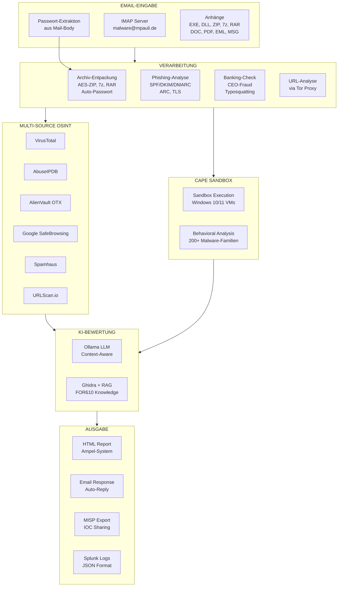

# IcePorge-CAPE-Mailer

[View on GitHub](https://github.com/icepaule/IcePorge-CAPE-Mailer){: .btn .btn-primary .fs-5 .mb-4 .mb-md-0 .mr-2 }

***

**Email-Triggered CAPE Analysis with Automated Response**

[](LICENSE)

***

# Betriebshandbuch CAPE Mailer - E-Mail-basierte Malware-Analyse

***

**Dokumenteninformationen**

| Attribut | Wert |
|----------|------|
| Dokumentenversion | 1.0 |
| Erstellungsdatum | 2026-01-19 |
| Letzte Änderung | 2026-01-19 |
| Klassifizierung | INTERN |
| Zielgruppe | ITSO / Cyber Security Analyst Level 3 |
| Dokumentenverantwortlicher | IT-Sicherheitsbetrieb |
| Review-Zyklus | Quartalsweise |

***

## Inhaltsverzeichnis

1. [Zweck und Geltungsbereich](#1-zweck-und-geltungsbereich)
2. [Systemübersicht und Architektur](#2-systemübersicht-und-architektur)
3. [Regulatorische Anforderungen](#3-regulatorische-anforderungen)
4. [Installation und Konfiguration](#4-installation-und-konfiguration)
5. [Betriebsverfahren](#5-betriebsverfahren)
6. [Wartungsverfahren](#6-wartungsverfahren)
7. [Incident Response Prozeduren](#7-incident-response-prozeduren)
8. [Troubleshooting](#8-troubleshooting)
9. [Sicherheitsaspekte](#9-sicherheitsaspekte)
10. [Anhänge](#10-anhänge)

***

## 1. Zweck und Geltungsbereich

### 1.1 Zweck des Dokuments

Dieses Betriebshandbuch dokumentiert den Betrieb des CAPE Mailers - einer automatisierten E-Mail-Analyse-Pipeline für die Erkennung von Malware und Phishing-Angriffen. Das System ermöglicht Mitarbeitern die unkomplizierte Einreichung verdächtiger E-Mail-Anhänge zur automatisierten Analyse.

### 1.2 Geltungsbereich

Das Handbuch gilt für:
- Die CAPE Mailer-Installation unter `/opt/cape-mailer/`
- Die IMAP/SMTP-Schnittstelle zu `malware@mpauli.de`
- Alle integrierten OSINT-Dienste (OTX, AbuseIPDB, VirusTotal, Google Safe Browsing)
- Die MISP-Anbindung für Threat Intelligence

### 1.3 Systemzweck

CAPE Mailer automatisiert den kompletten Workflow der verdächtigen E-Mail-Analyse:

1. **Eingangsverarbeitung**: IMAP-Abruf von `malware@mpauli.de`
2. **Klassifizierung**: Automatische Erkennung von Malware vs. Phishing
3. **Analyse**: CAPE Sandbox (Malware) oder Multi-Source OSINT (Phishing)
4. **Bewertung**: KI-gestützte Risikobewertung via Ollama LLM
5. **Reporting**: HTML-Report per E-Mail an Einsender
6. **Threat Intelligence**: Automatische MISP-Event-Erstellung

**Quelle**: `/opt/cape-mailer/bin/cape_mailer.py:1-76` (Dokumentation)

***

## 2. Systemübersicht und Architektur

### 2.1 Architektur-Diagramm


<details>
<summary>Mermaid-Diagramm (klicken zum Ausklappen)</summary>


</details>

**Zentrale Features:**
- **Email-Eingabe**: Automatischer IMAP-Abruf mit Passwort-Extraktion aus dem Mail-Body
- **Archiv-Handling**: ZIP (AES-verschlüsselt), 7z, RAR mit automatischem Passwort-Versuch
- **Phishing-Analyse**: Multi-Source Auth-Header-Parsing (SPF/DKIM/DMARC/ARC)
- **OSINT-Enrichment**: 6+ Threat Intelligence Quellen
- **KI-Bewertung**: Ollama LLM mit OSINT-Context für präzise Risikobewertung

### 2.2 Systemkomponenten

| Komponente | Beschreibung | Quelle |
|------------|--------------|--------|
| cape_mailer.py | Hauptskript (3459 Zeilen) | `/opt/cape-mailer/bin/cape_mailer.py` |
| config.yaml | Konfiguration | `/opt/cape-mailer/config/config.yaml` |
| phishing_prompt.txt | Ollama-Prompt für Phishing-Bewertung | `/opt/cape-mailer/config/phishing_prompt.txt` |
| cleanup_logs.sh | Log-Bereinigung | `/opt/cape-mailer/bin/cleanup_logs.sh` |

### 2.3 Verzeichnisstruktur

```
/opt/cape-mailer/
├── bin/
│   ├── cape_mailer.py          # Hauptskript
│   └── cleanup_logs.sh         # Log-Cleanup
├── config/
│   ├── config.yaml             # Hauptkonfiguration
│   └── phishing_prompt.txt     # Ollama LLM-Prompt
├── logs/
│   ├── cape_mailer_YYYY-MM-DD.log  # Tägliche Logs
│   └── splunk/                     # JSON-Logs für SIEM
├── reports/                    # HTML-Reports
├── work/                       # Temporäre Arbeitsdateien
├── processed/                  # Verarbeitete Samples
├── quarantine/                 # Quarantäne-Dateien
├── venv/                       # Python Virtual Environment
└── cape-mailer.lock            # Process-Lock-Datei
```

**Quelle**: `/opt/cape-mailer/bin/cape_mailer.py:135-142`

### 2.4 Analyse-Modi

| Modus | Trigger | Analyse-Schritte |
|-------|---------|------------------|
| **Malware** | Nicht-EML/MSG-Anhänge (.exe, .dll, .pdf, etc.) | CAPE Sandbox → Verhaltensanalyse → Ghidra → Ollama |
| **Phishing** | EML/MSG-Anhänge | Header-Analyse → OSINT → URL-Check → Ollama |

**Quelle**: `/opt/cape-mailer/bin/cape_mailer.py:150-152` (EML_EXTENSIONS)

***

## 3. Regulatorische Anforderungen

### 3.1 BaFin / MaRisk

| MaRisk-Anforderung | Umsetzung |
|-------------------|-----------|
| AT 7.2 (IT-Risikomanagement) | Automatisierte Phishing-/Malware-Erkennung |
| AT 8.2 (Auslagerung) | OSINT-APIs als externe Dienste dokumentiert |
| BT 3.2 (Überwachung) | Vollständige Protokollierung (Splunk JSON) |

### 3.2 BAIT (Bankaufsichtliche Anforderungen an die IT)

| BAIT-Kapitel | Relevanz | Maßnahme |
|--------------|----------|----------|
| IV. Informationssicherheit | Bedrohungserkennung | Multi-Source Threat Intelligence |
| VI. IT-Betrieb | Automatisierung | Vollautomatische Analyse-Pipeline |
| VIII. Outsourcing | API-Dienste | Dokumentierte OSINT-Anbieter |

### 3.3 DORA (Digital Operational Resilience Act)

| DORA-Artikel | Anforderung | Umsetzung |
|--------------|-------------|-----------|
| Art. 5 | IKT-Risikomanagement | Automatisierte Bedrohungsanalyse |
| Art. 8 | Erkennung | Real-time Phishing-Detection |
| Art. 11 | Incident Response | MISP-Integration für Threat Sharing |

### 3.4 ISO 27001 Kontrollen

| ISO 27001 Control | Umsetzung |
|-------------------|-----------|
| A.7.2.2 Awareness | Mitarbeiter können verdächtige E-Mails einfach einreichen |
| A.12.2 Schutz vor Malware | Automatisierte Analyse-Pipeline |
| A.16.1.4 Incident Assessment | Automatische Risikobewertung (Ampel-System) |

***

## 4. Installation und Konfiguration

### 4.1 Systemvoraussetzungen

**Hardware**:
- CPU: 2 Kerne (für OSINT-Parallelverarbeitung)
- RAM: 4 GB
- Storage: 50 GB (für Reports und Logs)

**Software**:
- Python 3.12 mit Virtual Environment
- Zugang zu IMAP/SMTP-Server
- Tor-Proxy (für sichere URL-Prüfung)

### 4.2 Hauptkonfiguration

Die Konfiguration erfolgt in `/opt/cape-mailer/config/config.yaml`:

**IMAP-Konfiguration** (Zeile 8-16):
```yaml
imap:
  host: "10.1.1.11"
  port: 143
  ssl: false
  starttls: true
  verify_ssl: false
  user: "malware@mpauli.de"
  pass: "onlyinfected"
  folder: "INBOX"
```

**SMTP-Konfiguration** (Zeile 21-29):
```yaml
smtp:
  host: "10.1.1.11"
  port: 25
  ssl: false
  starttls: true
  verify_ssl: false
  user: "malware@mpauli.de"
  pass: "onlyinfected"
  from: "CAPE Sandbox <malware@mpauli.de>"
```

**Quelle**: `/opt/cape-mailer/config/config.yaml:8-29`

### 4.3 Ampel-System

Das Ampel-System klassifiziert Bedrohungen anhand des Malscores:

```yaml
# /opt/cape-mailer/config/config.yaml:86-88
ampel:
  green_max_malscore: 1.9    # 🟢 CLEAN: 0-1.9
  yellow_max_malscore: 4.9   # 🟡 VERDÄCHTIG: 2.0-4.9
                              # 🔴 MALICIOUS: 5.0+
```

| Ampel | Malscore | Bedeutung | Aktion |
|-------|----------|-----------|--------|
| 🟢 GRÜN | 0-1.9 | Unverdächtig | Informativ |
| 🟡 GELB | 2.0-4.9 | Verdächtig | Manuelle Prüfung empfohlen |
| 🔴 ROT | 5.0+ | Malicious | MISP-Event + Eskalation |

### 4.4 OSINT-Integration

CAPE Mailer nutzt mehrere OSINT-Quellen für umfassende Threat Intelligence:

```yaml
# /opt/cape-mailer/config/config.yaml:123-172
osint:
  # AlienVault OTX - Threat Intelligence
  otx:
    enabled: true
    api_key: "<MASKED_OTX_KEY>"
    timeout: 10

  # AbuseIPDB - IP Reputation
  abuseipdb:
    enabled: true
    api_key: "<MASKED_ABUSEIPDB_KEY>"
    timeout: 10
    max_age_days: 90

  # VirusTotal - Multi-Engine Scanner
  virustotal:
    enabled: true
    api_key: "<MASKED_VIRUSTOTAL_KEY>"
    timeout: 15

  # Google Safe Browsing
  google_safe_browsing:
    enabled: true
    api_key: "<MASKED_GOOGLE_SAFEBROWSING_KEY>"
    timeout: 10

  # Spamhaus (DNS-basiert, kostenlos)
  spamhaus:
    enabled: true
```

**Quelle**: `/opt/cape-mailer/config/config.yaml:123-172`

### 4.5 MISP-Integration

Automatische Event-Erstellung bei kritischen Findings:

```yaml
# /opt/cape-mailer/config/config.yaml:176-208
misp:
  enabled: true
  url: "https://10.10.0.204"
  api_key: "<MASKED_MISP_KEY>"
  verify_ssl: false

  # Event Settings
  publish: false          # Manuelles Review erforderlich!
  distribution: 0         # Your organization only
  threat_level_id: 4      # 1=High, 2=Medium, 3=Low, 4=Undefined

  # IOC Export
  export_hashes: true
  export_urls: true
  export_domains: true
  export_ips: true
  export_registry_keys: true
  export_mutexes: true
```

**Phishing-spezifische MISP-Trigger** (Zeile 210-258):
```yaml
misp_phishing:
  trigger:
    min_verdict: "suspicious"     # Ab "suspicious" Event erstellen
    min_risk_score: 40            # Oder ab Risk Score 40
    ollama_keywords:              # Oder wenn Ollama diese Keywords nutzt
      - "high"
      - "critical"
      - "phishing"
      - "credential theft"
```

**Quelle**: `/opt/cape-mailer/config/config.yaml:176-258`

***

## 5. Betriebsverfahren

### 5.1 Automatischer Betrieb

CAPE Mailer läuft automatisch via Systemd-Timer:

**Timer-Konfiguration** (`/etc/systemd/system/cape-mailer.timer`):
```ini
[Timer]
OnBootSec=45s           # Erster Start 45s nach Boot
OnUnitActiveSec=60s     # Dann alle 60 Sekunden
Persistent=true
```

**Service-Konfiguration** (`/etc/systemd/system/cape-mailer.service`):
```ini
[Service]
Type=oneshot
User=cape
Group=cape
WorkingDirectory=/opt/cape-mailer
ExecStart=/opt/cape-mailer/venv/bin/python3 /opt/cape-mailer/bin/cape_mailer.py

# Hardening
NoNewPrivileges=true
PrivateTmp=true
ProtectSystem=strict
ProtectHome=true
```

**Quelle**: `/etc/systemd/system/cape-mailer.service`

### 5.2 Service-Management

```bash
# Timer starten
sudo systemctl start cape-mailer.timer

# Timer stoppen
sudo systemctl stop cape-mailer.timer

# Timer-Status prüfen
systemctl status cape-mailer.timer

# Manueller Einzellauf
sudo systemctl start cape-mailer.service

# Logs anzeigen
journalctl -u cape-mailer -f
```

### 5.3 E-Mail-Einreichung durch Mitarbeiter

**Vorgehensweise für Mitarbeiter**:

1. Verdächtige E-Mail als `.eml` oder `.msg` speichern (oder Anhang extrahieren)
2. Neue E-Mail an `malware@mpauli.de` erstellen
3. Verdächtige Datei anhängen
4. Optional: Passwort für verschlüsselte Archive im Text angeben
   - Format: `Passwort: infected` oder `Password: malware`
5. E-Mail absenden
6. Automatischer Report innerhalb von ~5-30 Minuten

**Unterstützte Dateitypen** (`/opt/cape-mailer/config/config.yaml:34-61`):
- Ausführbare Dateien: `.exe`, `.dll`, `.msi`
- Skripte: `.ps1`, `.js`, `.vbs`, `.bat`, `.cmd`
- Dokumente: `.pdf`, `.doc(x/m)`, `.xls(x/m)`, `.ppt(x/m)`
- Archive: `.zip`, `.7z`, `.rar`, `.iso`
- E-Mails: `.eml`, `.msg`

### 5.4 Mailbox-Verwaltung

Verarbeitete E-Mails werden automatisch verwaltet:

| Status | Aktion | Zielordner |
|--------|--------|------------|
| Erfolgreich analysiert | Verschieben | `Processed` |
| Fehler bei Analyse | Markieren als gelesen | `INBOX` (markiert) |
| Loop-Detection | Ignorieren | - |

**Loop-Prevention**: E-Mails von `malware@mpauli.de` werden nicht beantwortet (verhindert E-Mail-Loops).

**Quelle**: `/opt/cape-mailer/bin/cape_mailer.py:63` (Changelog v2.3.1)

### 5.5 Report-Interpretation

Der HTML-Report enthält folgende Sektionen:

**Malware-Report**:
- Executive Summary (Ampel-Bewertung)
- KI-Analyse (Ollama LLM)
- MITRE ATT&CK Mapping
- OTX Threat Intelligence
- Behavioral Sequence
- Ghidra Static Analysis
- OSINT Reputation

**Phishing-Report**:
- Risikobewertung (0-100)
- Header-Analyse (SPF/DKIM/DMARC)
- Mail-Routing-Chain (TLS-Verschlüsselung)
- URL-Analyse mit OSINT-Reputation
- Banking-spezifische Checks (Typosquatting, CEO-Fraud)
- KI-Bewertung mit Empfehlungen

***

## 6. Wartungsverfahren

### 6.1 Log-Rotation

Die Logs werden täglich rotiert und komprimiert:

**Cleanup-Skript** (`/opt/cape-mailer/bin/cleanup_logs.sh`):
```bash
#!/bin/bash
LOG_DIR="/opt/cape-mailer/logs"
RETENTION_DAYS=180

# Komprimieren nach 1 Tag
find "$LOG_DIR" -name "cape_mailer_*.log" -type f -mtime +1 ! -name "*.gz" -exec gzip -9 {} \;

# Löschen nach 180 Tagen
find "$LOG_DIR" -name "cape_mailer_*.log.gz" -type f -mtime +$RETENTION_DAYS -delete

# Splunk JSON-Logs
find "$LOG_DIR/splunk" -name "*.json" -type f -mtime +1 ! -name "*.gz" -exec gzip -9 {} \;
find "$LOG_DIR/splunk" -name "*.json.gz" -type f -mtime +$RETENTION_DAYS -delete
```

**Cron-Job** (`/etc/cron.daily/cape-log-cleanup`):
```bash
#!/bin/bash
/opt/cape-mailer/bin/cleanup_logs.sh >> /var/log/cape-log-cleanup.log 2>&1
```

**Aufbewahrung**: 180 Tage (6 Monate)

**Quelle**: `/opt/cape-mailer/bin/cleanup_logs.sh`

### 6.2 OSINT-API-Keys

Die API-Keys sollten regelmäßig auf Gültigkeit geprüft werden:

| Service | API-Key-Standort | Erneuerung |
|---------|------------------|------------|
| OTX | config.yaml:128 | Unbegrenzt (kostenlos) |
| AbuseIPDB | config.yaml:135 | Jährlich prüfen |
| VirusTotal | config.yaml:143 | Rate-Limits beachten |
| Google Safe Browsing | config.yaml:157 | Google Cloud Console |

**API-Key-Test**:
```bash
# OTX Test
curl -H "X-OTX-API-KEY: <key>" "https://otx.alienvault.com/api/v1/user/me"

# VirusTotal Test
curl -H "x-apikey: <key>" "https://www.virustotal.com/api/v3/users/current"
```

### 6.3 Python-Dependency-Updates

```bash
# Virtual Environment aktivieren
source /opt/cape-mailer/venv/bin/activate

# Aktuelle Dependencies anzeigen
pip list --outdated

# Security-Updates
pip install --upgrade requests urllib3 pyopenssl

# Nach Update: Service-Test
/opt/cape-mailer/venv/bin/python3 -c "import cape_mailer; print('OK')"
```

***

## 7. Incident Response Prozeduren

### 7.1 Phishing-Kampagne erkannt

**Indikatoren**:
- Mehrere ähnliche E-Mails von verschiedenen Mitarbeitern
- MISP-Events mit gleichen IOCs
- Splunk-Alert bei gehäuften ROT-Bewertungen

**Sofortmaßnahmen**:

1. **MISP-Events konsolidieren**:
   ```bash
   # Alle Phishing-Events der letzten 24h
   curl -k -H "Authorization: <api_key>" \
        "https://10.10.0.204/events/restSearch" \
        -d '{"tags":["phishing"],"from":"1d"}'
   ```

2. **IOCs an Mail-Gateway exportieren**:
   - Sender-Domains blocken
   - URLs in Web-Proxy sperren
   - Betroffene Mitarbeiter informieren

3. **Awareness-Maßnahme**:
   - Phishing-Report an betroffene Abteilungen
   - ggf. Test-Phishing zur Sensibilisierung

### 7.2 Malware-Ausbruch

**Bei ROT-Bewertung mit hohem Malscore (>8)**:

1. **CAPE-Report analysieren**:
   ```bash
   # Report öffnen
   firefox /opt/cape-mailer/reports/cape_<hash>.html
   ```

2. **IOCs aus MISP extrahieren**:
   - Hashes für EDR-Suche
   - C2-Domains für Proxy-Block
   - Registry-Keys für Forensik

3. **Eskalation**:
   - CERT-Team informieren
   - Betroffene Systeme isolieren
   - Forensik einleiten

### 7.3 Service-Ausfall

**Symptome**: Keine Reports, Timer läuft nicht

**Diagnose**:
```bash
# Timer-Status
systemctl status cape-mailer.timer

# Letzte Ausführungen
journalctl -u cape-mailer --since "1 hour ago"

# Lock-File prüfen
ls -la /opt/cape-mailer/cape-mailer.lock
cat /opt/cape-mailer/cape-mailer.lock  # Zeigt PID

# Prozess prüfen (falls Lock existiert)
ps aux | grep cape_mailer
```

**Behebung**:
```bash
# Bei verwaister Lock-Datei
rm /opt/cape-mailer/cape-mailer.lock

# Timer neu starten
sudo systemctl restart cape-mailer.timer
```

***

## 8. Troubleshooting

### 8.1 Häufige Fehler

| Fehler | Ursache | Lösung |
|--------|---------|--------|
| `Lock file exists` | Vorheriger Prozess läuft noch | Warten oder Lock-Datei manuell entfernen |
| `IMAP connection failed` | Netzwerk/Auth-Problem | Credentials in config.yaml prüfen |
| `CAPE API timeout` | CAPE-Überlastung | max_wait in config.yaml erhöhen |
| `OSINT rate limit` | API-Limits erreicht | Wartezeit erhöhen oder API-Key upgraden |
| `Ollama timeout` | LLM-Server überlastet | timeout in config.yaml erhöhen |

### 8.2 Log-Analyse

```bash
# Heutiges Log
tail -f /opt/cape-mailer/logs/cape_mailer_$(date +%Y-%m-%d).log

# Fehler suchen
grep -i "error\|exception\|failed" /opt/cape-mailer/logs/cape_mailer_*.log

# Spezifische Mail-ID suchen
grep "Mail #123" /opt/cape-mailer/logs/cape_mailer_*.log
```

### 8.3 IMAP-Verbindungstest

```bash
# Python-Test
/opt/cape-mailer/venv/bin/python3 << 'EOF'
from imapclient import IMAPClient
with IMAPClient('10.1.1.11', port=143, ssl=False) as c:
    c.starttls()
    c.login('malware@mpauli.de', 'onlyinfected')
    print("Verbindung erfolgreich!")
    print(f"Mails in INBOX: {c.select_folder('INBOX')}")
EOF
```

### 8.4 Manueller Testlauf

```bash
# Mit Debug-Output
cd /opt/cape-mailer
/opt/cape-mailer/venv/bin/python3 /opt/cape-mailer/bin/cape_mailer.py 2>&1 | tee /tmp/cape_mailer_debug.log
```

***

## 9. Sicherheitsaspekte

### 9.1 Systemd-Hardening

Der Service läuft mit restriktiven Berechtigungen:

```ini
# /etc/systemd/system/cape-mailer.service
NoNewPrivileges=true       # Keine Privilege Escalation
PrivateTmp=true            # Isoliertes /tmp
ProtectSystem=strict       # Nur explizit erlaubte Pfade schreibbar
ProtectHome=true           # Kein Zugriff auf /home
ReadWritePaths=/opt/cape-mailer /opt/CAPEv2/storage /opt/CAPEv2/log /opt/CAPEv2/conf
RestrictAddressFamilies=AF_INET AF_INET6 AF_UNIX
LockPersonality=true       # Keine Personality-Änderung
```

**Quelle**: `/etc/systemd/system/cape-mailer.service`

### 9.2 Credential-Management

| Credential | Speicherort | Schutzmechanismus |
|------------|-------------|-------------------|
| IMAP-Passwort | config.yaml | Dateiberechtigungen (640) |
| SMTP-Passwort | config.yaml | Dateiberechtigungen (640) |
| MISP-API-Key | config.yaml | TLS-Verschlüsselung |
| OSINT-API-Keys | config.yaml | Rate-Limiting |

**Empfehlung**: Für Produktivbetrieb HashiCorp Vault oder ähnliche Secret-Management-Lösung implementieren.

### 9.3 Netzwerk-Sicherheit

| Verbindung | Protokoll | Verschlüsselung |
|------------|-----------|-----------------|
| IMAP (10.1.1.11) | STARTTLS | TLS 1.2+ |
| SMTP (10.1.1.11) | STARTTLS | TLS 1.2+ |
| MISP (10.10.0.204) | HTTPS | TLS 1.2+ |
| Ollama (10.10.0.113) | HTTP | Intern (kein TLS) |
| OSINT-APIs | HTTPS | TLS 1.2+ |
| URL-Checks | Tor SOCKS5 | Anonymisiert |

### 9.4 Tor-Proxy für URL-Prüfung

URLs werden über Tor geprüft, um die IP des Analysten zu schützen:

```python
# /opt/cape-mailer/bin/cape_mailer.py:148
TOR_PROXY = "socks5h://127.0.0.1:9050"
```

***

## 10. Anhänge

### 10.1 Konfigurationsdateien-Referenz

| Datei | Zweck |
|-------|-------|
| `/opt/cape-mailer/config/config.yaml` | Hauptkonfiguration |
| `/opt/cape-mailer/config/phishing_prompt.txt` | Ollama-Prompt für Phishing-Bewertung |
| `/etc/systemd/system/cape-mailer.service` | Systemd-Service |
| `/etc/systemd/system/cape-mailer.timer` | Timer (60s Intervall) |
| `/etc/cron.daily/cape-log-cleanup` | Log-Bereinigung |
| `/etc/logrotate.d/opt-logs` | Logrotate-Konfiguration |

### 10.2 Kommandoreferenz

```bash
# Service-Management
systemctl {start|stop|restart|status} cape-mailer.timer
systemctl {start|stop|restart|status} cape-mailer.service

# Logs
tail -f /opt/cape-mailer/logs/cape_mailer_$(date +%Y-%m-%d).log
journalctl -u cape-mailer -f

# Lock-Management
cat /opt/cape-mailer/cape-mailer.lock    # PID anzeigen
rm /opt/cape-mailer/cape-mailer.lock     # Lock entfernen (Vorsicht!)

# Manueller Test
/opt/cape-mailer/venv/bin/python3 /opt/cape-mailer/bin/cape_mailer.py
```

### 10.3 Banking-spezifische Checks

CAPE Mailer erkennt Banking-bezogene Phishing-Versuche:

**Deutsche Banken-Keywords** (`/opt/cape-mailer/bin/cape_mailer.py:166-171`):
```python
GERMAN_BANKS = [
    "sparkasse", "volksbank", "raiffeisenbank", "commerzbank", "deutsche bank",
    "postbank", "ing-diba", "ing", "dkb", "comdirect", "hypovereinsbank", "unicredit",
    "targobank", "santander", "n26", "bunq", "consorsbank", "norisbank", "sparda",
    "apobank", "psd bank", "bw bank", "lbbw", "helaba", "landesbank", "kfw"
]
```

**CEO-Fraud-Keywords** (`/opt/cape-mailer/bin/cape_mailer.py:174-179`):
```python
CEO_FRAUD_KEYWORDS = [
    "dringend", "vertraulich", "geheim", "überweisung", "wire transfer",
    "geschäftsführer", "ceo", "vorstand", "chef", "direktor",
    "sofort", "immediately", "urgent", "asap", "zeitkritisch",
    "nicht weiterleiten", "nur für sie", "persönlich"
]
```

### 10.4 Kontaktinformationen

| Rolle | Kontakt |
|-------|---------|
| IT-Sicherheitsbetrieb (1st Level) | security-ops@bank.de |
| CERT/Incident Response (2nd Level) | cert@bank.de |
| System-Administration (3rd Level) | sysadmin@bank.de |
| Malware-Analyse-Mailbox | malware@mpauli.de |

### 10.5 Änderungshistorie

| Version | Datum | Autor | Änderung |
|---------|-------|-------|----------|
| 1.2 | 2026-01-23 | IcePorge | SVG-Architekturdiagramm, Mermaid-Diagramm, TruffleHog Security-Scan Integration |
| 1.1 | 2026-01-22 | IcePorge | Secret-Maskierung für GitHub-Push, Git-History-Bereinigung |
| 1.0 | 2026-01-19 | IT-Sicherheit | Initiale Erstellung |

***

**Ende des Dokuments**

*Dieses Dokument unterliegt der Klassifizierung INTERN und darf nur innerhalb des Instituts verwendet werden.*
