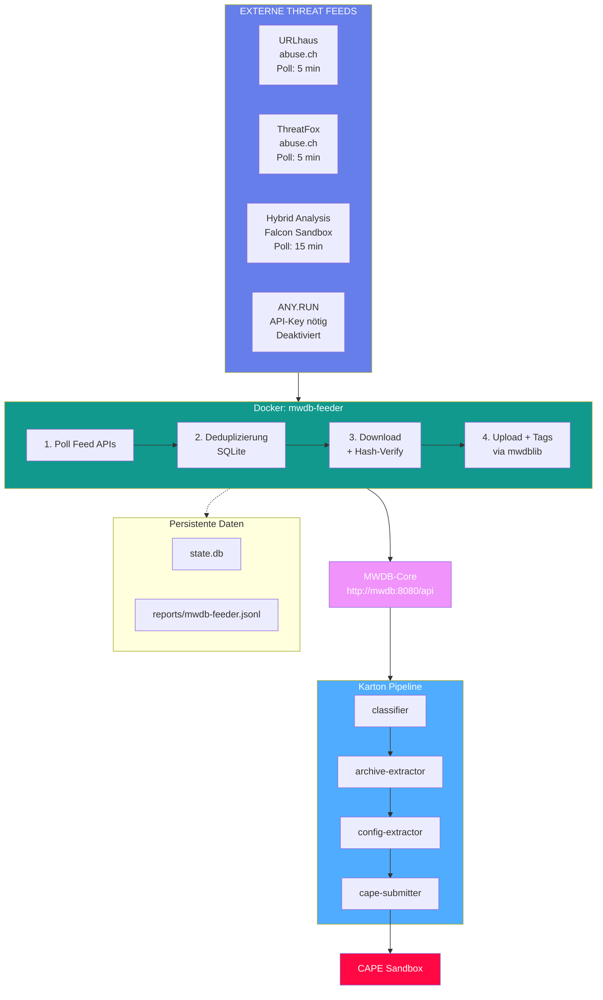

# IcePorge-MWDB-Feeder

[View on GitHub](https://github.com/icepaule/IcePorge-MWDB-Feeder){: .btn .btn-primary .fs-5 .mb-4 .mb-md-0 .mr-2 }

***

**Multi-Source Malware Sample Aggregator**

[](LICENSE)

Aggregates malware samples from multiple threat intelligence sources and uploads them to MWDB.

***

# Betriebshandbuch MWDB-Feeder - Multi-Source Malware Aggregator

***

**Dokumenteninformationen**

| Attribut | Wert |
|----------|------|
| Dokumentenversion | 1.0 |
| Erstellungsdatum | 2026-01-22 |
| Letzte Änderung | 2026-01-22 |
| Klassifizierung | INTERN |
| Zielgruppe | ITSO / Cyber Security Analyst Level 3 |
| Dokumentenverantwortlicher | IT-Sicherheitsbetrieb |
| Review-Zyklus | Quartalsweise |

***

## Inhaltsverzeichnis

1. [Zweck und Geltungsbereich](#1-zweck-und-geltungsbereich)
2. [Systemübersicht und Architektur](#2-systemübersicht-und-architektur)
3. [Regulatorische Anforderungen](#3-regulatorische-anforderungen)
4. [Installation und Konfiguration](#4-installation-und-konfiguration)
5. [Betriebsverfahren](#5-betriebsverfahren)
6. [Wartungsverfahren](#6-wartungsverfahren)
7. [Incident Response Prozeduren](#7-incident-response-prozeduren)
8. [Troubleshooting](#8-troubleshooting)
9. [Sicherheitsaspekte](#9-sicherheitsaspekte)
10. [Anhänge](#10-anhänge)

***

## 1. Zweck und Geltungsbereich

### 1.1 Zweck des Dokuments

Dieses Betriebshandbuch dokumentiert den Betrieb des MWDB-Feeder Systems - einer automatisierten Pipeline zur Aggregation von Malware-Samples aus mehreren externen Threat Intelligence Feeds und Upload in das MWDB (Malware Database) Repository.

### 1.2 Geltungsbereich

Das Handbuch gilt für:
- Die MWDB-Feeder-Installation unter `/opt/mwdb-feeder/`
- Die Docker-Container-Infrastruktur
- Die Integration mit dem MWDB-Core + Karton Stack

### 1.3 Systemzweck

MWDB-Feeder automatisiert die kontinuierliche Beschaffung von Malware-Samples aus verschiedenen "in the wild" Quellen:

1. **Polling**: Regelmäßiger Abruf neuer Samples von mehreren Threat Intelligence Feeds
2. **Deduplizierung**: SQLite-basierte Vermeidung von Mehrfach-Uploads
3. **Download**: Sichere Beschaffung der Malware-Samples mit Hash-Verifizierung
4. **Upload**: Automatischer Upload zu MWDB via mwdblib
5. **Tagging**: Automatische Kennzeichnung mit Quellen- und Malware-Tags
6. **Reporting**: JSONL-Logging für SIEM-Integration

### 1.4 Abgrenzung zu CAPE-Feed

| Aspekt | CAPE-Feed | MWDB-Feeder |
|--------|-----------|-------------|
| **Ziel** | Direkte CAPE-Submission | MWDB-Repository-Aufbau |
| **Quellen** | MalwareBazaar, ransomware.live | URLhaus, ThreatFox, Hybrid Analysis, (ANY.RUN) |
| **Pipeline** | Feed → CAPE → MISP | Feed → MWDB → Karton → CAPE |
| **Fokus** | Ransomware-fokussiert | Breites Malware-Spektrum |

**Quelle**: `/opt/mwdb-feeder/app/feeder.py:1-14`

***

## 2. Systemübersicht und Architektur

### 2.1 Architektur-Diagramm


<details>
<summary>Mermaid-Diagramm (klicken zum Ausklappen)</summary>


</details>

<details>
<summary>ASCII-Diagramm (Legacy)</summary>

```
┌────────────────────────────────────────────────────────────────────────┐
│                    MWDB-Feeder Pipeline (v1.0.0)                       │
├────────────────────────────────────────────────────────────────────────┤
│                                                                        │
│   ┌─────────────────────────────────────────────────────────────┐     │
│   │                  Externe Threat Feeds                        │     │
│   ├─────────────┬─────────────┬─────────────┬───────────────────┤     │
│   │  URLhaus    │  ThreatFox  │   Hybrid    │    ANY.RUN        │     │
│   │  (abuse.ch) │  (abuse.ch) │  Analysis   │   (API-Key)       │     │
│   │  Poll: 5min │  Poll: 5min │  Poll: 15min│   Poll: 10min     │     │
│   └─────────────┴─────────────┴─────────────┴───────────────────┘     │
│                               │                                        │
│                               ▼                                        │
│   ┌─────────────────────────────────────────────────────────────┐     │
│   │              Docker Container: mwdb-feeder                   │     │
│   │              /opt/mwdb-feeder/app/feeder.py                 │     │
│   ├─────────────────────────────────────────────────────────────┤     │
│   │  1. Poll Feed APIs (parallel)                               │     │
│   │  2. Check State DB (SQLite Deduplizierung)                 │     │
│   │  3. Size Check (max 50 MB)                                  │     │
│   │  4. Download Sample + Hash Verify                           │     │
│   │  5. Upload to MWDB via mwdblib                             │     │
│   │  6. Add Tags (source, malware family, verdict)             │     │
│   │  7. Update State + JSONL Log                                │     │
│   └─────────────────────────────────────────────────────────────┘     │
│                               │                                        │
│                               ▼                                        │
│   ┌─────────────────────────────────────────────────────────────┐     │
│   │                    MWDB-Core                                 │     │
│   │                    http://mwdb:8080/api                     │     │
│   │                    (Docker-Netzwerk)                        │     │
│   └─────────────────────────────────────────────────────────────┘     │
│                               │                                        │
│                               ▼                                        │
│   ┌─────────────────────────────────────────────────────────────┐     │
│   │                    Karton Pipeline                           │     │
│   │  classifier → archive-extractor → config-extractor          │     │
│   │                        ↓                                     │     │
│   │                 cape-submitter → CAPE Sandbox               │     │
│   └─────────────────────────────────────────────────────────────┘     │
│                                                                        │
│   ┌─────────────────────────────────────────────────────────────┐     │
│   │                    Persistente Daten                         │     │
│   │  /opt/mwdb-feeder/work/                                     │     │
│   │  ├── state.db              (SQLite State)                   │     │
│   │  └── reports/              (JSONL Logs)                     │     │
│   │      └── mwdb-feeder.jsonl                                  │     │
│   └─────────────────────────────────────────────────────────────┘     │
│                                                                        │
└────────────────────────────────────────────────────────────────────────┘
```
</details>

### 2.2 Threat Intelligence Feeds

| Feed | URL | Polling | Auth | Status | Beschreibung |
|------|-----|---------|------|--------|--------------|
| URLhaus | https://urlhaus-api.abuse.ch/v1/ | 5 min | Auth-Key | ✅ Aktiv | Malware-Payloads (ZIP-verschlüsselt) |
| ThreatFox | https://threatfox-api.abuse.ch/api/v1/ | 5 min | Auth-Key | ✅ Aktiv | IOCs (nur Hash-Logging, kein Download) |
| Hybrid Analysis | https://www.hybrid-analysis.com/api/v2/ | 15 min | API-Key | ✅ Aktiv | Falcon Sandbox Public Feed |
| ANY.RUN | https://api.any.run/v1/ | 10 min | API-Key | ❌ Benötigt API-Key | Kostenpflichtiger Plan erforderlich |

**Quelle**: `/opt/mwdb-feeder/.env`

### 2.3 Verzeichnisstruktur

```
/opt/mwdb-feeder/
├── app/
│   ├── feeder.py              # Hauptskript (v1.0.0)
│   └── requirements.txt       # Python Dependencies
├── work/                      # Persistente Daten (Volume)
│   ├── state.db              # SQLite State-Datenbank
│   └── reports/              # JSONL-Reports
│       └── mwdb-feeder.jsonl
├── .env                       # Konfiguration (API-Keys)
├── docker-compose.yml        # Docker-Compose-Datei
└── Dockerfile                # Container-Image-Definition
```

### 2.4 Feed-Spezifika

#### URLhaus (abuse.ch)

- **Datenformat**: ZIP-verschlüsselte Malware-Samples
- **Passwort**: `infected`
- **Hash-Verifizierung**: SHA256 nach Entpacken
- **Tags**: `source:urlhaus`, `malware:{signature}`

#### ThreatFox (abuse.ch)

- **Datenformat**: Hash-basierte IOCs (kein direkter Download)
- **Verwendung**: Logging von SHA256-Hashes für Cross-Referenz
- **Tags**: `source:threatfox`

#### Hybrid Analysis (Falcon Sandbox)

- **Datenformat**: Raw Binaries oder GZIP-komprimiert
- **Limitierung**: Nicht alle Samples downloadbar (HTTP 400)
- **Tags**: `source:hybrid_analysis`, `verdict:{verdict}`, `malware:{vx_family}`

#### ANY.RUN

- **Status**: Benötigt kostenpflichtigen API-Key (Searcher Plan oder höher)
- **API-Key**: https://app.any.run/profile → API & Limits
- **Hinweis**: Web-Scraping wird von Cloudflare blockiert

***

## 3. Regulatorische Anforderungen

### 3.1 BaFin / MaRisk

| MaRisk-Anforderung | Umsetzung |
|-------------------|-----------|
| AT 7.2 (IT-Risikomanagement) | Multi-Source Threat Intelligence Aggregation |
| AT 4.3.2 (Risikoidentifikation) | Kontinuierliche Erfassung neuer Bedrohungen |

### 3.2 BAIT

| BAIT-Kapitel | Relevanz | Maßnahme |
|--------------|----------|----------|
| IV. Informationssicherheit | Threat Intelligence | Automatisierte Multi-Feed-Integration |
| VIII. Outsourcing | Externe Dienste | abuse.ch, Hybrid Analysis dokumentiert |

### 3.3 DORA

| DORA-Artikel | Anforderung | Umsetzung |
|--------------|-------------|-----------|
| Art. 5 | IKT-Risikomanagement | Automatische Threat-Erkennung |
| Art. 13 | Threat Intelligence | Integration mehrerer externer Feeds |

### 3.4 ISO 27001

| Control | Umsetzung |
|---------|-----------|
| A.5.7 Threat Intelligence | Multi-Source Feed-Integration |
| A.12.2 Schutz vor Malware | Proaktive Sample-Analyse via MWDB/Karton |

***

## 4. Installation und Konfiguration

### 4.1 Voraussetzungen

```bash
# Docker und Docker Compose prüfen
docker --version
docker compose version

# MWDB-Core Stack muss laufen
cd /opt/mwdb-core
docker compose ps
```

### 4.2 Umgebungsvariablen

Die Konfiguration erfolgt über `/opt/mwdb-feeder/.env`:

**MWDB-Verbindung**:
```bash
# /opt/mwdb-feeder/.env
MWDB_URL=http://mwdb:8080/api
MWDB_API_KEY=eyJ0eXAiOiJKV1Q...  # JWT Token aus MWDB UI
```

**URLhaus (abuse.ch)**:
```bash
URLHAUS_ENABLED=true
URLHAUS_URL=https://urlhaus-api.abuse.ch/v1/
URLHAUS_AUTH_KEY=b3437fd58ef417...  # abuse.ch Auth-Key
URLHAUS_POLL_SECONDS=300
URLHAUS_ZIP_PASSWORD=infected
```

**ThreatFox (abuse.ch)**:
```bash
THREATFOX_ENABLED=true
THREATFOX_URL=https://threatfox-api.abuse.ch/api/v1/
THREATFOX_AUTH_KEY=b3437fd58ef417...  # Gleicher abuse.ch Auth-Key
THREATFOX_POLL_SECONDS=300
```

**Hybrid Analysis**:
```bash
HYBRID_ANALYSIS_ENABLED=true
HYBRID_ANALYSIS_API_KEY=nzkq8o2t310c9d...  # Von hybrid-analysis.com
HYBRID_ANALYSIS_POLL_SECONDS=900
```

**ANY.RUN** (Optional - kostenpflichtig):
```bash
ANYRUN_ENABLED=false
ANYRUN_API_KEY=                    # API-Key von any.run/profile
ANYRUN_POLL_SECONDS=600
```

**Allgemeine Einstellungen**:
```bash
WORK_DIR=/work
STATE_DB=/work/state.db
REPORT_PATH=/work/reports/mwdb-feeder.jsonl
MAX_MB_PER_FILE=50                 # Max. Dateigröße in MB
```

**Quelle**: `/opt/mwdb-feeder/.env`

### 4.3 Docker-Compose-Konfiguration

```yaml
# /opt/mwdb-feeder/docker-compose.yml
services:
  mwdb-feeder:
    build: .
    container_name: mwdb-feeder
    restart: unless-stopped
    env_file:
      - .env
    volumes:
      - ./work:/work
    networks:
      - mwdb-core_default    # Verbindung zum MWDB-Stack
    stop_grace_period: 30s

networks:
  mwdb-core_default:
    external: true
```

**Quelle**: `/opt/mwdb-feeder/docker-compose.yml`

### 4.4 API-Key-Beschaffung

| Dienst | Registrierung | Kosten |
|--------|---------------|--------|
| abuse.ch (URLhaus/ThreatFox) | https://auth.abuse.ch/ | Kostenlos |
| Hybrid Analysis | https://www.hybrid-analysis.com/signup | Kostenlos (Rate-Limits) |
| ANY.RUN | https://app.any.run/ → Profile → API | Kostenpflichtig (Searcher Plan) |

***

## 5. Betriebsverfahren

### 5.1 Container-Start

```bash
cd /opt/mwdb-feeder

# Container starten
docker compose up -d

# Logs verfolgen
docker compose logs -f mwdb-feeder

# Container-Status
docker compose ps
```

### 5.2 Container-Stop

```bash
cd /opt/mwdb-feeder

# Graceful Stop (30s Wartezeit)
docker compose down

# Sofortiger Stop
docker compose kill
```

### 5.3 Container-Rebuild

Nach Änderungen an `feeder.py` oder `.env`:

```bash
cd /opt/mwdb-feeder

# Rebuild mit Cache
docker compose build && docker compose up -d

# Rebuild ohne Cache (bei Dependency-Änderungen)
docker compose build --no-cache && docker compose up -d
```

### 5.4 Monitoring

**Container-Logs**:
```bash
# Live-Logs
docker logs -f mwdb-feeder

# Letzte 100 Zeilen
docker logs --tail 100 mwdb-feeder

# Nur Fehler
docker logs mwdb-feeder 2>&1 | grep -i error
```

**JSONL-Reports**:
```bash
# Aktuelle Einträge
tail -f /opt/mwdb-feeder/work/reports/mwdb-feeder.jsonl

# Uploads heute
cat /opt/mwdb-feeder/work/reports/mwdb-feeder.jsonl | \
    grep "$(date +%Y-%m-%d)" | \
    jq -r 'select(.uploaded==true) | .sha256' | wc -l
```

**State-Datenbank**:
```bash
# Gesamtzahl verarbeiteter Samples
sqlite3 /opt/mwdb-feeder/work/state.db "SELECT COUNT(*) FROM processed;"

# Letzte 10 Samples
sqlite3 /opt/mwdb-feeder/work/state.db \
    "SELECT sha256, source, processed_at FROM processed ORDER BY processed_at DESC LIMIT 10;"

# Statistik nach Quelle
sqlite3 /opt/mwdb-feeder/work/state.db \
    "SELECT source, COUNT(*) as count FROM processed GROUP BY source;"
```

### 5.5 Feed-Statistiken

```bash
# Uploads nach Quelle (heute)
for source in urlhaus hybrid_analysis anyrun; do
    count=$(cat /opt/mwdb-feeder/work/reports/mwdb-feeder.jsonl | \
        grep "$(date +%Y-%m-%d)" | \
        jq -r "select(.source==\"$source\" and .uploaded==true) | .sha256" | wc -l)
    echo "$source: $count"
done
```

***

## 6. Wartungsverfahren

### 6.1 State-Datenbank-Wartung

```bash
# Datenbankgröße prüfen
ls -lh /opt/mwdb-feeder/work/state.db

# Alte Einträge bereinigen (> 90 Tage)
sqlite3 /opt/mwdb-feeder/work/state.db "
    DELETE FROM processed
    WHERE processed_at < datetime('now', '-90 days');
    VACUUM;
"
```

### 6.2 Log-Rotation

```bash
# JSONL-Logs komprimieren (älter als 7 Tage)
find /opt/mwdb-feeder/work/reports -name "*.jsonl" -mtime +7 -exec gzip {} \;

# Alte komprimierte Logs löschen (älter als 180 Tage)
find /opt/mwdb-feeder/work/reports -name "*.jsonl.gz" -mtime +180 -delete
```

### 6.3 API-Key-Rotation

```bash
# 1. Neuen Key in .env eintragen
nano /opt/mwdb-feeder/.env

# 2. Container neu starten
docker compose restart mwdb-feeder

# 3. Logs auf Auth-Fehler prüfen
docker logs --tail 50 mwdb-feeder | grep -i "auth\|error\|401"
```

### 6.4 MWDB-API-Key erneuern

Falls der MWDB-API-Key abläuft:

```bash
# 1. Neuen Key in MWDB UI generieren
#    https://<host>:8443/ → Profile → API Keys

# 2. In .env eintragen
nano /opt/mwdb-feeder/.env
# MWDB_API_KEY=<neuer-key>

# 3. Container neustarten
docker compose restart mwdb-feeder
```

***

## 7. Incident Response Prozeduren

### 7.1 Feed-Ausfall

**Symptome**: Keine neuen Samples von einer Quelle, Fehler in Logs

**Diagnose**:
```bash
# URLhaus API testen
curl -s -H "Auth-Key: $URLHAUS_AUTH_KEY" \
    "https://urlhaus-api.abuse.ch/v1/payloads/recent/?limit=1" | jq .query_status

# Hybrid Analysis API testen
curl -s -H "api-key: $HYBRID_ANALYSIS_API_KEY" \
    -H "User-Agent: Falcon Sandbox" \
    "https://www.hybrid-analysis.com/api/v2/feed/latest" | head -100

# Container-Logs prüfen
docker logs --tail 100 mwdb-feeder | grep -i error
```

**Maßnahmen**:
1. API-Erreichbarkeit prüfen (Firewall, DNS)
2. API-Key-Gültigkeit verifizieren
3. Rate-Limits prüfen (besonders Hybrid Analysis)
4. Bei persistentem Ausfall: Quelle temporär deaktivieren

### 7.2 MWDB-Upload-Fehler

**Symptome**: Downloads erfolgreich, aber keine MWDB-Uploads

```bash
# MWDB-Erreichbarkeit testen
curl -s -H "Authorization: Bearer $MWDB_API_KEY" \
    "http://mwdb:8080/api/ping"

# MWDB-Container prüfen
cd /opt/mwdb-core && docker compose ps
```

**Maßnahmen**:
1. MWDB-Services prüfen
2. API-Key-Gültigkeit verifizieren
3. Netzwerkverbindung zwischen Containern prüfen

### 7.3 Speicherplatz-Probleme

```bash
# Speicherverbrauch
du -sh /opt/mwdb-feeder/work/*

# State-DB optimieren
sqlite3 /opt/mwdb-feeder/work/state.db "VACUUM;"
```

***

## 8. Troubleshooting

### 8.1 Häufige Fehler

| Fehler | Ursache | Lösung |
|--------|---------|--------|
| `MWDB client not available` | Ungültiger API-Key | Key in MWDB UI prüfen/erneuern |
| `Invalid ZIP and hash mismatch` | URLhaus-Download korrupt | Normales Verhalten, wird übersprungen |
| `Hybrid Analysis download failed: 400` | Sample nicht downloadbar | Normales Verhalten (API-Limits) |
| `ANY.RUN: API key invalid` | Kein/falscher API-Key | Kostenpflichtigen Plan erwerben |
| `too large (X bytes)` | Sample überschreitet MAX_MB | Erwartetes Verhalten |

### 8.2 Debug-Modus

```bash
# Container mit Shell starten
docker compose run --rm mwdb-feeder /bin/sh

# Manueller Python-Test
python3 /app/feeder.py
```

### 8.3 State-Reset

Bei Korruption der State-Datenbank:

```bash
# Container stoppen
docker compose down

# State-DB sichern und löschen
mv /opt/mwdb-feeder/work/state.db /opt/mwdb-feeder/work/state.db.backup
rm -f /opt/mwdb-feeder/work/state.db-journal

# Container neu starten (erstellt neue DB)
docker compose up -d
```

**Hinweis**: Nach State-Reset werden bereits in MWDB vorhandene Samples erneut verarbeitet, aber mwdblib erkennt Duplikate automatisch.

***

## 9. Sicherheitsaspekte

### 9.1 Netzwerk-Isolation

- Container kommuniziert nur mit MWDB-Netzwerk
- Externe Verbindungen nur zu dokumentierten APIs (HTTPS)

### 9.2 Credential-Management

| Credential | Speicherort | Schutz |
|------------|-------------|--------|
| MWDB_API_KEY | .env | Dateiberechtigung 640 |
| URLHAUS_AUTH_KEY | .env | Dateiberechtigung 640 |
| HYBRID_ANALYSIS_API_KEY | .env | Dateiberechtigung 640 |
| ANYRUN_API_KEY | .env | Dateiberechtigung 640 |

```bash
# Berechtigungen setzen
chmod 640 /opt/mwdb-feeder/.env
```

### 9.3 TLS-Konfiguration

| Verbindung | TLS | Anmerkung |
|------------|-----|-----------|
| URLhaus API | HTTPS (TLS 1.2+) | abuse.ch |
| ThreatFox API | HTTPS (TLS 1.2+) | abuse.ch |
| Hybrid Analysis | HTTPS (TLS 1.2+) | Falcon Sandbox |
| MWDB API | HTTP | Docker-internes Netzwerk |

### 9.4 Hash-Verifizierung

Alle Downloads werden vor Upload SHA256-verifiziert:
- URLhaus: Nach ZIP-Entpackung
- Hybrid Analysis: Nach optionaler GZIP-Dekompression
- ANY.RUN: Direkt nach Download

***

## 10. Anhänge

### 10.1 Konfigurationsdateien-Referenz

| Datei | Zweck |
|-------|-------|
| `/opt/mwdb-feeder/.env` | Umgebungsvariablen + API-Keys |
| `/opt/mwdb-feeder/docker-compose.yml` | Container-Orchestrierung |
| `/opt/mwdb-feeder/Dockerfile` | Image-Definition |
| `/opt/mwdb-feeder/app/feeder.py` | Hauptskript |
| `/opt/mwdb-feeder/work/state.db` | SQLite State-Datenbank |

### 10.2 Kommandoreferenz

```bash
# Container-Management
docker compose up -d                    # Starten
docker compose down                     # Stoppen
docker compose restart mwdb-feeder      # Neustart
docker compose logs -f mwdb-feeder      # Logs
docker compose build --no-cache         # Rebuild

# Monitoring
docker ps | grep mwdb-feeder            # Status
tail -f /opt/mwdb-feeder/work/reports/mwdb-feeder.jsonl  # Reports

# State-DB
sqlite3 /opt/mwdb-feeder/work/state.db "SELECT COUNT(*) FROM processed;"
sqlite3 /opt/mwdb-feeder/work/state.db "SELECT source, COUNT(*) FROM processed GROUP BY source;"
```

### 10.3 Feed-Quellen Übersicht

| Feed | Anbieter | Typ | Kosten | Registrierung |
|------|----------|-----|--------|---------------|
| URLhaus | abuse.ch | Malware Payloads | Kostenlos | https://auth.abuse.ch/ |
| ThreatFox | abuse.ch | IOCs (Hash-basiert) | Kostenlos | https://auth.abuse.ch/ |
| Hybrid Analysis | CrowdStrike | Sandbox Samples | Kostenlos (Rate-Limits) | https://www.hybrid-analysis.com/signup |
| ANY.RUN | ANY.RUN Ltd | Sandbox Samples | Kostenpflichtig | https://app.any.run/ |

### 10.4 Zusammenspiel mit MWDB + Karton

```
mwdb-feeder
    │
    ▼
┌─────────────────┐
│     MWDB        │  ← Sample-Repository
│  (Port 8081)    │
└────────┬────────┘
         │ Karton Task
         ▼
┌─────────────────┐
│ karton-system   │  ← Task-Dispatcher
└────────┬────────┘
         │
    ┌────┴────┬────────────┐
    ▼         ▼            ▼
┌────────┐ ┌────────┐ ┌──────────────┐
│class-  │ │archive-│ │cape-submitter│
│ifier   │ │extract │ │   → CAPE     │
└────────┘ └────────┘ └──────────────┘
```

### 10.5 Credentials-Referenz

Alle Zugangsdaten sind dokumentiert in:
- `/root/.claude/mwdb-credentials.md`

### 10.6 Änderungshistorie

| Version | Datum | Autor | Änderung |
|---------|-------|-------|----------|
| 1.0 | 2026-01-22 | IT-Sicherheit | Initiale Erstellung |

***

**Ende des Dokuments**

*Dieses Dokument unterliegt der Klassifizierung INTERN und darf nur innerhalb des Instituts verwendet werden.*
