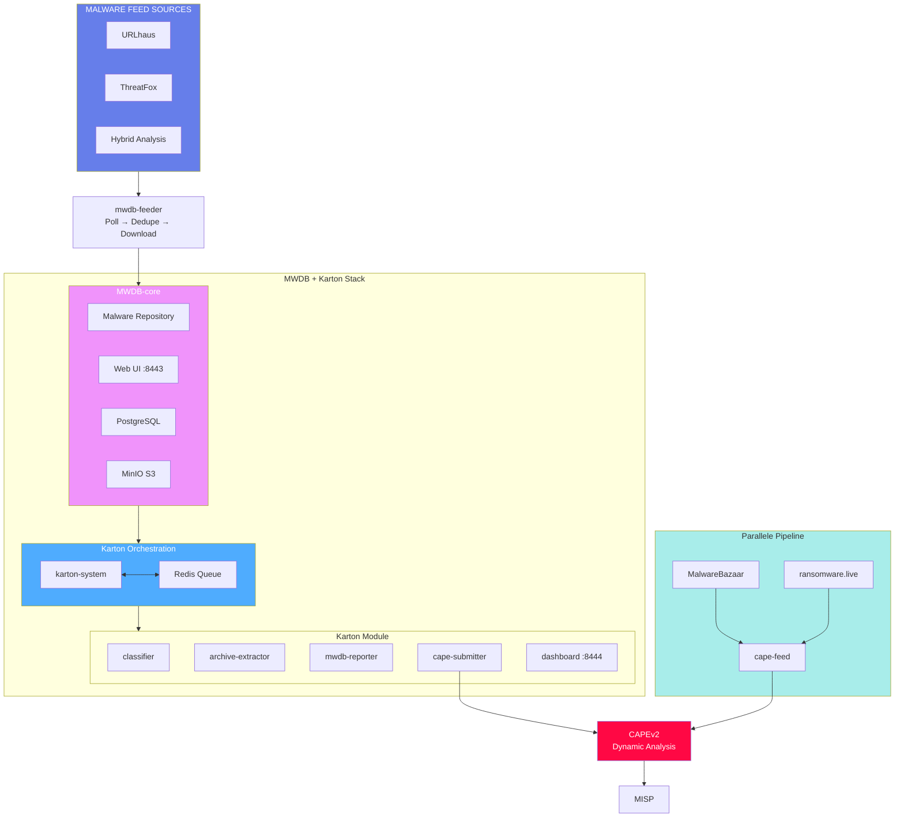

# IcePorge-MWDB-Stack

[View on GitHub](https://github.com/icepaule/IcePorge-MWDB-Stack){: .btn .btn-primary .fs-5 .mb-4 .mb-md-0 .mr-2 }

***

**MWDB-core with Karton Orchestration for Malware Sample Management**

Part of the [IcePorge](https://github.com/icepaule/IcePorge) Malware Analysis Stack.

[](LICENSE)

***

## Screenshots

### MWDB Web Interface


*MWDB provides a modern web interface for managing malware samples, viewing analysis results, and exploring relationships between samples.*

***

# MWDB + Karton Betriebshandbuch

**Version:** 1.0.0
**Stand:** 2026-01-21
**System:** MWDB-core mit Karton-Orchestrierung und Multi-Source Feeder

***

## 1. Systemübersicht

### 1.1 Architektur


<details>
<summary>Mermaid-Diagramm (klicken zum Ausklappen)</summary>


</details>

<details>
<summary>ASCII-Diagramm (Legacy)</summary>

```
┌─────────────────────────────────────────────────────────────────────┐
│                    MALWARE FEED SOURCES                             │
│         URLhaus ─────┬───── ThreatFox ─────┬───── (weitere)        │
│                      └─────────────────────┘                        │
│                              │                                      │
│                              ▼                                      │
│                    ┌─────────────────┐                              │
│                    │  mwdb-feeder    │  Poll → Dedupe → Download    │
│                    └────────┬────────┘                              │
│                             ▼                                       │
│  ┌───────────────────────────────────────────────────────────────┐ │
│  │                   MWDB + Karton Stack                          │ │
│  │  ┌─────────────────────────────────────────────────────────┐  │ │
│  │  │                    MWDB-core                             │  │ │
│  │  │  • Malware Repository    • Web UI: /mwdb/               │  │ │
│  │  │  • PostgreSQL Backend    • REST API                     │  │ │
│  │  │  • MinIO S3 Storage      • Karton Integration           │  │ │
│  │  └─────────────────────────────────────────────────────────┘  │ │
│  │                            │                                   │ │
│  │               ┌────────────┴────────────┐                     │ │
│  │               ▼                         ▼                     │ │
│  │   ┌────────────────────┐    ┌────────────────────┐           │ │
│  │   │   karton-system    │    │      Redis         │           │ │
│  │   │   (Dispatcher)     │◄──►│   (Task Queue)     │           │ │
│  │   └────────────────────┘    └────────────────────┘           │ │
│  │               │                                               │ │
│  │     ┌─────────┼─────────┬─────────────┬─────────────┐        │ │
│  │     ▼         ▼         ▼             ▼             ▼        │ │
│  │  ┌──────┐ ┌───────┐ ┌─────────┐ ┌──────────┐ ┌───────────┐  │ │
│  │  │class-│ │archive│ │  mwdb-  │ │  cape-   │ │ dashboard │  │ │
│  │  │ifier │ │extrac.│ │reporter │ │submitter │ │           │  │ │
│  │  └──────┘ └───────┘ └─────────┘ └────┬─────┘ └───────────┘  │ │
│  └───────────────────────────────────────┼───────────────────────┘ │
│                                          │                         │
│                                          ▼                         │
│                            ┌─────────────────────┐                 │
│                            │       CAPEv2        │                 │
│                            │   Dynamic Analysis  │                 │
│                            └─────────────────────┘                 │
└─────────────────────────────────────────────────────────────────────┘

Parallel bestehend (unverändert):
  MalwareBazaar ──► cape-feed ──► CAPE ──► MISP
```
</details>

### 1.2 Komponenten

| Komponente | Funktion | Image/Pfad |
|------------|----------|------------|
| **mwdb** | Malware Repository Backend | certpl/mwdb:master |
| **mwdb-web** | Web Frontend | certpl/mwdb-web:master |
| **mwdb-postgres** | PostgreSQL Datenbank | postgres:17-alpine |
| **mwdb-redis** | Karton Queue + Cache | redis:7-alpine |
| **mwdb-minio** | S3-kompatibler Storage | minio/minio:latest |
| **karton-system** | Task Dispatcher | certpl/karton-system:master |
| **karton-classifier** | Sample-Klassifizierung | certpl/karton-classifier:v2.1.0 |
| **karton-archive-extractor** | Archive-Extraktion | certpl/karton-archive-extractor:v1.5.1 |
| **karton-mwdb-reporter** | Ergebnisse → MWDB | certpl/karton-mwdb-reporter:latest |
| **karton-dashboard** | Karton Web UI | certpl/karton-dashboard:latest |
| **karton-cape-submitter** | Samples → CAPE | Custom (lokal gebaut) |
| **mwdb-feeder** | Multi-Source Aggregator (URLhaus, ThreatFox, Hybrid Analysis) | Custom (lokal gebaut) |

### 1.3 Verzeichnisstruktur

```
/opt/mwdb-core/                     # MWDB + Karton Stack
├── docker-compose.yml              # Stack Definition
├── .env                            # Secrets und Konfiguration
├── karton.ini                      # Karton-Framework Config
├── kartons/
│   └── cape_submitter/             # Custom Karton-Modul
│       ├── Dockerfile
│       ├── cape_submitter.py
│       └── requirements.txt
└── config/

/opt/mwdb-feeder/                   # Multi-Source Feeder
├── docker-compose.yml
├── Dockerfile
├── .env                            # Feed API-Keys
├── app/
│   ├── feeder.py
│   └── requirements.txt
└── work/
    ├── state.db                    # Verarbeitungsstatus
    └── reports/
        └── mwdb-feeder.jsonl       # Aktivitätslog

/mnt/cape-data/mwdb-storage/        # MinIO Sample Storage
```

***

## 2. Zugang und URLs

### 2.1 Web Interfaces

| Service | URL | Bemerkung |
|---------|-----|-----------|
| MWDB Web | https://\<host\>:8443/ | Malware Repository |
| Karton Dashboard | https://\<host\>:8444/ | Task-Übersicht |
| MinIO Console | http://127.0.0.1:9001 | Nur lokal |

**Hinweis:** `/mwdb` und `/karton` Pfade auf Port 443 leiten automatisch auf die dedizierten Ports weiter.

### 2.2 Zugangsdaten

**MWDB Admin:**
- User: `admin`
- Passwort: `QTlqfISkAGZ9vs+bAaSG03/fXM1EL+W8`

**Alle Credentials:** `/root/.claude/mwdb-credentials.md`

### 2.3 API Endpoints

```bash
# MWDB API Status
curl -s http://127.0.0.1:8081/api/ping
# {"status":"ok"}

# MWDB API mit Authentifizierung
curl -s http://127.0.0.1:8081/api/file \
  -H "Authorization: Bearer <API-KEY>"
```

***

## 3. Container-Management

### 3.1 MWDB + Karton Stack

```bash
cd /opt/mwdb-core

# Stack starten
docker compose up -d

# Stack stoppen
docker compose down

# Logs verfolgen
docker compose logs -f

# Einzelnen Container neustarten
docker compose restart mwdb
docker compose restart karton-cape-submitter

# Status prüfen
docker compose ps

# Container-Logs einzeln
docker logs -f mwdb
docker logs -f karton-cape-submitter
```

### 3.2 Feeder

```bash
cd /opt/mwdb-feeder

# Feeder starten
docker compose up -d

# Feeder stoppen
docker compose down

# Logs verfolgen
docker compose logs -f mwdb-feeder

# Nach Konfigurationsänderung neustarten
docker compose restart
```

### 3.3 Alle Container auf einmal

```bash
# Status aller MWDB-Container
docker ps --format "table {{.Names}}\t{{.Status}}" | grep -E "mwdb|karton"

# Alle MWDB-Container stoppen
docker stop $(docker ps -q --filter "name=mwdb") $(docker ps -q --filter "name=karton")
```

***

## 4. Konfiguration

### 4.1 MWDB Stack (.env)

**Pfad:** `/opt/mwdb-core/.env`

```bash
# PostgreSQL
POSTGRES_USER=mwdb
POSTGRES_PASSWORD=<generated>
POSTGRES_DB=mwdb

# MinIO
MINIO_ROOT_USER=mwdb-minio
MINIO_ROOT_PASSWORD=<generated>

# MWDB
MWDB_SECRET_KEY=<generated>
MWDB_POSTGRES_URI=postgresql://...
MWDB_REDIS_URI=redis://mwdb-redis:6379/0
MWDB_ENABLE_KARTON=1
MWDB_ADMIN_LOGIN=admin
MWDB_ADMIN_PASSWORD=<generated>
MWDB_STORAGE_PROVIDER=s3
MWDB_S3_STORAGE_ENDPOINT=mwdb-minio:9000
MWDB_S3_STORAGE_BUCKET_NAME=mwdb

# CAPE Connection (für karton-cape-submitter)
CAPE_SUBMIT_URL=https://host.docker.internal/apiv2/tasks/create/file/
CAPE_TLS_VERIFY=false
CAPE_TAGS_DEFAULT=win11,x64
```

### 4.2 Karton Config (karton.ini)

**Pfad:** `/opt/mwdb-core/karton.ini`

```ini
[s3]
access_key = mwdb-minio
secret_key = <minio-secret>
address = http://mwdb-minio:9000
bucket = karton

[redis]
host = mwdb-redis
port = 6379

[mwdb]
api_url = http://mwdb:8080/api
api_key = <mwdb-api-key>
```

### 4.3 Feeder Config

**Pfad:** `/opt/mwdb-feeder/.env`

```bash
# MWDB Connection
MWDB_URL=http://mwdb:8080/api
MWDB_API_KEY=<mwdb-api-key>

# URLhaus (abuse.ch)
URLHAUS_ENABLED=true          # Nach API-Key Registrierung aktivieren
URLHAUS_AUTH_KEY=<your-key>   # Von https://auth.abuse.ch/
URLHAUS_POLL_SECONDS=300

# ThreatFox (abuse.ch)
THREATFOX_ENABLED=true
THREATFOX_AUTH_KEY=<your-key>  # Gleicher Key wie URLhaus
THREATFOX_POLL_SECONDS=300

# Allgemein
MAX_MB_PER_FILE=50
```

***

## 5. Feed-Quellen aktivieren

### 5.1 abuse.ch API-Key (URLhaus + ThreatFox)

1. Registrierung: https://auth.abuse.ch/
2. API-Key in `/opt/mwdb-feeder/.env` eintragen:
   ```bash
   URLHAUS_ENABLED=true
   URLHAUS_AUTH_KEY=<dein-key>
   THREATFOX_ENABLED=true
   THREATFOX_AUTH_KEY=<dein-key>
   ```
3. Feeder neustarten:
   ```bash
   cd /opt/mwdb-feeder && docker compose restart
   ```

### 5.2 Hybrid Analysis API-Key (Falcon Sandbox)

1. Registrierung: https://www.hybrid-analysis.com/signup
2. (Noch nicht implementiert - kann später hinzugefügt werden)

***

## 6. Datenfluss

### 6.1 Sample-Pipeline

```
1. mwdb-feeder pollt URLhaus/ThreatFox
       ↓
2. Download → Upload zu MWDB
       ↓
3. MWDB löst Karton-Task aus
       ↓
4. karton-classifier analysiert Sample-Typ
       ↓
5. karton-archive-extractor entpackt Archive
       ↓
6. karton-cape-submitter sendet an CAPE
       ↓
7. CAPE führt dynamische Analyse durch
       ↓
8. Ergebnisse in CAPE + MISP
```

### 6.2 Karton Task-Types

| Task Type | Producer | Consumer |
|-----------|----------|----------|
| sample (new) | MWDB | karton-classifier |
| sample (recognized) | classifier | cape-submitter, mwdb-reporter |
| sample (unrecognized) | classifier | cape-submitter |
| config | extractor | mwdb-reporter |

***

## 7. Monitoring und Logs

### 7.1 Log-Dateien

```bash
# MWDB Feeder Activity Log
tail -f /opt/mwdb-feeder/work/reports/mwdb-feeder.jsonl

# Container Logs
docker logs -f mwdb
docker logs -f karton-cape-submitter
docker logs -f mwdb-feeder
```

### 7.2 Health Checks

```bash
# MWDB API
curl -s http://127.0.0.1:8081/api/ping

# Container Health
docker ps --format "{{.Names}}: {{.Status}}" | grep -E "mwdb|karton"

# PostgreSQL
docker exec mwdb-postgres pg_isready -U mwdb

# Redis
docker exec mwdb-redis redis-cli ping

# MinIO
curl -s http://127.0.0.1:9000/minio/health/live
```

### 7.3 Karton Dashboard

Über https://\<host\>/karton/ erreichbar:
- Aktive Tasks anzeigen
- Queue-Status prüfen
- Fehlerhafte Tasks identifizieren

***

## 8. Troubleshooting

### 8.1 MWDB startet nicht

```bash
# Logs prüfen
docker logs mwdb

# Häufige Ursachen:
# - PostgreSQL nicht ready → warten oder mwdb-postgres prüfen
# - S3 Bucket nicht vorhanden → mwdb-minio-init prüfen
# - Falsche Credentials → .env prüfen

# Manueller Neustart
docker compose restart mwdb
```

### 8.2 Karton Tasks stecken fest

```bash
# Karton-System Logs
docker logs karton-system

# Redis Queue prüfen
docker exec mwdb-redis redis-cli keys "karton*"

# Karton neustarten
docker compose restart karton-system karton-classifier
```

### 8.3 CAPE-Submission fehlgeschlagen

```bash
# Logs prüfen
docker logs karton-cape-submitter

# Häufige Ursachen:
# - CAPE nicht erreichbar → host.docker.internal prüfen
# - TLS-Fehler → CAPE_TLS_VERIFY=false setzen
# - Rate Limiting → Backoff abwarten

# CAPE-Erreichbarkeit testen (vom Host)
curl -k https://127.0.0.1/apiv2/tasks/list/
```

### 8.4 Feeder lädt keine Samples

```bash
# Logs prüfen
docker logs mwdb-feeder

# Häufige Ursachen:
# - API-Keys nicht konfiguriert → .env prüfen
# - Quellen deaktiviert → URLHAUS_ENABLED=true
# - Netzwerk-Probleme → DNS/Firewall prüfen

# State-DB prüfen
sqlite3 /opt/mwdb-feeder/work/state.db "SELECT COUNT(*) FROM processed"
```

### 8.5 Container "unhealthy"

Der `mwdb` Container zeigt oft "unhealthy", obwohl er funktioniert (curl fehlt im Image). Prüfen mit:

```bash
# API direkt testen
curl -s http://127.0.0.1:8081/api/ping
# Wenn {"status":"ok"} → alles in Ordnung
```

***

## 9. Backup und Recovery

### 9.1 Wichtige Daten

| Daten | Speicherort | Backup-Methode |
|-------|-------------|----------------|
| PostgreSQL | Docker Volume | pg_dump |
| MinIO Samples | /mnt/cape-data/mwdb-storage/ | rsync/tar |
| Konfiguration | /opt/mwdb-core/.env, karton.ini | Dateikopie |
| Feeder State | /opt/mwdb-feeder/work/state.db | Dateikopie |

### 9.2 PostgreSQL Backup

```bash
# Backup erstellen
docker exec mwdb-postgres pg_dump -U mwdb mwdb > /backup/mwdb-$(date +%Y%m%d).sql

# Restore
docker exec -i mwdb-postgres psql -U mwdb mwdb < /backup/mwdb-YYYYMMDD.sql
```

### 9.3 Komplettes Stack-Backup

```bash
#!/bin/bash
BACKUP_DIR=/backup/mwdb-$(date +%Y%m%d)
mkdir -p $BACKUP_DIR

# Konfiguration
cp /opt/mwdb-core/.env $BACKUP_DIR/
cp /opt/mwdb-core/karton.ini $BACKUP_DIR/
cp /opt/mwdb-feeder/.env $BACKUP_DIR/feeder.env

# PostgreSQL
docker exec mwdb-postgres pg_dump -U mwdb mwdb > $BACKUP_DIR/mwdb.sql

# Feeder State
cp /opt/mwdb-feeder/work/state.db $BACKUP_DIR/

echo "Backup complete: $BACKUP_DIR"
```

***

## 10. Updates

### 10.1 MWDB/Karton Images aktualisieren

```bash
cd /opt/mwdb-core

# Neue Images pullen
docker compose pull

# Stack mit neuen Images starten
docker compose up -d

# Alte Images aufräumen
docker image prune -f
```

### 10.2 Custom Module aktualisieren

```bash
cd /opt/mwdb-core

# cape-submitter neu bauen
docker compose build karton-cape-submitter

# Neustart
docker compose up -d karton-cape-submitter
```

### 10.3 Feeder aktualisieren

```bash
cd /opt/mwdb-feeder

# Neu bauen
docker compose build

# Neustart
docker compose up -d
```

***

## 11. Integration mit bestehendem System

### 11.1 Parallelbetrieb mit cape-feed

MWDB + Karton läuft parallel zum bestehenden cape-feed:

| Pipeline | Quellen | Ziel |
|----------|---------|------|
| cape-feed | MalwareBazaar | CAPE → MISP |
| mwdb-feeder | URLhaus, ThreatFox | MWDB → Karton → CAPE |

Beide Pipelines nutzen dieselbe CAPE-Instanz.

### 11.2 nginx Reverse Proxy

MWDB und Karton laufen auf dedizierten Ports (8443 und 8444).

In `/etc/nginx/sites-available/cape`:

```nginx
# Redirects auf Port 443
location /mwdb {
    return 301 https://$host:8443/;
}

location /karton {
    return 301 https://$host:8444/;
}

# =========================================
# MWDB Server (Port 8443)
# =========================================
server {
    listen 8443 ssl http2;
    server_name _;

    ssl_certificate /etc/nginx/ssl/cape.crt;
    ssl_certificate_key /etc/nginx/ssl/cape.key;
    ssl_protocols TLSv1.2 TLSv1.3;

    client_max_body_size 100M;

    location / {
        proxy_pass http://127.0.0.1:8081;
        proxy_set_header Host $host;
        proxy_set_header X-Real-IP $remote_addr;
        proxy_set_header X-Forwarded-For $proxy_add_x_forwarded_for;
        proxy_set_header X-Forwarded-Proto $scheme;
    }
}

# =========================================
# Karton Dashboard (Port 8444)
# =========================================
server {
    listen 8444 ssl http2;
    server_name _;

    ssl_certificate /etc/nginx/ssl/cape.crt;
    ssl_certificate_key /etc/nginx/ssl/cape.key;
    ssl_protocols TLSv1.2 TLSv1.3;

    location / {
        proxy_pass http://127.0.0.1:8082;
        proxy_set_header Host $host;
        proxy_set_header X-Real-IP $remote_addr;
    }
}
```

### 11.3 Ports-Übersicht

| Port | Service | Protokoll |
|------|---------|-----------|
| 443 | CAPEv2 | HTTPS |
| 8443 | MWDB | HTTPS |
| 8444 | Karton Dashboard | HTTPS |

***

## 12. Anhang

### 12.1 Nützliche Befehle

```bash
# Alle MWDB-bezogenen Container
docker ps -a | grep -E "mwdb|karton"

# Speicherverbrauch
docker system df
du -sh /mnt/cape-data/mwdb-storage/

# Sample in MWDB suchen (API)
curl -s "http://127.0.0.1:8081/api/file/<sha256>" \
  -H "Authorization: Bearer <API-KEY>"

# Feeder-Statistik
sqlite3 /opt/mwdb-feeder/work/state.db \
  "SELECT source, COUNT(*) FROM processed GROUP BY source"
```

### 12.2 Ports

| Port | Service | Zugang |
|------|---------|--------|
| 8081 | MWDB Web | localhost + nginx |
| 8082 | Karton Dashboard | localhost + nginx |
| 9000 | MinIO S3 API | localhost |
| 9001 | MinIO Console | localhost |
| 5432 | PostgreSQL | Docker internal |
| 6379 | Redis | Docker internal |

### 12.3 Docker Volumes

```bash
# Volumes anzeigen
docker volume ls | grep mwdb

# Volume-Größe
docker system df -v | grep mwdb
```

### 12.4 Referenzen

- MWDB Dokumentation: https://mwdb.readthedocs.io/
- Karton Dokumentation: https://karton-core.readthedocs.io/
- abuse.ch API: https://urlhaus-api.abuse.ch/
- CERT-Polska GitHub: https://github.com/CERT-Polska/

***

**Erstellt:** 2026-01-21
**Maintainer:** Automated Pipeline
**Credentials:** /root/.claude/mwdb-credentials.md
