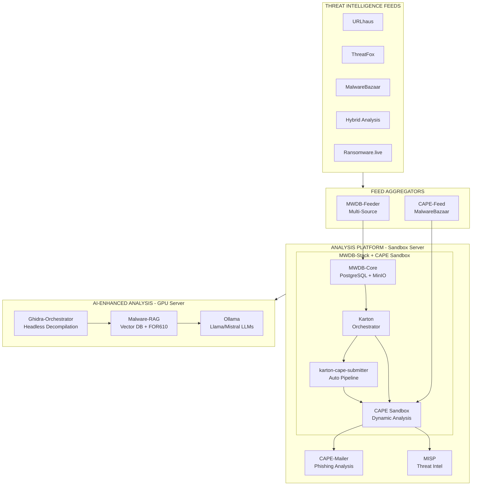

# IcePorge

[View on GitHub](https://github.com/icepaule/IcePorge){: .btn .btn-primary .fs-5 .mb-4 .mb-md-0 .mr-2 }

***

**IcePorge - Comprehensive Malware Analysis & Threat Intelligence Stack**


**Comprehensive Malware Analysis & Threat Intelligence Stack**

IcePorge is a modular, enterprise-grade malware analysis ecosystem that integrates dynamic sandboxing, static reverse engineering, threat intelligence feeds, and LLM-powered analysis into a cohesive workflow.

[](https://opensource.org/licenses/MIT)
[](https://github.com/icepaule)

---

## Quick Start

### Option 1: AWS CloudShell Deployment (Recommended)

Deploy IcePorge on AWS Ubuntu with a single command sequence:

```bash
# From AWS CloudShell - creates EC2 instance with full IcePorge stack
# See docs/aws/AWS-CLOUDSHELL-DEPLOY.md for complete guide

# 1. Create EC2 Instance
export INSTANCE_TYPE="t3.2xlarge" VOLUME_SIZE="500"
# ... (see full script in docs/aws/)

# 2. SSH and install
ssh -i ~/.ssh/iceporge-key.pem ubuntu@$PUBLIC_IP
sudo git clone https://github.com/icepaule/IcePorge.git /opt/iceporge
cd /opt/iceporge && sudo ./install/install-iceporge.sh
```

**Full AWS deployment guide:** [docs/aws/AWS-CLOUDSHELL-DEPLOY.md](https://github.com/icepaule/IcePorge/blob/main/docs/aws/AWS-CLOUDSHELL-DEPLOY.md)

### Option 2: On-Premise Installation

```bash
# Clone main repository
git clone https://github.com/icepaule/IcePorge.git /opt/iceporge
cd /opt/iceporge

# Configure
cp install/config.env.example install/config.env
nano install/config.env

# Install
sudo ./install/install-iceporge.sh --config install/config.env
```

### Clone All Component Repositories

```bash
./scripts/clone-all.sh

# For HTTPS instead of SSH:
./scripts/clone-all.sh --https
```

---

## Architecture Overview




---

## Components

| Repository | Description | Server |
|------------|-------------|--------|
| [IcePorge-MWDB-Stack](https://github.com/icepaule/IcePorge-MWDB-Stack) | MWDB-core with Karton orchestration | Sandbox |
| [IcePorge-MWDB-Feeder](https://github.com/icepaule/IcePorge-MWDB-Feeder) | Multi-source malware aggregator | Sandbox |
| [IcePorge-CAPE-Feed](https://github.com/icepaule/IcePorge-CAPE-Feed) | MalwareBazaar → CAPE → MISP pipeline | Sandbox |
| [IcePorge-CAPE-Mailer](https://github.com/icepaule/IcePorge-CAPE-Mailer) | Email-triggered analysis | Sandbox |
| [IcePorge-Cockpit](https://github.com/icepaule/IcePorge-Cockpit) | Web management UI (Cockpit modules) | Sandbox |
| [IcePorge-Ghidra-Orchestrator](https://github.com/icepaule/IcePorge-Ghidra-Orchestrator) | Automated reverse engineering | GPU |
| [IcePorge-Malware-RAG](https://github.com/icepaule/IcePorge-Malware-RAG) | LLM-powered RAG analysis | GPU |

---

## Features

### Threat Intelligence Ingestion
- **URLhaus** - Malicious URL and payload collection
- **ThreatFox** - IOC aggregation with sample downloads
- **MalwareBazaar** - Malware sample repository
- **Hybrid Analysis** - Falcon Sandbox public feed
- **Ransomware.live** - Ransomware gang tracking

### Dynamic Analysis
- **CAPE Sandbox** - Behavior analysis with config extraction
- **Automated submission** - Tag-based routing and prefiltering
- **MISP integration** - Automatic IOC export

### Static Analysis
- **Ghidra Headless** - Automated decompilation
- **LLM Enhancement** - AI-powered code understanding
- **API Extraction** - Function and string analysis

### AI-Enhanced Analysis
- **Ollama Integration** - Local LLM inference (privacy-focused)
- **AWS Bedrock** - Cloud-based Claude analysis (enterprise)
- **RAG Pipeline** - Context-aware malware analysis
- **Vector Search** - Semantic similarity with Qdrant

### Web Dashboard
- **Phishing Reports** - Interactive report browser with filtering
- **SMTP Header Analysis** - Mail routing chain, authentication status
- **Security Recommendations** - Actionable guidance for mail gateway hardening
- **System Status** - Real-time health monitoring

---

## AWS Deployment

### CloudShell Quick Deploy

Full deployment from AWS CloudShell in under 30 minutes:

| Phase | Description | Time |
|-------|-------------|------|
| 1 | EC2 Instance erstellen | 5 min |
| 2 | IcePorge installieren | 15 min |
| 3 | WireGuard für Ollama | 5 min |
| 4 | Bedrock aktivieren | 5 min |

**Documentation:**
- [AWS CloudShell Deployment](https://github.com/icepaule/IcePorge/blob/main/docs/aws/AWS-CLOUDSHELL-DEPLOY.md) - Complete step-by-step guide
- [WireGuard Ollama Connection](https://github.com/icepaule/IcePorge/blob/main/docs/aws/WIREGUARD-OLLAMA.md) - Secure on-premise LLM access
- [Configuration Reference](https://github.com/icepaule/IcePorge/blob/main/install/config.env.example) - All configuration options

### AI Backend Options

| Backend | Use Case | Latency | Cost |
|---------|----------|---------|------|
| Ollama (On-Prem) | Privacy-sensitive, low latency | ~2s | Hardware only |
| AWS Bedrock | Enterprise, high accuracy | ~3s | Pay-per-token |
| Both | Fallback/comparison | Varies | Combined |

```bash
# In config.env:
AI_BACKEND="both"  # ollama, bedrock, or both
OLLAMA_API_URL="http://10.10.0.210:11434"  # via WireGuard
BEDROCK_MODEL_ID="anthropic.claude-3-sonnet-20240229-v1:0"
```

---

## Configuration

All sensitive data (API keys, passwords) is stored in `.env` files which are **never committed**.

### Required API Keys

| Service | Registration | Used By |
|---------|--------------|---------|
| abuse.ch | https://auth.abuse.ch/ | MWDB-Feeder, CAPE-Feed |
| Hybrid Analysis | https://www.hybrid-analysis.com/signup | MWDB-Feeder |
| MISP | Your instance | CAPE-Feed |

---

## Automatic Sync

The `sync-to-github.sh` script automatically synchronizes local changes:

```bash
# Manual sync with dry-run
/opt/iceporge/sync-to-github.sh --dry-run --verbose

# Sync with screenshot capture
/opt/iceporge/sync-to-github.sh --screenshots

# Add to crontab (daily at 2:00 AM)
0 2 * * * /opt/iceporge/sync-to-github.sh >> /var/log/iceporge-sync.log 2>&1
```

Features:
- **Sensitive data detection** - Blocks commits with passwords/keys
- **Screenshot capture** - Documents web interfaces
- **Multi-server support** - Works on capev2 and ki01

---

## Web Dashboard

IcePorge includes a built-in web dashboard for phishing report management and system monitoring.

**Access:** `http://your-server:8085`

### Features

| Page | Function |
|------|----------|
| `/` | Dashboard with statistics and system health |
| `/reports` | Phishing reports with filtering (time, verdict, score) |
| `/report/<id>/analysis` | Detailed SMTP header analysis |
| `/cape` | CAPE sandbox analyses overview |
| `/status` | System component health status |

### SMTP Header Analysis

The report analysis view provides:
- **Sender Information** - Real email vs display name (spoofing detection)
- **Authentication** - SPF/DKIM/DMARC validation results
- **Mail Routing Chain** - Complete path through all servers with TLS status
- **IP Geolocation** - Origin countries with high-risk warnings
- **Security Systems** - Detected gateways (Sophos, Barracuda, etc.)
- **Recommendations** - Actionable steps for mail security improvement

### API Endpoints

```bash
GET /api/reports          # All phishing reports (JSON)
GET /api/report/<id>/headers  # Header analysis (JSON)
GET /api/statistics       # Report statistics
GET /api/status          # System health
```

---

## Management UI (Cockpit)

Access via Cockpit at `https://your-server:9090/`:
- **CAPE Sandbox** - Service status, VM management
- **MWDB Stack** - Container status, Karton pipeline

---

## Screenshots

### MWDB Web Interface


*Central malware sample repository with tagging, relationships, and Karton integration.*

### MWDB Stack Manager (Cockpit)


*Manage MWDB services, Karton pipeline, and container health from Cockpit.*

### CAPE Sandbox Manager (Cockpit)


*Monitor CAPE services, VMs, and external service connectivity.*

---

## License

MIT License with Attribution

**Author:** Michael Pauli
- GitHub: [@icepaule](https://github.com/icepaule)
- Email: ****@****.***

When using this software, please maintain attribution to the original author.

---

## Contributing

Contributions welcome! Please:
1. Fork the relevant component repository
2. Create a feature branch
3. Submit a pull request

## Documentation

### Core Guides
- **[Troubleshooting Guide](https://github.com/icepaule/IcePorge/blob/main/docs/TROUBLESHOOTING.md)** - Common issues and fixes
- **[CAPE AI Analysis](https://github.com/icepaule/IcePorge/blob/main/docs/CAPE-AI-ANALYSIS.md)** - AI-enhanced malware analysis system
- **[AWS Deployment](https://github.com/icepaule/IcePorge/blob/main/docs/aws/AWS-CLOUDSHELL-DEPLOY.md)** - Cloud deployment guide
- **[Changelog August 2026](https://github.com/icepaule/IcePorge/blob/main/docs/CHANGELOG-2026-08.md)** - Recent fixes and improvements

### Operational Manuals (German)
- [ITSO Production Setup](https://github.com/icepaule/IcePorge/blob/main/docs/ITSO_PRODUCTION_SETUP.md)
- [Security Operations Manual](https://github.com/icepaule/IcePorge/blob/main/docs/SECURITY-BETRIEBSHANDBUCH.md)
- [TruffleHog Operations](https://github.com/icepaule/IcePorge/blob/main/docs/TRUFFLEHOG-BETRIEBSHANDBUCH.md)

---

## Support

- Open an issue in the relevant repository
- Email: ****@****.***

