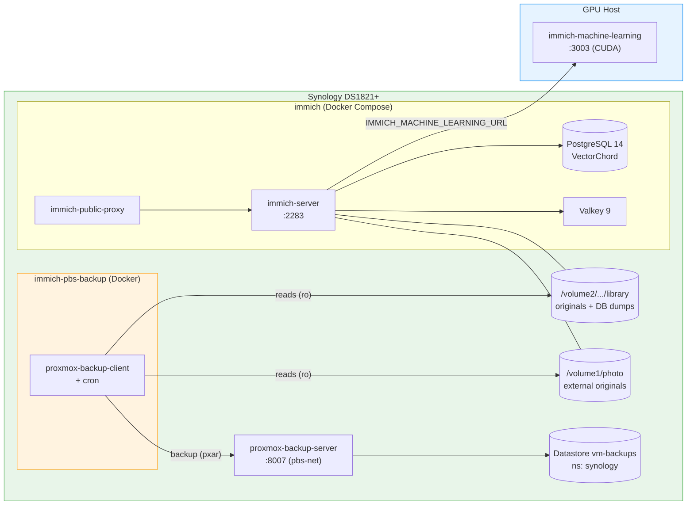

# IceProxmoxBackup

[View on GitHub](https://github.com/icepaule/IceProxmoxBackup){: .btn .btn-primary .fs-5 .mb-4 .mb-md-0 .mr-2 }

***

**IceProxmoxBackup**


Documentation of two related operations on a Synology DS1821+:

1. **Upgrading the self-hosted [Immich](https://immich.app) photo stack from v2.7.5 → v3.0.1** (a major version jump with breaking changes), with zero data loss.
2. **Adding Immich's data to Proxmox Backup Server (PBS)** — a file-level backup that pushes the photo originals + database dumps into the existing PBS datastore, in its own namespace.

> Companion to **[IceBackup](https://github.com/icepaule/IceBackup)** (the PBS + ABB strategy for Proxmox VMs and bare-metal Linux). This repo covers the *Docker-on-Synology* workload (Immich) that IceBackup's VM-oriented jobs do not reach. See [IceBackup › File-Backup Sources](https://github.com/icepaule/IceBackup#additional-backup-sources).

> **No secrets in this repo.** All passwords, API-token secrets, certificate fingerprints, IP addresses, hostnames and keys are shown as placeholders like `<PASSWORD>`, `<PBS_TOKEN_SECRET>`, `<PBS_FINGERPRINT>`, `<SYNOLOGY_IP>`, `<GPU_HOST_IP>`. Substitute your own at deploy time.

---

## Why this exists

Immich runs as a **Docker Compose stack on the Synology** (server + PostgreSQL + Valkey + public-proxy), with **machine learning offloaded to a separate GPU host**. PBS in this environment only backs up **Proxmox VMs/CTs** pushed from the hypervisors — it never touched the Synology's own Docker data. After the v3 upgrade, the photo library and database were still unprotected by PBS. This repo closes that gap.

## Architecture

## What gets backed up

| pxar archive | Source (read-only) | ~Size | Notes |
|---|---|---|---|
| `immich-originals.pxar` | `library/library` | 33 G | Uploaded original assets |
| `immich-db.pxar` | `library/backups` | 1.8 G | Immich's own nightly `pg_dump` (consistent) |
| `immich-profile.pxar` | `library/profile` | tiny | Profile images |
| `photos.pxar` | `/volume1/photo` | 50 G | External library originals (Synology Photos) |

**Deliberately excluded** (regenerable): `encoded-video/`, `thumbs/`, in-progress `upload/`.

One PBS snapshot per run (`host/immich`), daily at **03:30**, retained **7 daily / 4 weekly / 3 monthly**.

## Documentation

- [01 — Immich v2.7.5 → v3.0.1 Upgrade](https://github.com/icepaule/IceProxmoxBackup/blob/main/docs/01-immich-v3-upgrade.md) — compatibility analysis, step-by-step, rollback
- [02 — PBS File Backup Setup](https://github.com/icepaule/IceProxmoxBackup/blob/main/docs/02-pbs-file-backup-setup.md) — the backup action, full step-by-step
- [03 — Compose & Scripts Reference](https://github.com/icepaule/IceProxmoxBackup/blob/main/docs/03-compose-and-scripts-reference.md) — annotated Dockerfile / compose / scripts
- [04 — Operations & Restore](https://github.com/icepaule/IceProxmoxBackup/blob/main/docs/04-operations-and-restore.md) — monitor, manual run, list, verify, restore
- [05 — Troubleshooting](https://github.com/icepaule/IceProxmoxBackup/blob/main/docs/05-troubleshooting.md) — common pitfalls and fixes

## Stack

| Component | Image | Role |
|---|---|---|
| immich-server | `ghcr.io/immich-app/immich-server:v3.0.1` | API + web |
| immich-postgres | `ghcr.io/immich-app/postgres:14-vectorchord…` | DB (VectorChord) |
| immich-redis | `docker.io/valkey/valkey:9` | queue/cache |
| immich-machine-learning | `ghcr.io/immich-app/immich-machine-learning:v3.0.1-cuda` | ML (GPU host) |
| immich-public-proxy | `ghcr.io/alangrainger/immich-public-proxy:latest` | public share proxy |
| immich-pbs-backup | `debian:bookworm-slim` + `proxmox-backup-client` (built here) | PBS file backup |
| proxmox-backup-server | `ayufan/proxmox-backup-server` | PBS (see IceBackup) |

## License

MIT — see [LICENSE](https://github.com/icepaule/IceProxmoxBackup/blob/main/LICENSE).

