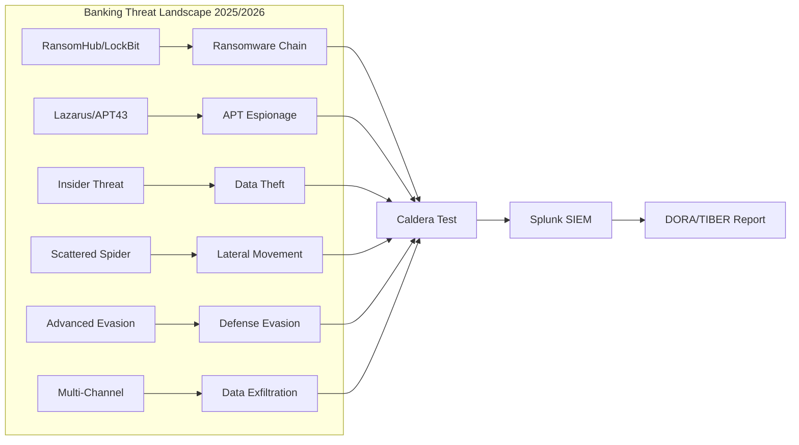

# IceUseCaseTesting

[View on GitHub](https://github.com/icepaule/IceUseCaseTesting){: .btn .btn-primary .fs-5 .mb-4 .mb-md-0 .mr-2 }

***

**IceUseCaseTesting**

> Automatisierte Adversary-Emulation und SIEM-UseCase-Validierung für mittelständische Banken
> Basierend auf MITRE Caldera + Splunk | TIBER-EU / DORA konform


## Überblick

Dieses Projekt stellt ein vollständiges **Purple Team Testing Framework** bereit, mit dem eine mittelständische Bank ihre SIEM-Erkennung gegen aktuelle Bedrohungen (2025/2026) validieren kann.

**Kernkomponenten:**
- **6 Banking-Adversary-Profile** für MITRE Caldera (111 Abilities)
- **15 SIEM Use Cases** als Splunk Saved Searches
- **63 MITRE ATT&CK Techniken** gemappt auf Bankrisiken
- **Splunk Dashboard** mit Echtzeit-Auswertung
- **Kill Chain Korrelation** über alle Use Cases
- **DORA/TIBER-EU Compliance-Mapping**

## Dokumentation

| Dokument | Beschreibung |
|----------|-------------|
| [Betriebshandbuch](docs/BETRIEBSHANDBUCH.md) | Vollständige Schritt-für-Schritt Installations- und Betriebsanleitung |
| [SIEM Use Cases](docs/SIEM_USECASES.md) | Detaillierte Dokumentation aller 15 SIEM Use Cases |
| [Adversary Profile](docs/ADVERSARY_PROFILES.md) | Beschreibung der 6 Banking-Bedrohungsszenarien |
| [Architektur](docs/ARCHITEKTUR.md) | Systemarchitektur und Datenfluss |

## Quick Start

```bash
# 1. Repository klonen
git clone https://github.com/icepaule/IceUseCaseTesting.git

# 2. Konfiguration anpassen
cp examples/config.env.example .env
# → API-Keys, Splunk-HEC, IP-Adressen eintragen

# 3. Caldera-Profile deployen
cp caldera/adversaries/*.yml /opt/caldera/data/adversaries/

# 4. Splunk-App installieren
source .env && ./scripts/install-splunk-app.sh

# 5. Tests ausführen
./scripts/run-bank-adversaries.sh

# 6. Ergebnisse nach Splunk publizieren
./scripts/publish-to-splunk.sh
```

## Bedrohungsszenarien



## Regulatorischer Rahmen

- **DORA** (EU 2022/2554) - Art. 25-27: Threat-Led Penetration Testing
- **TIBER-EU** Framework (ECB, aktualisiert 2025)
- **MaRisk** AT 7.2: Protokollierung und Monitoring
- **BAIT** Abschnitt 5: IT-Sicherheitsmanagement
- **DSGVO** Art. 33: Meldepflichten

## Lizenz

Dieses Projekt dient ausschließlich zu Bildungs- und Testzwecken in autorisierten Umgebungen.
MITRE Caldera: [Apache 2.0](https://github.com/mitre/caldera/blob/master/LICENSE)

## Quellen

- [MITRE ATT&CK](https://attack.mitre.org/)
- [MITRE CTID - CRI Profile Mapping](https://ctid.mitre.org/blog/2025/06/16/threat-informed-defense-for-the-financial-sector/)
- [TIBER-EU Framework](https://www.ecb.europa.eu/paym/cyber-resilience/tiber-eu/html/index.en.html)
- [DORA TLPT RTS](https://tiber.info/blog/2025/06/18/the-dora-threat-led-penetration-testing-rts-has-been-published/)
- [PT Security Financial Forecast 2025-2026](https://global.ptsecurity.com/en/research/analytics/cyberthreats-to-the-financial-sector--forecast-for-2025-2026/)
