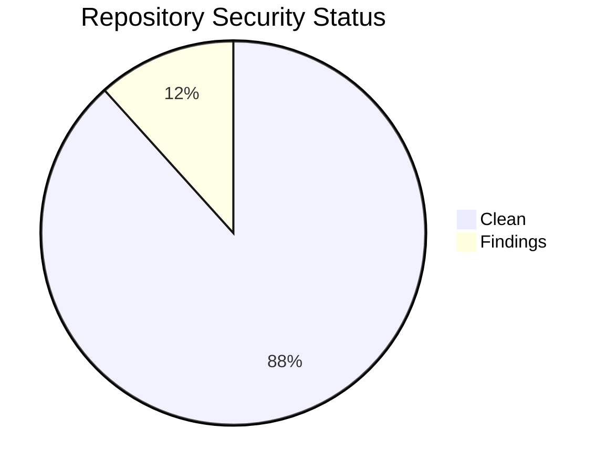

# Status Dashboard
{: .fs-9 }

Automated documentation & security scanning status.
{: .fs-6 .fw-300 }

*Last updated: 2026-08-04 05:38 UTC*

---

## CI/CD Pipeline

```mermaid
flowchart LR
    A[Cron 03:00 UTC] --> B[Checkout]
    B --> C[Setup Python]
    C --> D{Scan Secrets}
    D -->|Findings| E[Pushover Alert]
    D -->|Clean| F[Generate Docs]
    E --> F
    F --> G[Generate Status]
    G --> H{Changes?}
    H -->|Yes| I[Commit & Push]
    H -->|No| J[Done]
    I --> J

    style A fill:#2d333b,stroke:#539bf5
    style D fill:#2d333b,stroke:#f47067
    style E fill:#2d333b,stroke:#f0883e
    style F fill:#2d333b,stroke:#57ab5a
    style I fill:#2d333b,stroke:#539bf5
```

---

## Documentation Coverage

**60 repos** documented: 3 curated, 50 auto-generated.

| Repo | Description | Status | Doc Page |
|:-----|:------------|:-------|:---------|
| [adguard-kiosk](https://github.com/icepaule/adguard-kiosk) | My Adguard implementation using a raspberry 3b | Auto | [View](adguard-kiosk.html) |
| [audiobookshelf-synology](https://github.com/icepaule/audiobookshelf-synology) | Selbst gehosteter Hoerbuch-Server mit KI-Metadaten (Ollama)  | Auto | [View](audiobookshelf-synology.html) |
| [cuckoo-docker](https://github.com/icepaule/cuckoo-docker) | Creating a docker container hosting a cuckoo sandbox | Auto | [View](cuckoo-docker.html) |
| [doed_forensics](https://github.com/icepaule/doed_forensics) | doed´s little helpers | No README | - |
| [esp32cam-dataset-firmware](https://github.com/icepaule/esp32cam-dataset-firmware) | AI Edge version to look at my postbox if there is a mail. | No README | - |
| [esxi2proxmox](https://github.com/icepaule/esxi2proxmox) |  | Curated | [View](esxi2proxmox.html) |
| [followmysun](https://github.com/icepaule/followmysun) | Single axis adjustment for my solar panel | Auto | [View](followmysun.html) |
| [Ice-2FA-Kiosk](https://github.com/icepaule/Ice-2FA-Kiosk) |  | Auto | [View](ice-2fa-kiosk.html) |
| [ICE-DKMS](https://github.com/icepaule/ICE-DKMS) |  | Auto | [View](ice-dkms.html) |
| [Ice-GitHub-Doku](https://github.com/icepaule/Ice-GitHub-Doku) |  | Auto | [View](ice-github-doku.html) |
| [Ice-IR-Plattform](https://github.com/icepaule/Ice-IR-Plattform) |  | Auto | [View](ice-ir-plattform.html) |
| [Ice-Kubernetes](https://github.com/icepaule/Ice-Kubernetes) |  | Auto | [View](ice-kubernetes.html) |
| [Ice-Leak-Monitoring](https://github.com/icepaule/Ice-Leak-Monitoring) |  | Curated | [View](ice-leak-monitoring.html) |
| [Ice-LLM-router](https://github.com/icepaule/Ice-LLM-router) |  | Auto | [View](ice-llm-router.html) |
| [Ice-MTastik](https://github.com/icepaule/Ice-MTastik) | My Meshtastik setup | Auto | [View](ice-mtastik.html) |
| [Ice-SEC-cli](https://github.com/icepaule/Ice-SEC-cli) |  | Auto | [View](ice-sec-cli.html) |
| [ICE_www.mpauli.de](https://github.com/icepaule/ICE_www.mpauli.de) |  | No README | - |
| [IceAI-tax-2025](https://github.com/icepaule/IceAI-tax-2025) |  | Auto | [View](iceai-tax-2025.html) |
| [IceAlexaSecure](https://github.com/icepaule/IceAlexaSecure) |  | Auto | [View](icealexasecure.html) |
| [IceBackup](https://github.com/icepaule/IceBackup) |  | Auto | [View](icebackup.html) |
| [IceBewerkungsAssistent](https://github.com/icepaule/IceBewerkungsAssistent) |  | No README | - |
| [IceBirdwatch](https://github.com/icepaule/IceBirdwatch) |  | Auto | [View](icebirdwatch.html) |
| [IceBSB-Heizung](https://github.com/icepaule/IceBSB-Heizung) |  | Auto | [View](icebsb-heizung.html) |
| [IceCrow](https://github.com/icepaule/IceCrow) |  | No README | - |
| [IceDataEmphasise](https://github.com/icepaule/IceDataEmphasise) |  | Auto | [View](icedataemphasise.html) |
| [IceDHCP](https://github.com/icepaule/IceDHCP) |  | No README | - |
| [IceHomeAssist](https://github.com/icepaule/IceHomeAssist) | My Home Assistant setup | Auto | [View](icehomeassist.html) |
| [IceIntelligence](https://github.com/icepaule/IceIntelligence) |  | Auto | [View](iceintelligence.html) |
| [IceITSOAI](https://github.com/icepaule/IceITSOAI) |  | Auto | [View](iceitsoai.html) |
| [IceLaborVPN](https://github.com/icepaule/IceLaborVPN) | Secure Zero-Trust Remote Access Gateway for Malware Analysis | Auto | [View](icelaborvpn.html) |
| [IceMailArchive](https://github.com/icepaule/IceMailArchive) | Self-hosted Email-Archivierung mit OpenArchiver, Proton Brid | Auto | [View](icemailarchive.html) |
| [IceMatrix](https://github.com/icepaule/IceMatrix) |  | Curated | [View](icematrix.html) |
| [IceMeshCore](https://github.com/icepaule/IceMeshCore) |  | Auto | [View](icemeshcore.html) |
| [IceMultiGPUAI](https://github.com/icepaule/IceMultiGPUAI) |  | Auto | [View](icemultigpuai.html) |
| [IceOSINT](https://github.com/icepaule/IceOSINT) |  | Auto | [View](iceosint.html) |
| [IcePaperlessAI](https://github.com/icepaule/IcePaperlessAI) |  | Auto | [View](icepaperlessai.html) |
| [IcePhotos](https://github.com/icepaule/IcePhotos) |  | Auto | [View](icephotos.html) |
| [IcePorge](https://github.com/icepaule/IcePorge) | IcePorge - Comprehensive Malware Analysis & Threat Intellige | Auto | [View](iceporge.html) |
| [IcePorge-CAPE-Feed](https://github.com/icepaule/IcePorge-CAPE-Feed) | MalwareBazaar to CAPE to MISP automated pipeline | Auto | [View](iceporge-cape-feed.html) |
| [IcePorge-CAPE-Mailer](https://github.com/icepaule/IcePorge-CAPE-Mailer) | CAPE Sandbox Email Integration - Automated malware analysis  | Auto | [View](iceporge-cape-mailer.html) |
| [IcePorge-Cockpit](https://github.com/icepaule/IcePorge-Cockpit) | Cockpit web management modules for CAPE and MWDB stacks | Auto | [View](iceporge-cockpit.html) |
| [IcePorge-Ghidra-Orchestrator](https://github.com/icepaule/IcePorge-Ghidra-Orchestrator) | Automated Ghidra reverse engineering with LLM enhancement | Auto | [View](iceporge-ghidra-orchestrator.html) |
| [IcePorge-Malware-RAG](https://github.com/icepaule/IcePorge-Malware-RAG) | LLM-powered malware analysis using RAG and vector databases | Auto | [View](iceporge-malware-rag.html) |
| [IcePorge-MWDB-Feeder](https://github.com/icepaule/IcePorge-MWDB-Feeder) | Multi-source malware sample aggregator (URLhaus, ThreatFox,  | Auto | [View](iceporge-mwdb-feeder.html) |
| [IcePorge-MWDB-Stack](https://github.com/icepaule/IcePorge-MWDB-Stack) | MWDB-core with Karton orchestration for malware sample manag | Auto | [View](iceporge-mwdb-stack.html) |
| [IceProxmoxBackup](https://github.com/icepaule/IceProxmoxBackup) |  | Auto | [View](iceproxmoxbackup.html) |
| [IceSeller](https://github.com/icepaule/IceSeller) |  | Auto | [View](iceseller.html) |
| [IceSpider](https://github.com/icepaule/IceSpider) |  | Auto | [View](icespider.html) |
| [IceSSO](https://github.com/icepaule/IceSSO) |  | Auto | [View](icesso.html) |
| [IceTimereport](https://github.com/icepaule/IceTimereport) |  | Auto | [View](icetimereport.html) |
| [IceTravelAP](https://github.com/icepaule/IceTravelAP) |  | Auto | [View](icetravelap.html) |
| [IceUseCaseTesting](https://github.com/icepaule/IceUseCaseTesting) |  | Auto | [View](iceusecasetesting.html) |
| [IceWeatherstation](https://github.com/icepaule/IceWeatherstation) |  | Auto | [View](iceweatherstation.html) |
| [IceWiFi](https://github.com/icepaule/IceWiFi) | My Home-WiFi setup using UniFi equipment | Auto | [View](icewifi.html) |
| [IceXWiKi](https://github.com/icepaule/IceXWiKi) |  | Auto | [View](icexwiki.html) |
| [no-telemetry](https://github.com/icepaule/no-telemetry) | Win10 Telemetry blocklist for piHole | Auto | [View](no-telemetry.html) |
| [secintel](https://github.com/icepaule/secintel) | A security intel project powered by Django | Auto | [View](secintel.html) |
| [tibberampel](https://github.com/icepaule/tibberampel) | Meine Tibberampel mit einem ESP8266 | Auto | [View](tibberampel.html) |
| [Torlinks](https://github.com/icepaule/Torlinks) | Tor Links Database. This repository contains 2 files contain | Auto | [View](torlinks.html) |
| [xwiki-stack](https://github.com/icepaule/xwiki-stack) |  | No README | - |

---

## Security Scan Summary

| Metric | Value |
|:-------|:------|
| Last Scan | 2026-08-04 |
| Repos Scanned | 60 |
| Clean Repos | 53 |
| Repos with Findings | 7 |
| Total Findings | 52 |
| Verified Findings | 0 |
| New Findings (last scan) | 0 |

```mermaid
pie title Repository Security Status
    "Clean" : 53
    "Findings" : 7
```

---

## Configuration

| Setting | Status |
|:--------|:-------|
| Daily Schedule | 03:00 UTC |
| Secret Scanning | Enabled |
| Doc Generation | Enabled |
| Pushover Alerts | Configured |
| Fork Scanning | Disabled |

---

*This page is auto-generated by [generate_status.py](https://github.com/icepaule/icepaule.github.io/blob/main/scripts/generate_status.py).*
